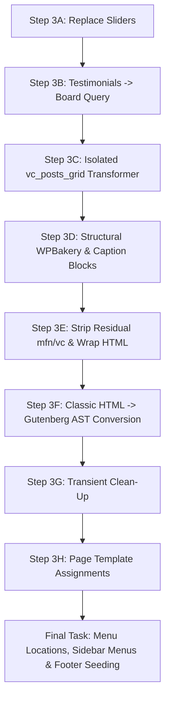

# SPECIFICATION: Legacy WordPress Migration Consolidation & Pipeline Architecture

- **TOPIC NAME**: Legacy WordPress Migration Strategy & Architecture
- **ISSUE NAME**: Migration Consolidation & Modular Pipeline Refactoring
- **TARGET DATABASE**: `backstage_eka` (Environment Database Snapshot)
- **BASE ENVIRONMENT**: PHP 7.4 (Initial Migration & Cleanup) → PHP 8.2 (Final Cutover & Core Upgrade)
- **STATUS**: DRAFT FOR USER INSPECTION

---

## 1. Executive Summary & Objective

The objective of this specification is to consolidate and structure all legacy WordPress migration steps for the EKA Portal modernization into a clean, deterministic, 3-stage modular pipeline. 

### Core Architectural Decisions:
1. **Zero Theme Bloat**: Disposable migration logic (CPT import, shortcode regex, slider conversion) is kept strictly isolated in `bin/` scripts (executable via PHP CLI or WP-CLI `--require`). Theme runtime files like `functions.php` and `inc/custom-features.php` remain untouched and pristine.
2. **Total Theme File Preservation**: `reset-env.sh` is updated to explicitly preserve all files within `wp-content/themes/ekalexandria-flagship/` using comprehensive `rsync` exclude patterns.
3. **Isolated Modular Transformations**: High-value transformations such as `vc_posts_grid` (sub-navigation grid) and `[testimonials]` (Board Members query loop) are separated into dedicated, modular handlers within the migration engine for future enhancement without risking general shortcode remediation logic.
4. **Guaranteed Idempotency & AST Validation**: All transformation scripts include pre-update checks and validate rendered markup against Gutenberg block AST structures via `eka_validate_blocks_ast()`.
5. **Strict Log Hygiene & Reporting**: Every command and script clears its log file at startup and outputs exact match/conversion metrics (e.g., `Converted: 4000/4000`, or `Failed: 2/5 - IDs [123, 456]`).

---

## 2. Architecture Comparison: Theme-Embedded vs. Isolated Scripts

| Dimension | Theme-Embedded WP-CLI (`inc/cli-commands.php`) | Isolated External PHP Scripts (`bin/*.php`) | Selected Architecture |
| :--- | :--- | :--- | :--- |
| **Code Hygiene** | Leaves temporary, single-use migration logic inside active production theme. | Migration logic lives in `bin/`, completely separated from theme runtime. | **Isolated External PHP Scripts (`bin/`)** |
| **Server Dependencies** | Requires no extra Python packages; runs via standard WP-CLI. | Runs via `php7.4` CLI / WP-CLI `--require`; zero server package overhead. | **Isolated External PHP Scripts (`bin/`)** |
| **Maintainability** | Difficult to delete after cutover without modifying `functions.php`. | Can be archived or deleted post-migration without touching theme code. | **Isolated External PHP Scripts (`bin/`)** |
| **Performance** | Boots full WP stack per batch. | Direct MySQL/AST processing with WP-CLI context when needed. | **Hybrid Isolated Context** |

---

## 3. Consolidation Mapping Table of Legacy Scripts & Functions

| Legacy File / Script | Function / Action | Current Limitations & Collisions | Consolidated Strategy & New Location |
| :--- | :--- | :--- | :--- |
| `bin/reset-env.sh` | Resets `backstage_eka` DB from live dump & syncs files. | Risk: `rsync --delete` wipes theme files not in production (`theme.json`, `templates/`, etc.). | **Refactored to `bin/01-reset-env.sh`**: Added `--exclude='wp-content/themes/ekalexandria-flagship/***'` to `rsync`. Protects theme directory completely. |
| `bin/cleanup-plugins.sh` | Deactivates/deletes legacy plugins (`js_composer`, `LayerSlider`, etc.). | Lacks `rm -rf` fallback when WP-CLI deletion fails due to inactive DB state. | **Integrated into `bin/02-setup-theme-and-plugins.sh`**: WP-CLI `plugin delete` supplemented with automated `rm -rf` directory purge fallback. |
| `ai-work/cleanup-plugins.sh` | Legacy plugin cleanup. | Redundant duplicate script. | **DEPRECATED & REMOVED**. |
| `inc/cli-commands.php` (`replace_sliders`) | Converts `[rev_slider]` & `[layerslider]` to `wp:query` / `wp:gallery`. | Collided with generic slider placeholders in `remediate-shortcodes-to-blocks.php`. | **Moved to `bin/migration-content-engine.php` (Step A)**: Runs first in content pipeline using explicit page ID mapping and media library attachment IDs. |
| `inc/cli-commands.php` (`remediate_shortcodes`) | Converts `[testimonials]` & `[vc_posts_grid]`, injects sidebars. | Mixed generic shortcodes with specific CPT queries in one method. | **Modularized in `bin/migration-content-engine.php`**: `[testimonials]` (Step B) and `[vc_posts_grid]` (Step C) separated into isolated functions. |
| `inc/cli-commands.php` (`migrate-tachydromos` & `migrate-board`) | Imports PDFs & Board Member CPT items with Polylang links. | Worked well but was embedded in theme CLI commands file. | **Extracted to `bin/migrate-cpts.php`**: Executed via WP-CLI `--require` during Step 2 shell script. |
| `inc/cli-commands.php` (`assign_menus` & `seed_footer_menus`) | Sets nav menu locations & seeds footer navigation blocks. | Executed prematurely in previous pipelines. | **Moved to Final Step in `bin/03-migrate-content.sh`**: Always runs as the last task post-content conversion. |
| `bin/remediate-shortcodes-to-blocks.php` | Regex transformer for `vc_row`, `vc_column`, `[caption]`, generic shortcodes. | Wrapped `[vc_posts_grid]` in `<!-- wp:html -->`, preventing smart query conversion. | **Merged into `bin/migration-content-engine.php` (Step D & E)**: Runs after slider and specific grid/testimonial transformations. |
| `bin/convert-classic-to-gutenberg.php` | Converts HTML elements (`<p>`, `<hN>`, `<ul>`, `<table>`) to Gutenberg blocks. | Standalone script. | **Maintained as Step F in `bin/migration-content-engine.php`**: Final AST block wrapping & FSE inline CSS sanitization step. |

---

## 4. 3-Stage Shell Script Pipeline Specification

The migration process is organized into 3 sequential, executable shell scripts in `bin/`:

```
bin/
├── 01-reset-env.sh                   # Script 1: Staging Reset & Production DB Import
├── 02-setup-theme-and-plugins.sh     # Script 2: Theme Activation, CPT Import & Legacy Cleanup
└── 03-migrate-content.sh             # Script 3: Content Transformation & Navigation Assignment
```

### Script 1: `bin/01-reset-env.sh` (Staging Reset)
- **Target DB**: `backstage_eka`
- **PHP Version**: `php7.4`
- **Log File**: `ai-work/logs/01-reset-env.log` (Truncated on startup)
- **Execution Steps**:
  1. Execute `bin/pre-flight.sh` check.
  2. Export live production database (`/var/www/ekalexandria.org/public/`) snapshot to `/tmp/prod_db.sql`.
  3. Drop residual `backstage_eka` database and import fresh snapshot.
  4. Synchronize staging files from production while **strictly excluding the flagship theme**:
     ```bash
     rsync -av --delete \
         --exclude='wp-config.php' \
         --exclude='wp-content/themes/ekalexandria-flagship/***' \
         "$PROD_DIR/public/" "$STAGING_DIR/public/"
     ```
  5. Apply file ownership (`alexseif:www-data`) and permissions.
  6. Execute DB search-replace: `ekalexandria.org` → `backstage.ekalexandria.org`.
  7. Patch legacy PHP 7.4/8.0 autoloader class hash mismatches (Mailchimp, Rank Math, Polylang) and WPBakery nested ternary syntax error (`class-vc-frontend-editor.php` line 339) to maintain site boot stability post-reset.

### Script 2: `bin/02-setup-theme-and-plugins.sh` (Theme Activation & CPT Import)
- **Target DB**: `backstage_eka`
- **PHP Version**: `php7.4`
- **Log Files**: `ai-work/logs/02-setup-theme-and-plugins.log`, `ai-work/logs/cpt-migration.log`, `ai-work/logs/cleanup-plugins.log`
- **Execution Steps**:
  1. **Activate Theme**:
     ```bash
     php7.4 $(which wp) theme activate ekalexandria-flagship --path="$WP_DIR" --allow-root
     ```
  2. **Migrate CPTs**:
     - Run `migrate-tachydromos` to import Alexandrinos Tachydromos PDF items.
     - Run `migrate-board` to import Board Member testimonials, media thumbnails, and link Polylang language translations (`el`, `en`, `ar`).
  3. **Delete Legacy Plugins with Fallback**:
     - Deactivate & uninstall legacy plugins: `LayerSlider`, `js_composer`, `display-posts-shortcode`, `force-regenerate-thumbnails`, `ewww-image-optimizer`, `wordpress-seo`, `w3-total-cache`.
     - **Fallback Enforcement**: If `wp plugin delete` fails or leaves a directory behind, execute:
       ```bash
       rm -rf "$STAGING_DIR/public/wp-content/plugins/$plugin"
       ```
     - Remove legacy drop-ins: `advanced-cache.php`, `object-cache.php`, `cache/`, `w3tc-config/`.

### Script 3: `bin/03-migrate-content.sh` (Content Transformation & Navigation)
- **Target DB**: `backstage_eka`
- **PHP Version**: `php7.4`
- **Log Files**: `ai-work/logs/03-migrate-content.log`, `ai-work/logs/content-engine.log`, `ai-work/logs/menu-assignments.log`
- **Execution Steps**:
  1. Execute `bin/migration-content-engine.php` in strict sequence:
     - **Phase 3A (Sliders)**: Replace `[rev_slider]` & `[layerslider]` shortcodes on scoped pages with native `wp:query` or `wp:gallery` blocks containing attachment IDs.
     - **Phase 3B (Testimonials)**: Replace `[testimonials]` shortcodes on pages with native `wp:query` blocks targeting post_type `board_member`.
     - **Phase 3C (Isolated VC Posts Grid)**: Parse `[vc_posts_grid]` parameters (`by_id:X,Y,Z`) and convert into isolated custom `wp:query` blocks for sub-navigation grids.  
       > [!NOTE]  
       > **TODO**: Other `[vc_posts_grid]` shortcode variants across legacy pages need further analysis to be fully incorporated into the solution in future iterations.
     - **Phase 3D (WPBakery Structure)**: Transform `[vc_row]` → `wp:columns`, `[vc_column width="X/Y"]` → `wp:column {"width":"Z%"}`, `[caption]` → `wp:image`.
     - **Phase 3E (Residual Cleanup)**: Strip unhandled `[mfn_*]` / `[vc_*]` tags; wrap arbitrary custom shortcodes in `wp:html`.
     - **Phase 3F (Classic HTML to Gutenberg AST)**: Wrap bare `<p>`, `<hN>`, `<ul>`, `<table>`, `<blockquote>` tags in Gutenberg blocks, filter inline CSS through FSE allowlist, and validate via `eka_validate_blocks_ast()`.
  2. **Transient Clean-Up**:
     - Flush cache transients (`wp transient delete --all`) to ensure clean state before assigning templates and navigation menus.
  3. **Page Template Assignments**:
     - Assign Homepage templates: Greek (`13236`) → `front-page-el`, English → `front-page-en`, Arabic → `front-page-ar`.
     - Assign Parent/Sub-page templates: `Ίδρυση`, `Υπηρεσίες`, `Δραστηριότητες` and child pages assigned language-specific sidebar template (`page-parent-sidebar`).
  4. **Navigation Menu Assignments, Sidebar Injection & Seeding (LAST TASK)**:
     - Assign navigation menu locations (`main-menu`, `main-menu___en`, `main-menu___ar`, `social-menu-bottom`).
     - Seed language-specific footer navigation posts (`footer-english-menu`, `footer-arabic-menu`) idempotently.
     - Inject sidebar navigation menus into designated parent/sub-pages.  
       > [!NOTE]  
       > **TODO**: Sidebar menu assignment for parent/sub-pages is specified here, but implementation logic is pending in the next phase.

---

## 5. Detailed Content Migration Order of Operations

To prevent any script from destroying data required by a subsequent step, the content transformation engine (`bin/migration-content-engine.php`) strictly executes in the following 6-step order:



### Detailed Logic per Transformation Step:

#### Step 3A: Slider Replacement
- Matches `[rev_slider]` and `[layerslider]` on specific scoped pages (`13236`, `8934`, `7820`, `17129`, etc.).
- Replaces dynamic news sliders with `wp:query` blocks.
- Replaces static photo sliders with `wp:gallery` blocks using exact media library IDs.

#### Step 3B: Testimonials Shortcode Remediation
- Scans `wp_posts` for `[testimonials]`.
- Replaces with `wp:query` block configured for `postType: "board_member"`, `orderBy: "menu_order"`, displaying post thumbnail, title, and content.

#### Step 3C: Isolated `vc_posts_grid` Sub-navigation Handler
- Isolated as a standalone function in `bin/migration-content-engine.php` to allow future enhancements.
- Extracts `by_id:12,13,14` IDs via regex.
- Builds a structured `wp:query` block passing `"include": [12, 13, 14]` to render page cards with featured images and excerpts.
> [!NOTE]
> **TODO**: Other `[vc_posts_grid]` shortcode variants across legacy pages need further analysis to be fully incorporated into the solution in future iterations.

#### Step 3D: Structural WPBakery Shortcode Conversion
- `[vc_row]` → `<!-- wp:columns --><div class="wp-block-columns">`
- `[vc_column width="1/3"]` → `<!-- wp:column {"width":"33.33%"} --><div class="wp-block-column" style="flex-basis: 33.33%;">`
- `[caption id="attachment_123" align="aligncenter" width="300"] Caption text[/caption]` → `<!-- wp:image {"id":123} --><figure class="wp-block-image"><figcaption>Caption text</figcaption></figure><!-- /wp:image -->`

#### Step 3E: Residual Shortcode Clean-Up
- Strips all unhandled `[/vc_*]` and `[/mfn_*]` tags.
- Wraps any unrecognized 3rd-party shortcode in `<!-- wp:html -->[shortcode]<!-- /wp:html -->`.

#### Step 3F: Classic HTML AST Block Conversion & CSS Sanitization
- Parses post content for bare HTML elements.
- Applies FSE property allowlist (`color`, `background-color`, `font-size`, `text-align`, `margin`, `padding`, `border`) to sanitize inline styles.
- Validates transformed content via `eka_validate_blocks_ast()`.

#### Step 3G: Transient Clean-Up
- Flushes transient cache (`wp transient delete --all`) to prevent stale options or menu render issues.

#### Step 3H: Page Template Assignment
- Assigns homepage templates based on language:
  - Greek Homepage (`13236`) → `front-page-el`
  - English Homepage → `front-page-en`
  - Arabic Homepage → `front-page-ar`
- Assigns parent & sub-page templates: `Ίδρυση`, `Υπηρεσίες`, `Δραστηριότητες` and their sub-pages assigned `page-parent-sidebar` (or language-specific sidebar variants).

#### Final Task: Navigation Menu Assignments, Sidebar Menus & Footer Seeding
- Assigns main navigation menu locations (`main-menu`, `main-menu___en`, `main-menu___ar`, `social-menu-bottom`).
- Seeds language-specific footer navigation posts (`footer-english-menu`, `footer-arabic-menu`).
- Assigns sidebar navigation menus for parent/sub-pages.
> [!NOTE]
> **TODO**: Sidebar menu assignment for parent/sub-pages is specified here, but implementation logic is pending in the next phase.

---

## 6. Logging, Verification & Idempotency Rules

### Log Hygiene Protocol
- Each script (`01-reset-env.sh`, `02-setup-theme-and-plugins.sh`, `03-migrate-content.sh`) truncates its log file at initialization (`> "ai-work/logs/<script-name>.log"`).
- All stderr and stdout are captured via `exec > >(tee -a "$LOG_FILE") 2>&1`.

### Exact Metric Verification
Every migration task must output structured summary counts upon completion:
```
==================================================
 MIGRATION SUMMARY: Shortcode & Block Remediation
==================================================
 Total Posts Scanned   : 4000
 Successfully Converted: 3998
 Skipped / Unchanged   : 0
 Failed AST Validation : 2
 Failed Post IDs       : [ 14205, 16891 ]
==================================================
```

### Idempotency Enforcement
- **CPT Import**: Checks for existing `_eka_pdf_filename` meta or `_legacy_testimonial_id` before inserting posts.
- **Sliders & Shortcodes**: Skips posts that already contain `<!-- wp:query -->` or `<!-- wp:gallery -->` annotations.
- **Footer Menus**: Checks `post_name` in `wp_posts` before inserting `wp_navigation` blocks.

---

## 7. Post-Migration Upgrade Sequence (Steps 4 & 5)

Once Script 3 completes successfully and content conversion is verified:

### Step 4: Upgrade PHP Version to PHP 8.2
- Update CLI environment and web server (Nginx/Apache + PHP-FPM) to use `php8.2`.
- Verify CLI status: `php8.2 -v`.

### Step 5: Update WordPress Core & Active Plugins
- Update WP Core: `php8.2 $(which wp) core update`
- Update DB schema: `php8.2 $(which wp) core update-db`
- Update remaining active plugins (Polylang, Rank Math): `php8.2 $(which wp) plugin update --all`

---

## 8. Git Workflow Standards & Cleanup Discipline

### Git Commit & Branching Protocol
1. **Feature Branch Strategy**: All work must be conducted on a dedicated feature branch (e.g., `feat/migration-consolidation-refactor`) off the main codebase branch.
2. **Atomic Step Commits**: Each step in the implementation loop must be committed separately post-verification:
   - `refactor(bin): implement 01-reset-env.sh with flagship theme preservation`
   - `feat(migration): implement 02-setup-theme-and-plugins.sh with rm -rf plugin fallback`
   - `feat(migration): implement modular 03-migrate-content.sh engine and menu assignments`
   - `cleanup(bin): remove obsolete legacy runners and deprecated scripts`
3. **Pre-Commit Verification**: No commit may be pushed until scripts pass syntax checks (`php -l`) and dry-run execution tests.

### Legacy Script Cleanup Protocol
1. **Redundant Runner Deletion**: Upon successful verification of the 3 consolidated scripts (`01-reset-env.sh`, `02-setup-theme-and-plugins.sh`, `03-migrate-content.sh`), delete superseded runner scripts:
   - Remove `ai-work/cleanup-plugins.sh`
   - Remove `bin/cutover.sh`
   - Remove `bin/run-phase2-migration.sh`
   - Remove `bin/run-phase4-migration.sh`
2. **Preservation Exemption (STRICT)**:
   - **DO NOT DELETE SCOPING RESULTS**: All JSON scoping data in `ai-work/scopings/` (`tachydromos-scoping.json`, `board-scoping.json`, slider scopings) must be strictly preserved as permanent migration references.

---

## 9. Summary Checklist of Tasks

- [ ] Implement `bin/01-reset-env.sh` with full theme directory preservation (`--exclude='wp-content/themes/ekalexandria-flagship/***'`).
- [ ] Implement `bin/02-setup-theme-and-plugins.sh` for theme activation, CPT import, and legacy plugin deletion with `rm -rf` fallback.
- [ ] Implement `bin/03-migrate-content.sh` engine (Sliders → Board Testimonials → Isolated `vc_posts_grid` → Structural WPBakery → Residual Shortcodes → Classic HTML AST → Transient Delete → Template Assignments → Menu & Sidebar Assignments).
- [ ] Add `TODO` comment for future `[vc_posts_grid]` variant analysis.
- [ ] Add `TODO` comment for sidebar menu assignment implementation logic.
- [ ] Execute legacy script cleanup (delete `ai-work/cleanup-plugins.sh`, `bin/cutover.sh`, `bin/run-phase2-migration.sh`, `bin/run-phase4-migration.sh`).
- [ ] Verify that all scoping JSON files in `ai-work/scopings/` remain intact.
- [ ] Enforce atomic Git commits for each milestone following conventional commit standards.
- [ ] Document post-migration PHP 8.2 upgrade and core update steps.
