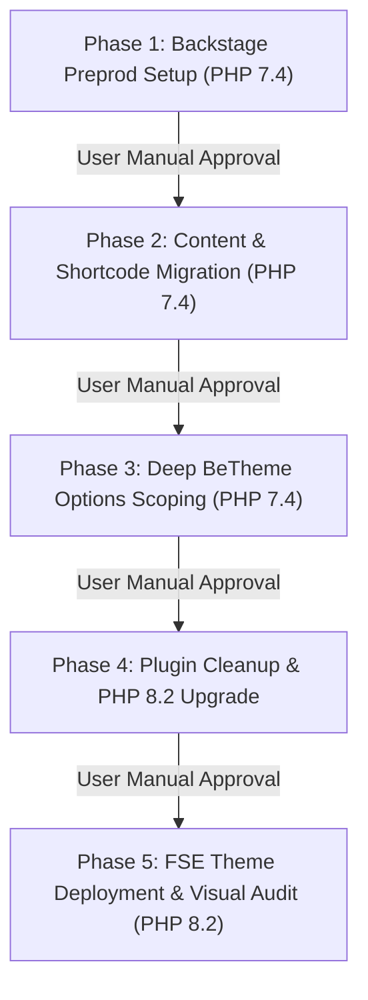

# EKA Portal Migration Roadmap

## Overview
This roadmap outlines the 5-phase migration of the Greek Community of Alexandria portal (`ekalexandria.org`) into the bespoke `ekalexandria-flagship` Full Site Editing (FSE) block theme.

All Phase 1, Phase 2, and Phase 3 operations execute under **PHP 7.4** CLI routing (`php7.4 $(which wp)`). Phase 4 and Phase 5 transition the environment to **PHP 8.2**.

---

## Global Governance & Process Rules

> [!IMPORTANT]
> 1. **Manual User Validation Pause**: At the end of EVERY phase, execution MUST pause for manual user review and approval before starting the next phase.
> 2. **Git Workflow Discipline**: Enforce strict atomic commits per phase task (`RED-GREEN-COMMIT` pattern).
> 3. **Token Conservation via Scripts**: In Phases 1, 2, and 4, execute pre-existing scripts (`bin/reset-env.sh`, `inc/cli-commands.php`, `bin/cleanup-plugins.sh`). Do not re-implement script logic unless modifying a script.
> 4. **Script Modification Mandate**: Any modification to a script MUST log execution output, issues encountered, fallbacks taken, and technical reasoning into `ai-work/logs/`.
> 5. **AI Active Work Phases**: AI deep analysis and template building occur strictly in Phase 3 (BeTheme Deep Scoping) and Phase 5 (FSE Theme Implementation).

---

## Phase Execution Sequence

---

## Phase Summaries & Deliverables

### [Phase 1: Backstage Preproduction Setup (PHP 7.4)](specs/PHASE-1-BACKSTAGE-PREPROD-SPEC.md) `[IMPLEMENTED & VERIFIED]`
* **Goal**: Synchronize `backstage.ekalexandria.org` (DB: `backstage_eka`) from live production (`ekalexandria.org`, DB `db207080_eka`) using existing `bin/reset-env.sh`.
* **Key Tasks**:
  1. Execute `bash bin/reset-env.sh`.
  2. Preserves key folders/files (`ai-work/`, `bin/`, `AGY_INSTRUCTIONS.md`, `Master Project Roadmap...`).
  3. Executes automated patch for WPBakery line 339 nested ternary operator error (`class-vc-frontend-editor.php`).
* **Pause Checkpoint**: **HALT & REQUIRE MANUAL USER VALIDATION** of staging DB and admin access.

### [Phase 2: Content & Shortcode Migration (PHP 7.4)](specs/PHASE-2-TACHYDROMOS-BOARD-MIGRATION-SPEC.md) `[IMPLEMENTED & VERIFIED]`
* **Goal**: Run pre-existing CLI commands in `inc/cli-commands.php` under PHP 7.4 to migrate custom content, replace sliders, remediate shortcodes, and assign menus.
* **Key Tasks**:
  1. `php7.4 $(which wp) eka migrate-tachydromos`: Greek title normalization, month casing, unscaled media reassignment, PDF embeds.
  2. `php7.4 $(which wp) eka migrate-board`: Polylang translation linking (`pll_save_post_translations`), unscaled media reassignment, body `` cleaning.
  3. `php7.4 $(which wp) eka replace-sliders`: Dynamic sliders -> Query Loops; static sliders -> Gallery blocks.
  4. `php7.4 $(which wp) eka remediate-shortcodes`: Shortcodes to Gutenberg blocks, dynamic subnav sidebars.
  5. Assign navigation menus (Greek Main 13, English Main 3315, Arabic Main 3316, Greek Footer 21).
* **Pause Checkpoint**: **HALT & REQUIRE MANUAL USER VALIDATION** of migrated posts, taxonomies, and menu structures.

### [Phase 3: Deep BeTheme Configuration Scoping (PHP 7.4)](specs/PHASE-3-BETHEME-CONFIG-SCOPING-SPEC.md) `[SCOPING IN PROGRESS / AI ACTIVE]`
* **Goal**: Extract complete BeTheme settings, MFN builder page structures, custom sidebars, header/footer tokens, and custom CSS into `ai-work/scopings/betheme-config-scoping.json`.
* **Key Tasks**:
  1. Export `betheme` option array via `php7.4 $(which wp) option get betheme --format=json`.
  2. Catalog MFN builder layout grids across pages (`_mfn-builder-items`).
  3. Scrape custom CSS declarations, header settings, and font styles.
* **Pause Checkpoint**: **HALT & REQUIRE MANUAL USER VALIDATION** of exported scoping JSON files.

### [Phase 4: Plugin Cleanup & PHP 8.2 Upgrade](specs/PHASE-4-PLUGIN-DEACTIVATION-SPEC.md) `[IMPLEMENTED & VERIFIED]`
* **Goal**: Clean up stalling legacy plugins using `bin/cleanup-plugins.sh` with file removal fallbacks (`rm -rf`), log reasoning on failure, and upgrade environment to PHP 8.2.
* **Key Tasks**:
  1. Run `bash bin/cleanup-plugins.sh`.
  2. Log any script failures and fallback actions to `ai-work/logs/cleanup-plugins.log`.
  3. Upgrade system environment CLI to **PHP 8.2**.
* **Pause Checkpoint**: **HALT & REQUIRE MANUAL USER VALIDATION** of active plugin list and PHP 8.2 runtime stability.

### [Phase 5: FSE Theme Deployment & Visual Audit (PHP 8.2)](specs/PHASE-5-PHP82-THEME-DEPLOYMENT-SPEC.md) `[PLANNED / AI ACTIVE]`
* **Goal**: Build FSE templates across 3 languages (EL, EN, AR), construct exact top bar, header (with search), and footer components, assign menus, and perform Playwright visual audit.
* **Key Tasks**:
  1. Build multi-language templates for Front-Page, Pages, Single Posts, Board Members list, and Tachydromos newsletter pages.
  2. Build Top Bar, Header (EL, EN, AR) with restored search trigger, and Footer (EL, EN, AR) matching legacy elements.
  3. Assign menus via FSE template navigation blocks.
  4. Run Playwright visual snapshot comparison (`node bin/scrape-baselines.js`) against `ai-work/baselines/`.
* **Pause Checkpoint**: **FINAL MANUAL USER VALIDATION & CUTOVER APPROVAL**.
