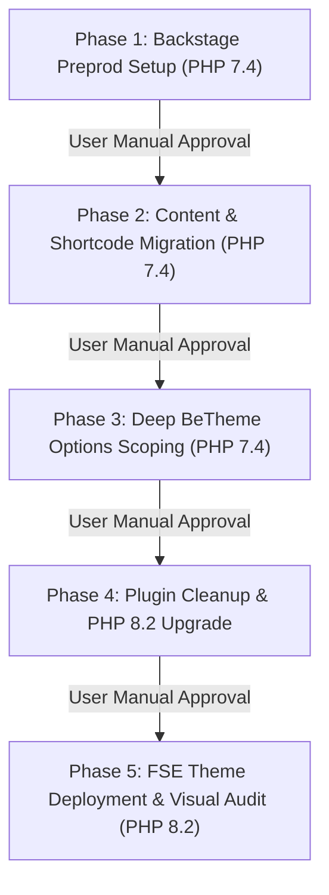

# EKA Portal Migration Roadmap

## Overview
This roadmap outlines the 5-phase migration of the Greek Community of Alexandria portal (`ekalexandria.org`) into the bespoke `ekalexandria-flagship` Full Site Editing (FSE) block theme.

All Phase 1, Phase 2, and Phase 3 operations execute under **PHP 7.4** CLI routing (`php7.4 $(which wp)`). Phase 4 and Phase 5 transition the environment to **PHP 8.2**.

---

## Global Governance & Process Rules

> [!IMPORTANT]
> 1. **Manual Spec Verification Before Commit**: Work in spec and planning documents MUST be manually reviewed and verified by the user before creating any Git commit.
> 2. **Manual User Validation Pause**: At the end of EVERY phase, execution MUST pause for manual user review and approval before starting the next phase.
> 3. **Clean Output Log Dumping**: ALL commands and scripts executed MUST dump their output into dedicated, clean log files in `ai-work/logs/` (e.g. `> ai-work/logs/<name>.log 2>&1`) for post-run verification and auditing.
> 4. **Git Workflow Discipline**: Enforce strict atomic commits per phase task (`RED-GREEN-COMMIT` pattern) following user verification.
> 5. **Token Conservation via Scripts**: In Phases 1, 2, and 4, execute pre-existing scripts (`bin/reset-env.sh`, `inc/cli-commands.php`, `bin/cleanup-plugins.sh`). Do not re-implement script logic unless modifying a script.
> 6. **Script Modification Mandate**: Any script modification MUST be detailed in the relevant spec file first. Scripts MUST log execution output and failures to `ai-work/logs/`.
> 7. **No AI Fallbacks or Destructive Deletions**: Scripts and AI must NOT execute automated `rm` / `rm -rf` fallbacks. Failures must be logged for manual review.
> 8. **AI Active Work Phases**: AI deep analysis and template building occur strictly in Phase 3 (BeTheme Deep Scoping) and Phase 5 (FSE Theme Implementation).

---

## Phase Execution Sequence

---

## Phase Summaries & Deliverables

### [Phase 1: Backstage Preproduction Setup (PHP 7.4)](specs/PHASE-1-BACKSTAGE-PREPROD-SPEC.md) `[REVISED SPEC / VERIFICATION PENDING]`
* **Goal**: Update `bin/reset-env.sh` to freshly export and import the database from production (`ekalexandria.org`, DB `db207080_eka`) to staging (`backstage.ekalexandria.org`, DB `backstage_eka`) and synchronize files from the neighbouring production folder while preserving `wp-config.php` and designated project files, resetting all new/modified files to their original production state.
* **Key Tasks**:
  1. Update `bin/reset-env.sh` logic to perform fresh DB export & import.
  2. Sync files from neighbouring production folder, preserving `wp-config.php`, `ai-work/`, `bin/`, `AGY_INSTRUCTIONS.md`, and `Master Project Roadmap...`.
  3. Reset any new or modified staging files back to their original production baseline.
  4. Dump execution output to clean log file `ai-work/logs/reset-env.log`.
* **Pause Checkpoint**: **HALT & REQUIRE MANUAL USER VALIDATION** of staging DB and file reset.

### [Phase 2: Content & Shortcode Migration (PHP 7.4)](specs/PHASE-2-TACHYDROMOS-BOARD-MIGRATION-SPEC.md) `[REVISED SPEC / VERIFICATION PENDING]`
* **Goal**: Create and execute a unified content migration script (`bin/run-phase2-migration.sh` / `wp eka migrate-all`) combining all Phase 2 efforts under PHP 7.4, with dedicated clean log files for each task and the unified script.
* **Key Tasks**:
  1. `php7.4 $(which wp) eka migrate-tachydromos`: Title normalization, month casing, unscaled media reassignment, PDF embeds -> `ai-work/logs/tachydromos-migration.log`.
  2. `php7.4 $(which wp) eka migrate-board`: Polylang translation linking (`pll_save_post_translations`), unscaled media reassignment, body `` cleaning -> `ai-work/logs/board-migration.log`.
  3. `php7.4 $(which wp) eka replace-sliders`: Dynamic sliders -> Query Loops; static sliders -> Gallery blocks -> `ai-work/logs/sliders-migration.log`.
  4. `php7.4 $(which wp) eka remediate-shortcodes`: Shortcodes to Gutenberg blocks, dynamic subnav sidebars -> `ai-work/logs/remediate-shortcodes.log`.
  5. Assign navigation menus (Greek Main 13, English Main 3315, Arabic Main 3316, Greek Footer 21).
  6. Execute unified migration wrapper logging to `ai-work/logs/phase2-unified-migration.log`.
* **Pause Checkpoint**: **HALT & REQUIRE MANUAL USER VALIDATION** of migrated posts, taxonomies, and menu structures.

### [Phase 3: Deep BeTheme Configuration Scoping (PHP 7.4)](specs/PHASE-3-BETHEME-CONFIG-SCOPING-SPEC.md) `[SCOPING IN PROGRESS / AI ACTIVE]`
* **Goal**: Extract complete BeTheme settings, MFN builder page structures, custom sidebars, header/footer tokens, and custom CSS into `ai-work/scopings/betheme-config-scoping.json`.
* **Key Tasks**:
  1. Export `betheme` option array via `php7.4 $(which wp) option get betheme --format=json`.
  2. Catalog MFN builder layout grids across pages (`_mfn-builder-items`).
  3. Scrape custom CSS declarations, header settings, and font styles.
  4. Dump CLI log outputs to `ai-work/logs/phase3-scoping.log`.
* **Pause Checkpoint**: **HALT & REQUIRE MANUAL USER VALIDATION** of exported scoping JSON files.

### [Phase 4: Plugin Cleanup & PHP 8.2 Upgrade](specs/PHASE-4-PLUGIN-DEACTIVATION-SPEC.md) `[REVISED SPEC / VERIFICATION PENDING]`
* **Goal**: Clean up stalling legacy plugins using `bin/cleanup-plugins.sh` without AI/script `rm` fallbacks, log all script failures for manual remediation, perform legacy caching drop-in cleanup, and upgrade environment to PHP 8.2.
* **Key Tasks**:
  1. Update `bin/cleanup-plugins.sh` specification to log failures instead of running `rm` fallbacks.
  2. Include legacy caching cleanup (`advanced-cache.php`, `object-cache.php`, `w3tc-config`, `cache`).
  3. Dump execution and failure log outputs to `ai-work/logs/cleanup-plugins.log`.
  4. Upgrade system environment CLI to **PHP 8.2**.
* **Pause Checkpoint**: **HALT & REQUIRE MANUAL USER VALIDATION** of active plugin list and PHP 8.2 runtime stability.

### [Phase 5: FSE Theme Deployment & Visual Audit (PHP 8.2)](specs/PHASE-5-PHP82-THEME-DEPLOYMENT-SPEC.md) `[REVISED SPEC / VERIFICATION PENDING]`
* **Goal**: Integrate tech stack build instructions (SCSS dev & minified production compilation), construct scoped multi-language FSE templates (Front-Page, Single Post, Listing Archives, Categories, Board, Tachydromos), implement strictly scoped header/footer parts (no un-scoped quick info or 4-column widget assumptions), assign menus, and perform Playwright visual audit.
* **Key Tasks**:
  1. Configure SCSS build pipeline with `@wordpress/scripts` (`npm run dev` for SCSS development, `npm run build` for minified production bundle).
  2. Build templates across languages (EL, EN, AR): Front-Page, Pages, Single Posts, Archives (`archive.html`, CPT archives), Categories (`category.html`), Board Members, and Tachydromos.
  3. Build Header and Footer template parts matching actual BeTheme Phase 3 scoped elements (Polylang switcher, restored search, scoped footer layout).
  4. Run Playwright visual snapshot comparison (`node bin/scrape-baselines.js`) against `ai-work/baselines/`.
  5. Dump execution outputs to `ai-work/logs/phase5-deployment.log`.
* **Pause Checkpoint**: **FINAL MANUAL USER VALIDATION & CUTOVER APPROVAL**.
