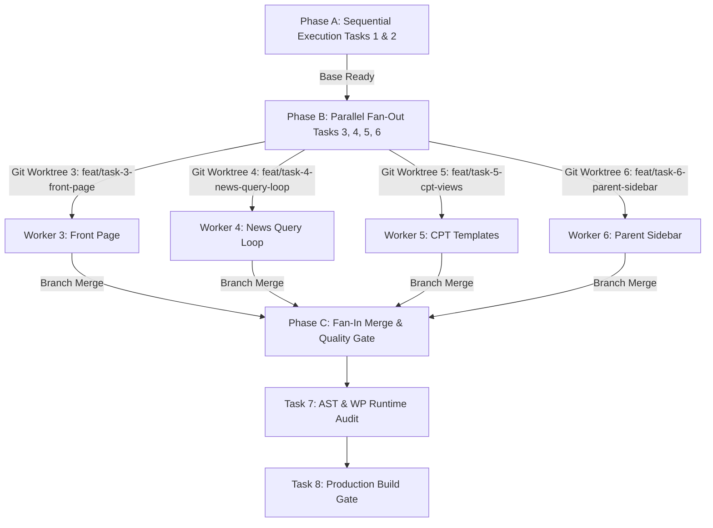

# TOPIC: EKA Flagship FSE Theme Refinement & Quality Assurance
# ISSUE: Detailed Page Inventory, Shortcode Remediation, Dynamic Grid Blocks, FSE Validation, Python Orchestration & Git Workflow

## 1. Objective & Target Users
The objective of Phase 6 is to refine the `ekalexandria-flagship` Full Site Editing (FSE) WordPress theme to achieve 100% visual and functional parity with the production legacy site (`https://ekalexandria.org`), resolve template structure bugs, replace legacy shortcodes with dynamic FSE blocks/patterns (including Query Loops and Carousel block styles), enforce strict Gutenberg AST serialization, ban inline styles, and manage execution via a Python CLI Master Orchestrator (`bin/orchestrate-phase-6.py`) with sequential base execution, parallel fan-out worktrees, task branch isolation, and tagged git commits across all multilingual page types.

---

## 2. Environment & Commands

### Build & SCSS Tooling
- **Development Script (Watch Mode + Source Maps)**:
  `npm run dev` (executes `wp-scripts start assets/scss/style.scss assets/scss/rtl.scss --output-path=build`)
- **Production Script (Minified & Optimized Output)**:
  `npm run build` (executes `wp-scripts build assets/scss/style.scss assets/scss/rtl.scss --output-path=build`)

### Quality Assurance & Validation Commands
- **AST Gutenberg Serialization Test**:
  `npm run test:parser` (validates block syntax against `@wordpress/block-serialization-default-parser`)
- **WP REST API / Runtime Block Render Test**:
  `npm run test:render` (executes `do_blocks()` runtime validation via WP-CLI)
- **Playwright Structural DOM Comparison Tool**:
  `node bin/compare-dom.js --staging=http://localhost:8000 --live=https://ekalexandria.org`
- **Python CLI Master Orchestrator**:
  `python3 bin/orchestrate-phase-6.py`

---

## 3. Project Structure & File Layout

```
public/wp-content/themes/ekalexandria-flagship/
├── package.json                   # SCSS dev/build scripts & validation dependencies
├── theme.json                     # Theme color palette, typography & block styles
├── functions.php                  # Custom block registrations & asset enqueueing
├── inc/
│   ├── blocks.php                 # Dynamic blocks (Homepage Services, News Carousel, Child Pages Grid)
│   └── cpt-rules.php              # CPT single view redirects & custom ordering rules
├── assets/
│   ├── scss/
│   │   ├── style.scss             # Main LTR stylesheets
│   │   ├── rtl.scss               # RTL stylesheets (Arabic support)
│   │   └── components/            # SCSS modules (carousels, sidebars, news grid)
│   └── js/
│       ├── carousel.js            # News & Gallery Carousel interactive behavior (Swiper/Scroll-Snap)
│       └── dom-observer.js        # Editor/Frontend runtime handlers
├── parts/                         # FSE Template Parts (Header, Footer, Sidebars)
│   ├── header.html / header-el.html / header-ar.html / header-en.html
│   ├── footer.html / footer-el.html / footer-ar.html / footer-en.html
│   ├── sidebar-child-pages.html   # Parent/Child internal page sidebar navigation part
│   └── sidebar-news.html          # News page categories & archives sidebar part
├── templates/                     # FSE Block Templates
│   ├── front-page.html / front-page-el.html / front-page-ar.html / front-page-en.html
│   ├── page.html                  # Standard internal page template
│   ├── page-parent-sidebar.html   # Parent page template with child grid & sidebar
│   ├── index.html                 # News / Blog list page template (recreated with Query Loop)
│   ├── archive-board_member.html  # Board Members list view ONLY (new bespoke layout)
│   ├── archive-alx_tachydromos.html# Alexandrinos Tachydromos archive view (new bespoke layout)
│   ├── single-alx_tachydromos.html # Alexandrinos Tachydromos single publication view
│   ├── single.html                # Standard single post template
│   ├── category.html              # Category archive template
│   ├── search.html                # Search results template
│   └── 404.html                   # 404 error template
├── bin/
│   ├── orchestrate-phase-6.py     # Python CLI Master Orchestrator script
│   ├── validate-ast.js            # Gutenberg AST parser validator
│   └── compare-dom.js             # Playwright DOM tree comparative auditing script
└── ai-work/
    └── specs/
        └── PHASE-6-FSE-THEME-REFINEMENT-SPEC.md
```

---

## 4. Comprehensive Page Type & Layout Matrix

### 4.1 Front Page Matrix
- **Templates**: `front-page.html`, `front-page-el.html`, `front-page-ar.html`, `front-page-en.html`
- **Requirements**:
  - News Carousel at top (`core/gallery` with `is-style-legacy-slider` or `eka/news-carousel`).
  - Dedicated **Homepage Services & Actions Grid Block (`eka/homepage-services-grid`)**: Dynamic server-rendered block replacing brittle static ID queries.
  - Multilingual footer/header template parts.

### 4.2 News Page (`index.html` / `home.html`)
- **Template**: `index.html`
- **Requirements**:
  - Recreated layout matching live production site using `core/query` (Query Loop block).
  - Block style / variation for Query Loop to toggle between **Standard Grid View** and **Carousel Slider View** (`is-style-news-carousel` / `eka/news-carousel`).
  - Integrated featured main post, grid listing, `parts/sidebar-news.html`, pagination.

### 4.3 Carousel & Gallery Architecture
- **`core/gallery` Carousel**: Block style `legacy-slider` registered via `register_block_style('core/gallery', ...)` for image carousels.
- **`core/query` Carousel**: Custom block style `is-style-news-carousel` registered via `register_block_style('core/query', ...)` or server-rendered dynamic block `eka/news-carousel` allowing editorial staff to render posts as a dynamic touch-friendly slider.

### 4.4 Board Members CPT (`board_member`) — NEW FEATURE
- **Templates**: `archive-board_member.html`, `board-members.html`
- **Key Constraint**: **LIST VIEW ONLY**. Board members do NOT have individual single view pages.
- **Rules**: Custom sorting by `menu_order`. Single post requests for `board_member` MUST redirect to archive (`inc/cpt-rules.php`).

### 4.5 Alexandrinos Tachydromos CPT (`alx_tachydromos`) — NEW FEATURE
- **Templates**: `archive-alx_tachydromos.html` (list view) and `single-alx_tachydromos.html` (single issue view).
- **Requirements**: Bespoke grid archive layout and single issue reading view with cover image and PDF viewer.

### 4.6 Parent Pages with Child Grid & Sidebar (Shortcode Remediation)
- **Solution**: Dynamic server-rendered block (`eka/child-pages-grid`) and sidebar template part (`parts/sidebar-child-pages.html`) containing `eka/child-pages-sidebar`.

---

## 5. FSE Validation & Coding Rules

### Rule 1: STRICT BAN ON INLINE STYLES
- **NO `style="..."` attributes** in FSE template files, template parts, block HTML comments, or dynamic block PHP renders.

### Rule 2: Template Part Element Hierarchy (No Double Tags)
- Template parts designated with `tagName="footer"` or `tagName="header"` MUST NOT contain internal group blocks with duplicate `tagName` declarations.

### Rule 3: Programmatic AST & WP Runtime Audit Validation
- Every template HTML file MUST pass `npm run test:parser` and `npm run test:render` before commit.

---

## 6. Python CLI Orchestration Pipeline & Execution Architecture



### 6.1 Phase Breakdown in `bin/orchestrate-phase-6.py`
1. **Phase A (Sequential Base Setup)**: Executes Task 1 (`feat/task-1-env-setup`) and Task 2 (`feat/task-2-blocks-scaffold`) sequentially to build `package.json` scripts and `inc/blocks.php` registrations.
2. **Phase B (Parallel Fan-Out)**: Spawns 4 concurrent `agy` CLI processes across isolated Git worktrees (`/tmp/worktrees/task_N`) on dedicated branches (`feat/task-3-front-page`, `feat/task-4-news-query-loop`, `feat/task-5-cpt-views`, `feat/task-6-parent-sidebar`).
3. **Phase C (Fan-In Merge & Clean Up)**: Sequentially merges feature branches into `main` using tagged commit format `feat(task-N): #task-N-feat:description` and removes worktree directories.
4. **Phase D (Quality Gate Audit)**: Runs Task 7 (`npm run test:parser` and `npm run test:render`) and Task 8 (`npm run build`).

### 6.2 Commit Message Convention
Every Git commit message MUST follow the strict format:
`feat(task-N): #task-N-feat:description`
* Example: `feat(task-4): #task-4-feat:news-query-loop Recreate index.html with query loop and news carousel style`

---

## 7. Known Boundaries

### ALWAYS DO:
- Execute base tasks (Tasks 1 & 2) sequentially before parallel fan-out.
- Use `bin/orchestrate-phase-6.py` for task orchestration and branch management.
- Use tag prefix `#task-N-feat:description` in commit messages.
- Use `core/query` with `is-style-news-carousel` or `eka/news-carousel` for news carousels.
- Enforce strict prohibition of inline `style="..."` attributes.

### ASK FIRST BEFORE:
- Enqueuing external JS libraries or changing WP permalink structures.

### NEVER DO:
- Write inline CSS (`style="..."`) inside FSE templates or block markup.
- Allow single view for `board_member` CPT.
- Commit changes without branch tagging and AST parser validation.
