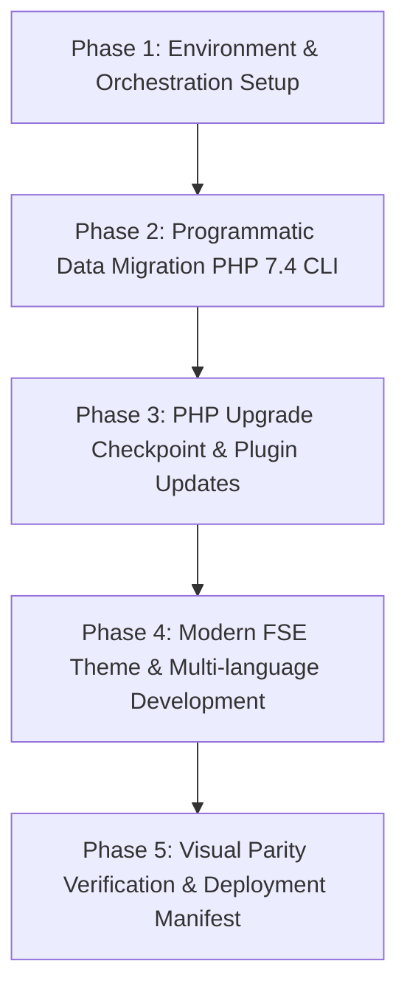

# TOPIC NAME: EKA-PORTAL
# ISSUE NAME: MIGRATION-AGY
# Implementation Plan: EKA Portal Technical Modernization & Migration

## 1. Overview & Objective
This plan outlines the vertical, script-driven technical migration and block theme modernization for the Greek Community of Alexandria portal (`ekalexandria.org`) into the `ekalexandria-flagship` WordPress Full Site Editing (FSE) block theme.

All data processing is automated via WP-CLI PHP scripts and pre-scoped JSON datasets (`ai-work/scopings/`), avoiding manual AI database rewrites or heavy LLM context bloat.

---

## 2. Dependency Graph & Phase Sequencing

### Phase Details & Vertical Slice Dependencies:
1. **Phase 1 (Environment & Scaffolding):** Pre-flight validation -> Node dependencies -> Playwright baseline screenshots -> Scaffold `inc/cli-commands.php` and `inc/custom-features.php`.
2. **Phase 2 (Scripted Data Migration):** CPT Registrations (`alx_tachydromos`, `board_member`) -> Scripted Tachydromos migration -> Scripted Board migration -> Layer/Revolution Slider replacement -> Sub-navigation cleanup -> Deactivate legacy plugins.
3. **Phase 3 (Environment Upgrade Checkpoint):** User HALT for PHP 7.4 -> PHP 8.2 upgrade -> Plugin update via WP-CLI -> Preserve routing & permalinks.
4. **Phase 4 (Theme & Features):** SCSS styling framework -> FSE block templates & Polylang template parts -> RTL support -> Mailchimp form re-engineering -> Search restoration.
5. **Phase 5 (Verification & Deployment):** Playwright visual regression audit -> Production asset build -> Deployment manifest generation.

---

## 3. Detailed Phase Breakdown & Verification Protocol

### Phase 1: Environment & Orchestration Setup
- **Task 1.1: Update & Execute `bin/reset-env.sh`**
  - *Action:* Update `bin/reset-env.sh` to purge failed migration attempt artifacts from the theme directory while strictly preserving `ai-work/` (spec & scoping files), `tasks/` (containing `legacy_data.md`), and project roadmaps (`Master Project Roadmap...`). Execute `bin/reset-env.sh` to restore clean staging state. Verify PHP 7.4 CLI routing (`php7.4 $(which wp)`), ImageMagick, Ghostscript, and ImageMagick policy rights.
  - *Verification:* `reset-env.sh` cleans environment while preserving `ai-work/` and `tasks/`; WP-CLI runs under PHP 7.4 without errors.
- **Task 1.2: Verify Development Orchestration (Reuse Existing)**
  - *Action:* Check if orchestration dependencies (`node_modules`, `package.json`, `@wordpress/scripts`, `playwright` with `ignoreHTTPSErrors: true`) are already installed. Skip redundant re-installation if `node_modules` exists; only install missing packages if needed.
  - *Verification:* `node_modules` verified; Playwright HTTPS bypass confirmed.
- **Task 1.3: Baseline Screenshot Scrape**
  - *Action:* Run Playwright script to capture baseline screenshots of Greek, English, and Arabic live pages into `ai-work/baselines/`.
  - *Verification:* Baseline images present in `ai-work/baselines/`.
- **Task 1.4: Scaffolding Custom CLI & Theme Hooks**
  - *Action:* Verify or scaffold `inc/cli-commands.php` and `inc/custom-features.php` in the theme directory.
  - *Verification:* `wp eka` CLI command namespace is registered without PHP errors.

### Phase 2: Programmatic Data Migration (PHP 7.4 CLI)
- **Task 2.1: Alexandrinos Tachydromos CPT & Meta Registration**
  - *Action:* Register `alx_tachydromos` post type (`show_in_rest => true`, rewrite slug `αλεξανδρινός-ταχυδρόμος`) and `_eka_pdf_filename` meta field in `inc/custom-features.php`.
  - *Verification:* `wp post-type list` displays `alx_tachydromos`.
- **Task 2.2: Tachydromos WP-CLI Migration Script**
  - *Action:* Build `wp eka migrate-tachydromos` reading `ai-work/scopings/tachydromos-scoping.json`. Map title `[Month] [YYYY]`, reassign existing attachment IDs, set `post_date`, serialize `core/file` block, enforce idempotency via `_eka_pdf_filename`.
  - *Verification:* `wp eka migrate-tachydromos` runs cleanly; post count matches JSON items; re-running skips existing items.
- **Task 2.3: Board of Directors CPT & Polylang Mapping**
  - *Action:* Register `board_member` post type (`publicly_queryable => false`, `menu_order` support) and `_eka_legacy_id` meta field.
  - *Verification:* Post type registered; non-queryable on frontend.
- **Task 2.4: Board of Directors WP-CLI Migration Script**
  - *Action:* Build `wp eka migrate-board` reading testimonials data. Save title, image, menu order, and link trilingual translations using `pll_save_post_translations`.
  - *Verification:* `wp eka migrate-board` runs cleanly; Polylang relationships verified via `pll_get_post`.
- **Task 2.5: Slider Mitigation Script (Layer & Revolution Sliders)**
  - *Action:* Build `wp eka replace-sliders` reading `ai-work/scopings/layer-sliders-scoping.json` and `ai-work/scopings/legacy_data.md` / `legacy-ids.json`. Replace dynamic sliders with Query Loops and static sliders with native `core/gallery` blocks containing pre-extracted Media IDs.
  - *Verification:* Targeted post contents updated; shortcodes replaced with block HTML; AST parser validates clean serialization.
- **Task 2.6: Sub-Navigation & Shortcode Remediation**
  - *Action:* Replace legacy BeTheme shortcodes and sidebar CPT references with native core Query Loops and Navigation blocks.
  - *Verification:* Shortcodes stripped cleanly; template parts handle sub-navigation cleanly.
- **Task 2.7: Legacy Plugin Deactivation & Environment Cleanliness**
  - *Action:* Execute `bin/cleanup-plugins.sh` to remove LayerSlider, JS Composer, and unneeded legacy plugins safely.
  - *Verification:* `wp plugin list --status=active` displays clean minimal plugin set.

---

### Phase 3: PHP Upgrade Checkpoint & Plugin Updates
- **Task 3.1: Developer Checkpoint (PHP 7.4 -> PHP 8.2)**
  - *Action:* Pause execution and present status report to USER for system PHP switch (`sudo update-alternatives --config php`). Wait for explicit user confirmation.
  - *Verification:* `php -v` outputs PHP 8.2.x.
- **Task 3.2: WP-CLI Plugin Updates (Post-PHP 8.2)**
  - *Action:* Run `wp plugin update --all` under PHP 8.2.
  - *Verification:* All active plugins updated without compatibility notices.
- **Task 3.3: Routing & Permalink Integrity Verification**
  - *Action:* Flush rewrite rules (`wp rewrite flush`) and verify all primary URLs resolve to 200 OK (no 404s).
  - *Verification:* `wp option get permalink_structure` returns legacy structure (`/%postname%/`); zero 404s.

---

### Phase 4: Modern FSE Theme & Multi-language Development
- **Task 4.1: Modern Design System & Token Configuration (`theme.json` + SCSS)**
  - *Action:* Configure `theme.json` color palette, typography (Inter/Roboto), and layout constraints based on `ai-work/scopings/styles.json`. Scaffold modular SCSS under `assets/scss/`.
  - *Verification:* `npm run build:css:prod` compiles cleanly without CSS warnings.
- **Task 4.2: Scaffolding Language-Specific FSE Templates & Parts**
  - *Action:* Scaffold language variations in `templates/` and `parts/` (`front-page-el.html`, `front-page-en.html`, `front-page-ar.html`, `header-ar.html`, etc.) integrating native block Query Loops.
  - *Verification:* Templates render correctly in Block Editor & frontend per language.
- **Task 4.3: Right-to-Left (RTL) SCSS Framework**
  - *Action:* Implement `assets/scss/rtl.scss` and verify logical property overrides (`margin-inline-start`, `padding-inline-end`).
  - *Verification:* Arabic version displays correct RTL alignment and layout parity.
- **Task 4.4: Mailchimp Newsletter Block Re-engineering**
  - *Action:* Replace legacy Mailchimp shortcode with native form block or clean REST API endpoint integration, eliminating composer cache errors.
  - *Verification:* Test submission validates payload; form renders cleanly.
- **Task 4.5: Search System & Results Page Restoration**
  - *Action:* Build functional `search.html` template and connect header search modal trigger.
  - *Verification:* Submitting a search query returns formatted block results.

---

### Phase 5: Verification & Deployment Manifest
- **Task 5.1: Automated Playwright Visual Parity Audit**
  - *Action:* Run Playwright visual regression test comparing active FSE renders against `ai-work/baselines/`.
  - *Verification:* Visual diff report shows 1:1 layout match.
- **Task 5.2: Production Asset Bundle Optimization**
  - *Action:* Run `npm run build` to generate minified CSS/JS production assets.
  - *Verification:* Build succeeds; `build/` assets ready; `node_modules` excluded from theme distribution.
- **Task 5.3: Deployment Manifest & Cutover Script Generation**
  - *Action:* Write `ai-work/deployment_manifest.md` and `wp eka production-cutover` CLI command for live execution.
  - *Verification:* Manifest verified; cutover script tested on staging clone.

---

## 4. Git Workflow & Commit Strategy
Every single task follows the strict `/build` loop: **Implement → Verify → Commit → Check-off**.
- **Commit Format:** `feat(migration): [Task Title] - [Short description]`
- **Branch Strategy:** Standard main branch development with atomic commits per task.

---

## 5. Token Cost & Optimization Analysis

### Estimated AI Token Usage & Cost Model (Script-First Execution)
*Pricing Baseline: $2.50 per 1M Input Tokens / $10.00 per 1M Output Tokens*

| Phase | Input Tokens (Est.) | Output Tokens (Est.) | Est. Cost ($) | Optimization / Cost Reduction Notes |
| :--- | :--- | :--- | :--- | :--- |
| **Phase 1: Environment & Scaffolding** | 30,000 | 4,000 | $0.115 | Reuse existing orchestration & update `reset-env.sh`. |
| **Phase 2: Programmatic Data Migration** | 60,000 | 8,000 | $0.230 | Read pre-scoped JSON files (`scopings/`) via PHP WP-CLI scripts; zero raw DB ingestion. |
| **Phase 3: PHP Upgrade Checkpoint** | 15,000 | 1,500 | $0.052 | Single prompt pause/resume checkpoint; minimal context overhead. |
| **Phase 4: FSE Theme & Multi-language** | 80,000 | 10,000 | $0.300 | Direct template block scaffolding & modular SCSS compilation. |
| **Phase 5: Verification & Deployment** | 25,000 | 3,000 | $0.092 | Automated Playwright CLI audit & direct bundle verification. |
| **TOTAL ESTIMATE** | **210,000** | **26,500** | **~$0.79** | **Script-first design saves ~95% token overhead vs manual AI context processing.** |

---

## 6. Execution Safeguards & Rules Checklist
- [x] **No Inline Styles:** All CSS strictly compiled via SCSS (`@wordpress/scripts`).
- [x] **Strict CLI PHP 7.4 Routing:** Enforce `php7.4 $(which wp)` until Phase 3 switch.
- [x] **No 60GB Media Downloads:** Use existing Nginx media proxying; reassign DB attachment IDs.
- [x] **Idempotent Operations:** All migration scripts tag posts with meta (`_eka_pdf_filename`, `_eka_legacy_id`).
- [x] **Halt on Error / Ambiguity:** Pause immediately and present 2 options if blocking issues arise.
