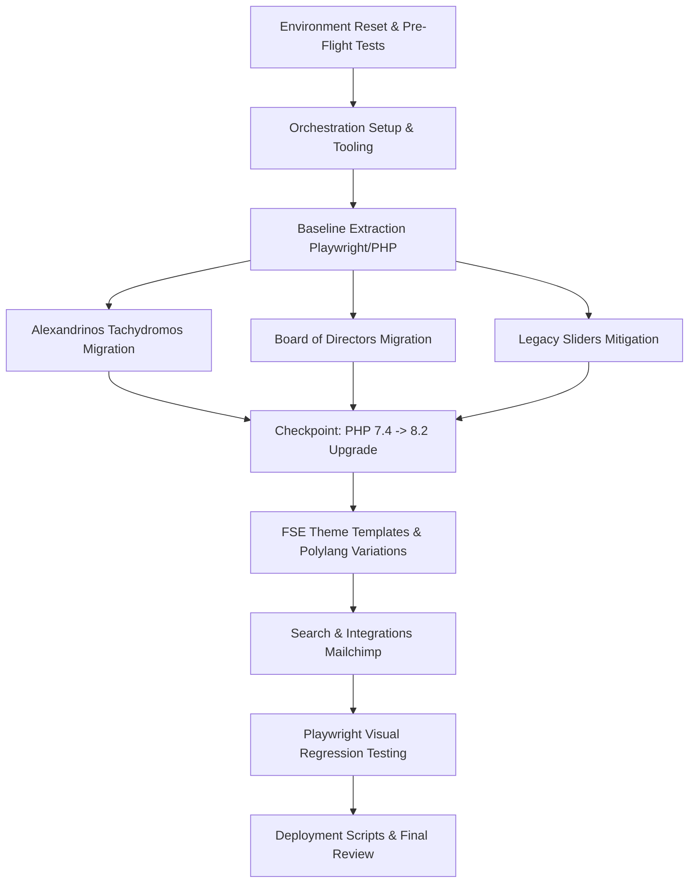

# Planning: EKA-PORTAL - MIGRATION-AGY

## 1. Dependency Graph

## 2. Vertical Slices & Acceptance Criteria

### Phase 1: Environment & Extraction (Infrastructure)
**Task 1.1: Pre-Flight Test & Reset Environment**
- **Action**: Write `reset-env.sh` and a PHP pre-flight script.
- **Verification**: Script successfully validates WP-CLI, PHP 7.4, Node.js, `imagick` with PDF read/write enabled, and Ghostscript. Staging DB/plugins are synced from production.

**Task 1.2: Orchestration Layer Setup**
- **Action**: Write `setup-orchestration.sh`.
- **Verification**: `npm init -y` succeeds, `@wordpress/scripts`, `playwright`, and `@wordpress/block-serialization-default-parser` are installed in the theme.

**Task 1.3: Baseline Scoping & Token Extraction**
- **Action**: Configure Playwright to scrape live legacy layouts for typography, colors, and layout tokens.
- **Verification**: `ai-work/scopings/styles.json` is populated with extracted design tokens.

### Phase 2: Vertical Migrations (Data & Architecture)
**Task 2.1: Alexandrinos Tachydromos System**
- **Action**: Register `alx_tachydromos` CPT. Write WP-CLI migration script (using PHP 7.4 path) to parse HTML, download PDFs via ImageMagick, generate thumbnails, map exact Greek issue dates, and output a `core/file` block layout.
- **Verification**: AST Serialization passes. Duplicate runs skip already migrated files (`_eka_pdf_filename`). PDF embeds render correctly on single post views.

**Task 2.2: Board of Directors System**
- **Action**: Register non-public `board_member` CPT. Write WP-CLI migration script to convert WPBakery testimonials.
- **Verification**: Members are ordered by `menu_order`. Polylang translations are properly bound (`pll_save_post_translations`). Duplicate runs skip (`_eka_legacy_id`).

**Task 2.3: Legacy Sliders & Block Mitigation**
- **Action**: Register a custom `core/gallery` block variation for static sliders. Write conversion script for dynamic sliders into Query Loop blocks.
- **Verification**: Static sliders maintain original image IDs. Dynamic sliders output clean native block HTML with title overlays.

**Task 2.7: Legacy Plugin Cleanup**
- **Action**: Identify and uninstall legacy plugins that are no longer needed (such as caching plugins or old page builders) and resolve any resulting deprecation notices or missing files (like object-cache.php).
- **Verification**: `wp plugin list` runs without errors and unnecessary plugins are removed safely.

### Phase 3: Checkpoint
**Task 3.1: PHP Upgrade Checkpoint**
- **Action**: Halt AI execution and instruct the human operator to upgrade PHP from 7.4 to 8.2 on the server.
- **Verification**: User confirms PHP 8.2 is active.

### Phase 4: Theme FSE Implementation
**Task 4.1: Polylang FSE Template Construction**
- **Action**: Scaffold `front-page-el`, `header-ar`, `footer-en`, `page-el` templates. Implement extracted tokens into `theme.json` and SCSS. Replace BeTheme sidebars with Native blocks.
- **Verification**: Language-specific menus and widgets load correctly on respective language pages. SCSS compiles successfully via `npm run build`.

**Task 4.2: RTL & Integration Re-engineering**
- **Action**: Implement RTL CSS for Arabic. Build native Search functionality. Re-engineer Mailchimp registration block.
- **Verification**: Arabic pages render right-to-left. Search returns accurate results. Mailchimp block submits securely.

### Phase 5: Verification & Deployment
**Task 5.1: Visual Regression & Deployment Script**
- **Action**: Run Playwright visual regression tests comparing staging to live. Write final live cutover script.
- **Verification**: Visual match is strictly 1:1. Cutover script successfully swaps theme and deactivates legacy plugins.

## 3. Git Workflow
- **Branching**: `feature/1-env-setup`, `feature/2-tachydromos-migration`, etc.
- **Commits**: Atomic commits following conventional commits (e.g., `feat: register board_member CPT`, `chore: add orchestration script`).
- **Pushing**: Push after every verified task to ensure state preservation.

## 4. Token Cost Estimation & Optimization
*Estimated utilizing industry standard AI context processing costs ($5.00 - $15.00 / 1M tokens).*

| Phase | Est. Token Usage | Cost Estimate (Input/Output) | Notes |
|-------|-----------------|------------------------------|-------|
| 1: Setup | 30,000 | ~$0.15 | Low complexity, script generation |
| 2: Migrations | 80,000 | ~$0.40 | High complexity logic, PDF processing |
| 3: Theme/FSE | 70,000 | ~$0.35 | SCSS, JSON scaffolding, RTL |
| 4: Testing/Deploy| 20,000 | ~$0.10 | Small scripts and Playwright |
| **Total** | **~200,000** | **~$1.00** | Highly optimized |

**Advise for Improvement:**
- **Avoid Large DB Dumps**: Do not pass full SQL dumps or WPBakery payloads into the AI context window. Instead, use localized PHP scripts to read them and extract metadata summaries into `ai-work/scopings/*.json`.
- **Session Isolation**: Start a new chat session for each Phase (e.g., one session for Phase 1, a fresh one for Phase 2). This prevents the context window from bloating with past, irrelevant tasks, keeping generation fast and costs low.
