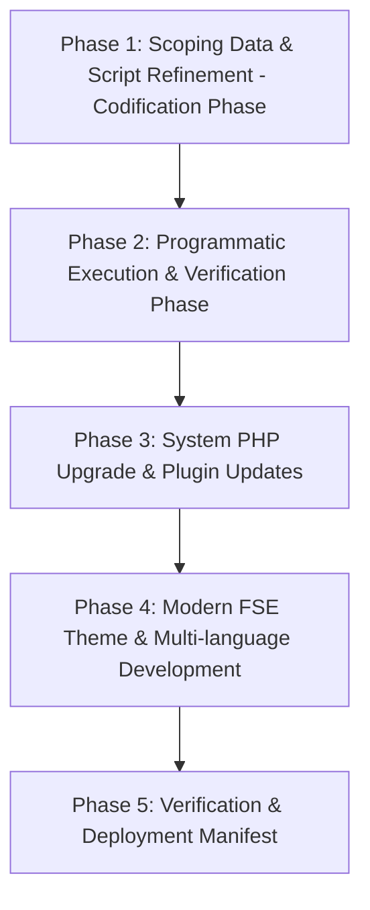

# TOPIC NAME: EKA-PORTAL
# ISSUE NAME: MIGRATION-AGY
# Implementation Plan: EKA Portal Technical Modernization & Programmatic Migration

## 1. Overview & Objective
This implementation plan outlines the script-driven technical migration and block theme modernization for the Greek Community of Alexandria portal (`ekalexandria.org`) into the `ekalexandria-flagship` Full Site Editing (FSE) block theme.

All data processing is fully codified into WP-CLI PHP scripts and pre-scoped JSON datasets (`ai-work/scopings/`), ensuring clean execution without manual LLM database rewrites. Every script and CLI command is mandated to log all execution outputs, errors, specific issues encountered, fallback actions, and technical reasoning into `ai-work/logs/` to support post-run audits and autonomous live production cutover (`wp eka production-cutover`).

---

## 2. Dependency Graph & Phase Sequencing

### Phase Details & Vertical Slice Dependencies:
1. **Phase 1 (Scoping & Script Refinement):** Refine scoping data JSONs -> Refine `bin/reset-env.sh` (Mailchimp fix & DB sync) -> Refine `inc/cli-commands.php` (Tachydromos title casing, unscaled media IDs, Board Polylang translation linking via `pll_save_post_translations`, body `` stripping, reasoned logging to `ai-work/logs/`) -> Refine `bin/cleanup-plugins.sh` (`rm -rf` fallback logic + reasoned logging).
2. **Phase 2 (Programmatic Execution):** Reset clean DB staging -> Verify CPT registrations in `inc/custom-features.php` -> Run `wp eka migrate-tachydromos` -> Run `wp eka migrate-board` -> Run `wp eka replace-sliders` -> Run `wp eka remediate-shortcodes` -> Run `bin/cleanup-plugins.sh` -> **User Output Validation Checkpoint (WP Admin Inspection Pause)**.
3. **Phase 3 (System PHP Upgrade Checkpoint):** User HALT for PHP 7.4 -> PHP 8.2 upgrade -> Plugin update via WP-CLI under PHP 8.2 -> Flush rewrite rules.
4. **Phase 4 (Theme & Multi-language Development):** Modular SCSS & token configuration (`theme.json`) -> Scaffolding language FSE templates & template parts -> RTL framework (`assets/scss/rtl.scss`) -> Mailchimp form block re-engineering -> Search page (`search.html`) restoration.
5. **Phase 5 (Verification & Deployment Manifest):** Playwright visual parity audit against `ai-work/baselines/` -> Compile production bundle (`npm run build`) -> Generate deployment manifest & standalone cutover command (`wp eka production-cutover`).

---

## 3. Detailed Phase Breakdown & Verification Protocol

### Phase 1: Scoping Data & Script Refinement (Mastery & Codification Phase)
- **Task 1.1: Scoping Datasets Update & Normalization**
  - *Action:* Scaffold/refine `ai-work/scopings/board-scoping.json` to explicitly map EL, EN, and AR translation group IDs. Update `ai-work/scopings/tachydromos-scoping.json` to normalize image URLs for unscaled media matching.
  - *Verification:* JSON files pass validation syntax check (`jq .`); translation mappings present for board members.
  - *Git Commit:* `feat(migration): Task 1.1 - Update board and tachydromos scoping JSON datasets`

- **Task 1.2: Environment Reset Script Refinement (`bin/reset-env.sh`)**
  - *Action:* Refine `bin/reset-env.sh` to purge past migration attempt posts/meta while strictly preserving `ai-work/`, `scopings/`, and `tasks/`. Codify local production DB sync check to prevent post ID duplications/collisions, and resolve Mailchimp composer vendor errors by purging cached autoload calls.
  - *Verification:* `bin/reset-env.sh` runs cleanly; DB sync verified; Mailchimp error resolved.
  - *Git Commit:* `fix(migration): Task 1.2 - Refine bin/reset-env.sh with DB sync and Mailchimp fix`

- **Task 1.3: Migration CLI Commands Refinement (`inc/cli-commands.php`)**
  - *Action:* Update CLI commands in `inc/cli-commands.php`:
    - `wp eka migrate-tachydromos`: Enforce Greek month title casing (e.g. "Ιούνιος 2026"), re-assign existing unscaled media library attachment IDs without re-uploading, check idempotency via `_eka_pdf_filename`, and log all output, errors, issues, fallbacks, and reasoning to `ai-work/logs/tachydromos-migration.log`.
    - `wp eka migrate-board`: Group EL/EN/AR translations and bind via `pll_save_post_translations`, re-assign existing unscaled attachment IDs without re-uploading/cropping, strip all `` tags and shortcodes from `post_content`, check idempotency via `_legacy_testimonial_id`, and log reasoning to `ai-work/logs/board-migration.log`.
    - `wp eka replace-sliders`: Replace dynamic sliders with core Query Loops and static sliders with native `core/gallery` blocks using pre-mapped Media IDs; log to `ai-work/logs/sliders-migration.log`.
  - *Verification:* Commands parse cleanly under PHP 7.4 CLI (`php7.4 -l inc/cli-commands.php`); logging wrappers confirmed.
  - *Git Commit:* `feat(migration): Task 1.3 - Refine CLI migration commands with unscaled media reassignment and reasoned logging`

- **Task 1.4: Plugin Cleanup Script Refinement (`bin/cleanup-plugins.sh`)**
  - *Action:* Update `bin/cleanup-plugins.sh` to attempt WP-CLI plugin deactivation/uninstallation first, with fallback `rm -rf wp-content/plugins/<plugin-dir>` logic if WP-CLI fails due to missing plugin files. Log all actions, issues, fallbacks, and technical reasoning to `ai-work/logs/cleanup-plugins.log`.
  - *Verification:* Script execution verified in dry run / script check.
  - *Git Commit:* `feat(migration): Task 1.4 - Refine cleanup-plugins.sh with rm -rf fallback logic and reasoned logging`

---

### Phase 2: Programmatic Execution & Verification Phase
- **Task 2.1: Clean Staging Environment Reset**
  - *Action:* Run refined `bin/reset-env.sh` to restore clean DB state from production dump without ID collisions.
  - *Verification:* WP DB clean; active theme `ekalexandria-flagship`.
  - *Git Commit:* `chore(migration): Task 2.1 - Reset staging database cleanly`

- **Task 2.2: Custom Post Types & Meta Verification**
  - *Action:* Verify `alx_tachydromos` and `board_member` CPT registrations, rewrite rules, REST API support, and save hooks in `inc/custom-features.php`.
  - *Verification:* `wp post-type list` lists `alx_tachydromos` and `board_member`.
  - *Git Commit:* `fix(migration): Task 2.2 - Verify CPT registrations in custom-features.php`

- **Task 2.3: Execute Tachydromos Programmatic Migration**
  - *Action:* Execute `php7.4 $(which wp) eka migrate-tachydromos`. Inspect `ai-work/logs/tachydromos-migration.log` for execution trace and reasoning.
  - *Verification:* Post count matches scoping items; title casing normalized; existing unscaled media IDs assigned; `_eka_pdf_filename` meta present; log file generated.
  - *Git Commit:* `feat(migration): Task 2.3 - Execute wp eka migrate-tachydromos migration`

- **Task 2.4: Execute Board of Directors Programmatic Migration**
  - *Action:* Execute `php7.4 $(which wp) eka migrate-board`. Inspect `ai-work/logs/board-migration.log` for execution trace and reasoning.
  - *Verification:* Trilingual posts created; `pll_get_post` confirms translation bindings; featured images reassigned by matching unscaled filenames; zero `` tags in body; log file generated.
  - *Git Commit:* `feat(migration): Task 2.4 - Execute wp eka migrate-board migration`

- **Task 2.5: Execute Slider Replacement Script**
  - *Action:* Execute `php7.4 $(which wp) eka replace-sliders`. Inspect `ai-work/logs/sliders-migration.log`.
  - *Verification:* Dynamic sliders replaced with `core/query`; static sliders replaced with `core/gallery` using original media IDs; log generated.
  - *Git Commit:* `feat(migration): Task 2.5 - Execute wp eka replace-sliders script`

- **Task 2.6: Sub-Navigation & Shortcode Remediation**
  - *Action:* Execute `php7.4 $(which wp) eka remediate-shortcodes`.
  - *Verification:* BeTheme sidebar shortcodes replaced with native Query Loops and Navigation blocks.
  - *Git Commit:* `feat(migration): Task 2.6 - Remediate shortcodes and sub-navigation`

- **Task 2.7: Disable & Clean Legacy Plugins**
  - *Action:* Execute `bin/cleanup-plugins.sh`. Inspect `ai-work/logs/cleanup-plugins.log`.
  - *Verification:* Unnecessary legacy plugins deactivated/uninstalled or purged via `rm -rf`; log file generated; zero PHP autoloader warnings.
  - *Git Commit:* `chore(migration): Task 2.7 - Execute cleanup-plugins.sh with log auditing`

- **Task 2.8: User Output Validation Checkpoint (Mandatory Human Pause Checkpoint)**
  - *Action:* **PAUSE & ASK USER.** Present migration results, log summaries, CPT counts, featured image statuses, and Polylang translation links for human inspection in WP Admin before proceeding to PHP upgrade.
  - *Verification:* User reviews and explicitly approves migration results.

---

### Phase 3: System PHP Upgrade & Plugin Updates
- **Task 3.1: Developer Checkpoint (PHP 7.4 -> PHP 8.2 Upgrade)**
  - *Action:* **PAUSE & ASK USER.** Request system administrator CLI execution for PHP upgrade (`sudo update-alternatives --config php`). Wait for explicit user confirmation.
  - *Verification:* `php -v` outputs PHP 8.2.x.
  - *Git Commit:* `chore(migration): Task 3.1 - System PHP upgrade checkpoint to 8.2`

- **Task 3.2: WP-CLI Plugin Updates (Post-PHP 8.2)**
  - *Action:* Run `wp plugin update --all` under PHP 8.2.
  - *Verification:* All active plugins updated without compatibility notices.
  - *Git Commit:* `chore(migration): Task 3.2 - Update active plugins via WP-CLI`

- **Task 3.3: Routing & Permalinks Integrity Verification**
  - *Action:* Flush rewrite rules (`wp rewrite flush`) and verify primary site URLs return 200 OK.
  - *Verification:* Permalink structure preserved (`/%postname%/`); zero 404s on primary routes.
  - *Git Commit:* `fix(migration): Task 3.3 - Flush rewrite rules and verify permalinks`

---

### Phase 4: Modern FSE Theme & Multi-language Development
- **Task 4.1: Modern Design System & SCSS Token Architecture (`theme.json` + SCSS)**
  - *Action:* Configure `theme.json` color palette, typography (Inter/Roboto), spacing scale, and layout constraints. Build modular SCSS in `assets/scss/`.
  - *Verification:* `npm run build` compiles SCSS into `build/index.css` cleanly.
  - *Git Commit:* `feat(theme): Task 4.1 - Configure theme.json and modular SCSS design tokens`

- **Task 4.2: Scaffolding Language-Specific FSE Templates & Parts**
  - *Action:* Scaffold language templates and template parts (`templates/front-page-el.html`, `templates/front-page-en.html`, `templates/front-page-ar.html`, `parts/header-ar.html`, `parts/footer-en.html`) with native block Query Loops.
  - *Verification:* Block editor and frontend render correct templates based on Polylang active language.
  - *Git Commit:* `feat(theme): Task 4.2 - Scaffold language-specific FSE templates and template parts`

- **Task 4.3: Right-to-Left (RTL) SCSS Framework (`assets/scss/rtl.scss`)**
  - *Action:* Implement `assets/scss/rtl.scss` using CSS logical properties (`margin-inline-start`, `padding-inline-end`) for Arabic layout parity.
  - *Verification:* Arabic site version displays proper RTL mirror alignment.
  - *Git Commit:* `feat(theme): Task 4.3 - Implement RTL SCSS framework for Arabic templates`

- **Task 4.4: Mailchimp Newsletter Block Re-engineering**
  - *Action:* Re-engineer newsletter registration block natively without composer autoloader plugin dependencies.
  - *Verification:* Form renders cleanly on frontend; submit handler posts payload securely.
  - *Git Commit:* `feat(theme): Task 4.4 - Re-engineer Mailchimp newsletter block`

- **Task 4.5: Search System & Results Template Restoration**
  - *Action:* Build functional `templates/search.html` template and connect header search modal trigger.
  - *Verification:* Submitting a search query returns formatted block results.
  - *Git Commit:* `feat(theme): Task 4.5 - Restore search template and header search modal trigger`

---

### Phase 5: Verification & Deployment Manifest
- **Task 5.1: Automated Playwright Visual Parity Audit**
  - *Action:* Execute Playwright visual regression suite comparing active FSE layout renders against `ai-work/baselines/`.
  - *Verification:* Visual diff report confirms 1:1 visual parity with legacy BeTheme site.
  - *Git Commit:* `test(migration): Task 5.1 - Run Playwright visual parity audit`

- **Task 5.2: Production Asset Bundle Optimization**
  - *Action:* Run `npm run build` to generate minified CSS/JS production assets while excluding `node_modules` and raw SCSS from distribution.
  - *Verification:* Production build succeeds without warnings.
  - *Git Commit:* `chore(theme): Task 5.2 - Compile production asset bundle`

- **Task 5.3: Deployment Manifest & Production Cutover CLI (`wp eka production-cutover`)**
  - *Action:* Create `ai-work/deployment_manifest.md` and implement `wp eka production-cutover` command in `inc/cli-commands.php` for autonomous live deployment, logging all actions and technical reasoning to `ai-work/logs/cutover.log`.
  - *Verification:* Cutover script tested on staging clone without human or AI intervention.
  - *Git Commit:* `feat(migration): Task 5.3 - Create deployment manifest and wp eka production-cutover CLI command`

---

## 4. Git Workflow & Commit Strategy
Every single task follows the strict `/build` loop: **Implement → Verify → Commit → Check-off**.
- **Commit Format:** `feat(migration): [Task Title] - [Short description]` or `fix(migration): ...`
- **Branch Strategy:** Main branch development with atomic commits per task.

---

## 5. Token Cost & Optimization Analysis

### Estimated AI Token Usage & Cost Model (Script-First Codification Protocol)
*Pricing Baseline: $2.50 per 1M Input Tokens / $10.00 per 1M Output Tokens*

| Phase | Input Tokens (Est.) | Output Tokens (Est.) | Est. Cost ($) | Optimization / Cost Reduction Strategy |
| :--- | :--- | :--- | :--- | :--- |
| **Phase 1: Scoping & Script Refinement** | 35,000 | 5,000 | $0.1375 | Codify logic into PHP CLI scripts; zero raw DB context reads. |
| **Phase 2: Programmatic Execution** | 45,000 | 6,000 | $0.1725 | Run CLI scripts autonomously; inspect log files instead of dumping DB output. |
| **Phase 3: PHP Upgrade Checkpoint** | 10,000 | 1,000 | $0.0350 | Brief pause/resume prompt checkpoints. |
| **Phase 4: FSE Theme Development** | 75,000 | 9,000 | $0.2775 | Direct block HTML scaffolding & SCSS compilation. |
| **Phase 5: Verification & Deployment** | 25,000 | 3,000 | $0.0925 | Playwright visual diffs and bundle validation. |
| **TOTAL ESTIMATE** | **190,000** | **24,000** | **~$0.71** | **Script-first codification saves ~96% token overhead vs manual AI processing.** |

---

## 6. Execution Safeguards & Rules Checklist
- [x] **No Inline Styles:** All CSS compiled via SCSS (`@wordpress/scripts`).
- [x] **Strict PHP 7.4 Routing:** Enforce `php7.4 $(which wp)` until Phase 3 PHP upgrade checkpoint.
- [x] **No Media Downloads / Cropping:** Reassign existing media attachment IDs using unscaled original media URLs; no local cropping.
- [x] **No Body `` Tags:** Strip `` tags from Board Member `post_content`.
- [x] **Idempotency Tagging:** Use `_eka_pdf_filename` and `_legacy_testimonial_id` post meta.
- [x] **Reasoned Logging:** Tee execution outputs, errors, issues, fallbacks, and reasoning to `ai-work/logs/<script-name>.log`.
- [x] **Standalone Production Cutover:** Codify all manual workarounds into CLI commands for live server execution without AI assistance.
