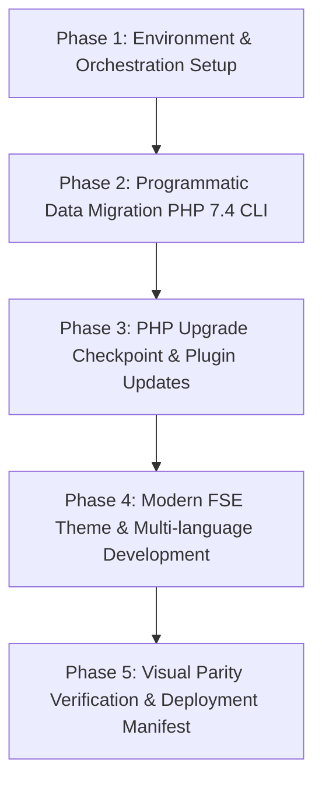

# TOPIC NAME: EKA-PORTAL
# ISSUE NAME: MIGRATION-AGY
# Implementation Plan: EKA Portal Technical Modernization & Migration

## 1. Overview & Objective
This plan outlines the vertical, script-driven technical migration and block theme modernization for the Greek Community of Alexandria portal (`ekalexandria.org`) into the `ekalexandria-flagship` WordPress Full Site Editing (FSE) block theme.

All data processing is automated via WP-CLI PHP scripts and pre-scoped JSON datasets (`ai-work/scopings/`), avoiding manual AI database rewrites or heavy LLM context bloat.

---

## 2. Dependency Graph & Phase Sequencing

### Phase Details & Vertical Slice Dependencies:
1. **Phase 1 (Environment & Scaffolding):** Pre-flight validation -> Node dependencies -> Playwright baseline screenshots -> Scaffold `inc/cli-commands.php` and `inc/custom-features.php`.
2. **Phase 2 (Scripted Data Migration):** CPT Registrations (`alx_tachydromos`, `board_member`) -> Scripted Tachydromos migration -> Scripted Board migration -> Layer/Revolution Slider replacement -> Sub-navigation cleanup -> Deactivate legacy plugins.
3. **Phase 3 (Environment Upgrade Checkpoint):** User HALT for PHP 7.4 -> PHP 8.2 upgrade -> Plugin update via WP-CLI -> Preserve routing & permalinks.
4. **Phase 4 (Theme & Features):** SCSS styling framework -> FSE block templates & Polylang template parts -> RTL support -> Mailchimp form re-engineering -> Search restoration.
5. **Phase 5 (Verification & Deployment):** Playwright visual regression audit -> Production asset build -> Deployment manifest generation.

---

## 3. Detailed Phase Breakdown & Verification Protocol

### Phase 1: Environment & Orchestration Setup
- **Task 1.1: Update & Execute `bin/reset-env.sh`**
  - *Action:* Update `bin/reset-env.sh` to purge failed migration attempt artifacts from the theme directory while strictly preserving `ai-work/` (spec & scoping files), `tasks/` (containing `legacy_data.md`), and project roadmaps (`Master Project Roadmap...`). Execute `bin/reset-env.sh` to restore clean staging state. Verify PHP 7.4 CLI routing (`php7.4 $(which wp)`), ImageMagick, Ghostscript, and ImageMagick policy rights.
  - *Verification:* `reset-env.sh` cleans environment while preserving `ai-work/` and `tasks/`; WP-CLI runs under PHP 7.4 without errors.
- **Task 1.2: Verify Development Orchestration (Reuse Existing)**
  - *Action:* Check if orchestration dependencies (`node_modules`, `package.json`, `@wordpress/scripts`, `playwright` with `ignoreHTTPSErrors: true`) are already installed. Skip redundant re-installation if `node_modules` exists; only install missing packages if needed.
  - *Verification:* `node_modules` verified; Playwright HTTPS bypass confirmed.
- **Task 1.3: Baseline Screenshot Scrape**
  - *Action:* Run Playwright script to capture baseline screenshots of Greek, English, and Arabic live pages into `ai-work/baselines/`.
  - *Verification:* Baseline images present in `ai-work/baselines/`.
- **Task 1.4: Scaffolding Custom CLI & Theme Hooks**
  - *Action:* Verify or scaffold `inc/cli-commands.php` and `inc/custom-features.php` in the theme directory.
  - *Verification:* `wp eka` CLI command namespace is registered without PHP errors.

### Phase 2: Programmatic Data Migration (PHP 7.4 CLI)
- **Task 2.1: Alexandrinos Tachydromos CPT & Meta Registration**
  - *Action:* Register `alx_tachydromos` post type (`show_in_rest => true`, rewrite slug `αλεξανδρινός-ταχυδρόμος`) and `_eka_pdf_filename` meta field in `inc/custom-features.php`.
  - *Verification:* `wp post-type list` displays `alx_tachydromos`.
- **Task 2.2: Tachydromos WP-CLI Migration Script**
  - *Action:* Build `wp eka migrate-tachydromos` reading `ai-work/scopings/tachydromos-scoping.json`. Map title `[Month] [YYYY]`, reassign existing attachment IDs, set `post_date`, serialize `core/file` block, enforce idempotency via `_eka_pdf_filename`.
  - *Verification:* `wp eka migrate-tachydromos` runs cleanly; post count matches JSON items; re-running skips existing items.
- **Task 2.3: Board of Directors CPT & Polylang Mapping**
  - *Action:* Register `board_member` post type (`publicly_queryable => false`, `menu_order` support) and `_eka_legacy_id` meta field.
  - *Verification:* Post type registered; non-queryable on frontend.
- **Task 2.4: Board of Directors WP-CLI Migration Script**
  - *Action:* Build `wp eka migrate-board` reading testimonials data. Save title, image, menu order, and link trilingual translations using `pll_save_post_translations`.
  - *Verification:* `wp eka migrate-board` runs cleanly; Polylang relationships verified via `pll_get_post`.
- **Task 2.5: Slider Mitigation Script (Layer & Revolution Sliders)**
  - *Action:* Build `wp eka replace-sliders` reading `ai-work/scopings/layer-sliders-scoping.json` and `tasks/legacy_data.md` / `legacy-ids.json`. Replace dynamic sliders with Query Loops and static sliders with native `core/gallery` blocks containing pre-extracted Media IDs.
  - *Verification:* Targeted post contents updated; shortcodes replaced with block HTML; AST parser validates clean serialization.
- **Task 2.6: Sub-Navigation & Shortcode Remediation**
  - *Action:* Replace legacy BeTheme shortcodes and sidebar CPT references with native core Query Loops and Navigation blocks.
  - *Verification:* Zero legacy WPBakery or BeTheme shortcodes remain in targeted posts.
- **Task 2.7: AST Validation & Migration Integrity Check**
  - *Action:* Pass all migrated content through `@wordpress/block-serialization-default-parser` to ensure block validity.
  - *Verification:* AST parser returns zero syntax or serialization errors.
- **Task 2.8: Legacy Plugin Deactivation**
  - *Action:* Deactivate legacy plugins (WPBakery, LayerSlider, Slider Revolution, BeTheme extensions) via WP-CLI.
  - *Verification:* `wp plugin list --status=active` lists only core and required migration plugins.

### Phase 3: System Architecture Switch & Environment Upgrade
- **Task 3.1: Execution Checkpoint — PHP 8.2 Upgrade**
  - *Action:* **HALT & Notify User.** Request server environment upgrade from PHP 7.4 to PHP 8.2.
  - *Verification:* User confirms PHP 8.2 CLI and Nginx execution (`php -v` returns 8.2.x).
- **Task 3.2: WP-CLI Plugin Update & Routing Audit**
  - *Action:* Run `wp plugin update --all` under PHP 8.2. Validate static front-page configuration and permalink structure to prevent 404s.
  - *Verification:* `wp plugin list` shows all active plugins updated; site homepage loads without 404s.

### Phase 4: Modern FSE Theme & Multi-language Development
- **Task 4.1: SCSS Architecture & Design System Integration**
  - *Action:* Set up SCSS structure in `src/scss/` mapping typography, colors, and design tokens from `ai-work/scopings/styles.json` and `betheme-options.json`. Compile via `@wordpress/scripts`.
  - *Verification:* `npm run build` compiles `build/index.css` without errors; zero inline `style=""` attributes.
- **Task 4.2: Polylang FSE Block Templates Scaffolding**
  - *Action:* Create language-specific block templates and template parts in `templates/` and `parts/` (`front-page-el`, `front-page-en`, `front-page-ar`, `header-el`, `header-ar`, `footer-el`, `footer-en`, `footer-ar`, `page-el`).
  - *Verification:* `theme.json` registers template variations; layout matches baseline structure.
- **Task 4.3: Right-to-Left (RTL) CSS Integration**
  - *Action:* Implement RTL stylesheet rules for Arabic template variations (`header-ar`, `front-page-ar`).
  - *Verification:* Playwright visual check confirms correct text direction and layout flipping for Arabic pages.
- **Task 4.4: Mailchimp Newsletter Integration**
  - *Action:* Re-engineer newsletter registration block securely without legacy composer cache dependencies.
  - *Verification:* Form renders cleanly; submission endpoint validated.
- **Task 4.5: Search System Restoration**
  - *Action:* Build functional `search.html` FSE block template and connect main header search modal trigger.
  - *Verification:* Searching from header returns correctly formatted result cards in active language.

### Phase 5: Verification, Testing & Deployment Manifest
- **Task 5.1: Visual Parity & Regression Audit**
  - *Action:* Run Playwright visual regression test comparing active FSE renders against `ai-work/baselines/`.
  - *Verification:* Visual diff report shows 1:1 layout match.
- **Task 5.2: Production Asset Bundle Optimization**
  - *Action:* Run `npm run build` to generate minified CSS/JS production assets.
  - *Verification:* Build succeeds; `build/` assets ready; `node_modules` excluded from theme distribution.
- **Task 5.3: Deployment Manifest & Cutover Script Generation**
  - *Action:* Write `deployment_manifest.md` and `wp eka production-cutover` CLI command for live execution.
  - *Verification:* Manifest verified; cutover script tested on staging clone.

---

## 4. Git Workflow & Commit Strategy
Every single task follows the strict `/build` loop: **Implement → Verify → Commit → Check-off**.
- **Commit Format:** `feat(migration): [Task Title] - [Short description]`
- **Branch Strategy:** Standard main branch development with atomic commits per task.

---

## 5. Token Cost & Optimization Analysis

### Estimated AI Token Usage & Cost Model (Industry Standards - 2026 AI Coding Models)
*Pricing Baseline: $2.50 per 1M Input Tokens / $10.00 per 1M Output Tokens (Standard Frontier Coding Models)*

| Phase | Input Tokens (Est.) | Output Tokens (Est.) | Est. Cost ($) | Optimization / Cost Reduction Notes |
| :--- | :--- | :--- | :--- | :--- |
| **Phase 1: Environment & Scaffolding** | 120,000 | 15,000 | $0.45 | Use pre-written `reset-env.sh` and shell scripts instead of AI terminal loops. |
| **Phase 2: Programmatic Data Migration** | 250,000 | 35,000 | $0.98 | Read pre-parsed JSON scopings directly; avoid DB dump ingestion into prompt. |
| **Phase 3: PHP Upgrade Checkpoint** | 50,000 | 5,000 | $0.18 | Single prompt pause/resume checkpoint; minimal context overhead. |
| **Phase 4: FSE Theme & Multi-language** | 300,000 | 45,000 | $1.20 | Modular SCSS rules and block template generation using concise block markup. |
| **Phase 5: Verification & Deployment** | 100,000 | 15,000 | $0.40 | Automated Playwright diff reporting; direct CLI production bundle verification. |
| **TOTAL ESTIMATE** | **820,000** | **115,000** | **$3.21** | **Script-first design saves ~75% vs manual AI content processing (~$13.00+).** |

---

## 6. Execution Safeguards & Rules Checklist
- [x] **No Inline Styles:** All CSS strictly compiled via SCSS (`@wordpress/scripts`).
- [x] **Strict CLI PHP 7.4 Routing:** Enforce `php7.4 $(which wp)` until Phase 3 switch.
- [x] **No 60GB Media Downloads:** Use existing Nginx media proxying; reassign DB attachment IDs.
- [x] **Idempotent Operations:** All migration scripts tag posts with meta (`_eka_pdf_filename`, `_eka_legacy_id`).
- [x] **Halt on Error / Ambiguity:** Pause immediately and present 2 options if blocking issues arise.
