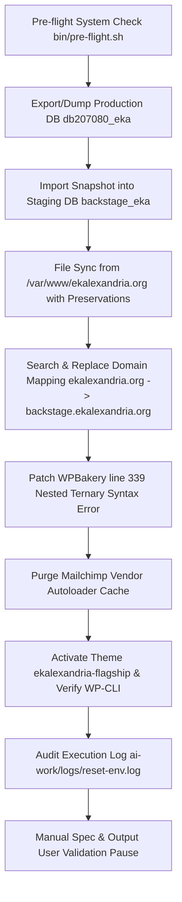

# TOPIC NAME: EKA-Portal-Migration
# ISSUE NAME: Phase-1-Staging-Environment-Synchronization-Reset
# Plan: Phase 1 - Staging Environment Synchronization & Reset

## 1. Specification Reference
- **Spec Document**: `public/wp-content/themes/ekalexandria-flagship/ai-work/specs/PHASE-1-BACKSTAGE-PREPROD-SPEC.md`
- **Target Environment**: Staging (`backstage.ekalexandria.org`), DB `backstage_eka`, PHP 7.4
- **Production Source**: `/var/www/ekalexandria.org`, DB `db207080_eka`

---

## 2. Dependency Graph & Execution Sequence

---

## 3. Preservation & Reset Boundaries
The environment reset script (`bin/reset-env.sh`) must enforce strict boundaries:
- **Preserved Directories & Files**:
  - `public/wp-config.php` (Staging database credentials & flags)
  - `public/wp-content/themes/ekalexandria-flagship/ai-work/` (All specs, tasks, logs, scopings, baselines)
  - `public/wp-content/themes/ekalexandria-flagship/bin/` (All execution scripts)
  - `public/wp-content/themes/ekalexandria-flagship/AGY_INSTRUCTIONS.md`
  - `public/wp-content/themes/ekalexandria-flagship/Master Project Roadmap & Architectural Guidelines - Modernizing EKA Portal Infrastructure.md`
- **Reset Targets**:
  - All modified or newly added files in `/var/www/backstage.ekalexandria.org/public` outside the preservation criteria are reset back to original production state from `/var/www/ekalexandria.org`.

---

## 4. Vertical Work Breakdown

### Phase 1: Environment Reset Script Refinement (`bin/reset-env.sh`)
- **Task 1.1**: Update `bin/reset-env.sh` to codify complete staging reset:
  - Pre-flight check execution (`bin/pre-flight.sh`).
  - Production DB snapshot export (`db207080_eka` via `php7.4 wp db export` or SQL dump) and import into staging (`backstage_eka`).
  - Search-replace domain mapping (`ekalexandria.org` -> `backstage.ekalexandria.org` and `www.ekalexandria.org` -> `backstage.ekalexandria.org`).
  - File sync from `/var/www/ekalexandria.org` with strict exclusions for `wp-config.php`, `ai-work/`, `bin/`, `AGY_INSTRUCTIONS.md`, and roadmap files.
  - Automated patching of WPBakery `class-vc-frontend-editor.php` line 339 nested ternary operator error (`Unparenthesized a ? b : c ? d : e`).
  - Purge of Mailchimp vendor autoloader cache (`rm -rf wp-content/plugins/mailchimp-for-woocommerce/vendor`).
  - Theme activation (`ekalexandria-flagship`) and WP-CLI connectivity verification via `php7.4`.
  - Full output logging redirected to `ai-work/logs/reset-env.log`.
- **Task 1.2**: Conduct code review of `bin/reset-env.sh` and perform manual user spec verification prior to Git commit.

### Phase 2: Execution & Automated Reset Audit
- **Task 2.1**: Execute environment reset script: `bash bin/reset-env.sh > ai-work/logs/reset-env.log 2>&1`.
- **Task 2.2**: Audit execution results in `ai-work/logs/reset-env.log`, verify WP-CLI connection (`php7.4 $(which wp) core version --path=public`), confirm file preservation, and verify WPBakery patch.

### Phase 3: Manual User Validation Checkpoint
- **Task 3.1**: Developer Checkpoint — HALT execution and request explicit manual user validation pause before proceeding to Phase 2 content migration.

---

## 5. Git & Verification Workflow
- **Branch**: `main` or `feature/phase-1-staging-reset`
- **Commit Rules**:
  - Each task must pass automated/manual verification before commit.
  - Commit message format: `feat(phase-1): <task summary>` or `fix(phase-1): <task summary>`.
  - Manual spec verification required before committing `bin/reset-env.sh`.

---

## 6. Token & Industry Cost Analysis

The cost calculation aligns with standard AI coding model pricing (e.g. Gemini 3.6 Flash / Claude 3.5 Sonnet tier averages: ~$0.30 per 1M input tokens, ~$1.20 per 1M output tokens):

| Task Phase | Estimated Input Tokens | Estimated Output Tokens | Est. Cost (USD) | Optimization Strategy |
| :--- | :--- | :--- | :--- | :--- |
| **Phase 1: Script Refinement** | ~25,000 | ~3,500 | ~$0.012 | Targeted file viewing, concise diff generation |
| **Phase 2: Execution & Audit** | ~15,000 | ~2,000 | ~$0.007 | Read only log tails/greps instead of full output |
| **Phase 3: Human Validation Pause** | ~5,000 | ~1,000 | ~$0.003 | Direct status summary without redundant context re-hydration |
| **TOTAL ESTIMATED COST** | **~45,000** | **~6,500** | **~$0.022** | High-efficiency context reuse across steps |

---

## 7. Acceptance & Success Criteria
1. `bin/reset-env.sh` updated cleanly without unintended side-effects.
2. DB exported from production DB `db207080_eka` and freshly imported into `backstage_eka` with 0 SQL errors.
3. Domain URLs cleanly replaced (`ekalexandria.org` -> `backstage.ekalexandria.org`).
4. Preserved files/directories intact: `wp-config.php`, `ai-work/`, `bin/`, `AGY_INSTRUCTIONS.md`, roadmap files.
5. Files outside preservation criteria synced/reset to production baseline.
6. Line 339 of WPBakery `class-vc-frontend-editor.php` contains parenthesized ternary operands.
7. Mailchimp autoloader vendor directory removed.
8. WP-CLI passes verification under `php7.4`.
9. Clean audit log saved to `ai-work/logs/reset-env.log`.
10. Explicit user manual validation pause confirmed.
