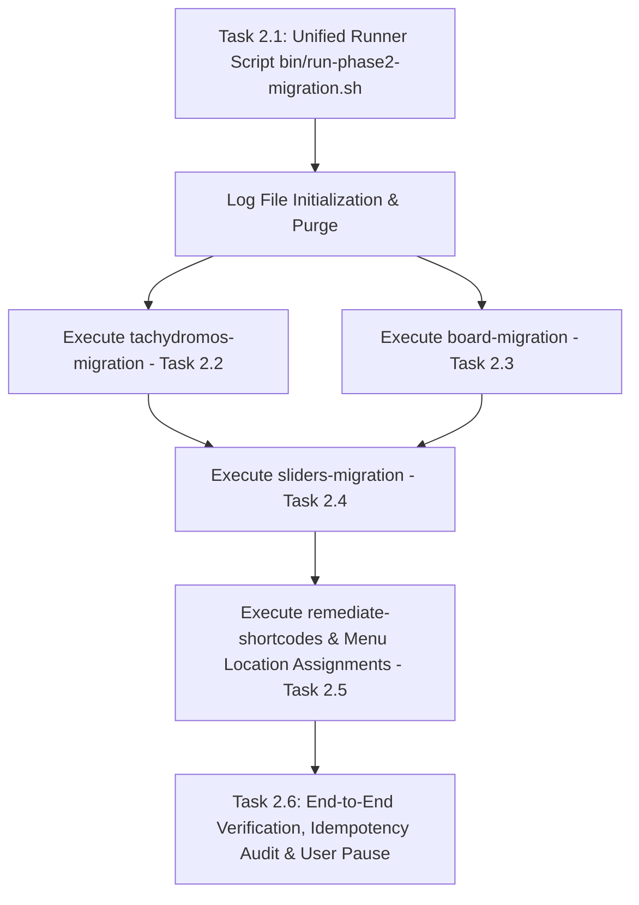

# Phase 2 Plan: Programmatic CPT Content, Shortcode & Menu Migration

**TOPIC NAME**: EKA Portal Migration  
**ISSUE NAME**: Phase 2 - Programmatic CPT Content, Shortcode & Menu Migration  
**SPEC FILE**: `ai-work/specs/PHASE-2-TACHYDROMOS-BOARD-MIGRATION-SPEC.md`  
**STATUS**: `[PLAN REVISED / READY FOR RUNNER CREATION]`  

---

## 1. Overview & Implementation Assessment

Phase 2 automates content migration, shortcode remediation, slider replacement, menu location assignments, and log management under **PHP 7.4**.

### Current Implementation Status Assessment
Analysis of existing WP-CLI subcommands in `inc/cli-commands.php` confirms:
* **Task 2.2 (`alx_tachydromos`)**: **ALREADY IMPLEMENTED** via `php7.4 $(which wp) eka migrate-tachydromos`.
* **Task 2.3 (`board_member`)**: **ALREADY IMPLEMENTED** via `php7.4 $(which wp) eka migrate-board`.
* **Task 2.4 (Sliders)**: **ALREADY IMPLEMENTED** via `php7.4 $(which wp) eka replace-sliders`.
* **Task 2.5 (Shortcodes & Sub-nav)**: **PARTIALLY IMPLEMENTED** — `php7.4 $(which wp) eka remediate-shortcodes` covers testimonial replacement, post grid replacement, shortcode stripping, and sidebar navigation injections. **Menu location assignments** (Greek Main: 13, English Main: 3315, Arabic Main: 3316, Greek Footer: 21) will be included in the unified runner script or menu assignment routine.

The primary task for Phase 2 implementation is creating the unified runner script `bin/run-phase2-migration.sh` that clears log files at startup, invokes all ready-made commands sequentially, assigns navigation menu locations, logs execution cleanly to `ai-work/logs/`, and enforces idempotency verification.

---

## 2. Dependency Graph & Architecture



---

## 3. Revised Tasks & Acceptance Criteria

### Task 2.1: Unified Runner Script Shell Creation & Log Purge (`bin/run-phase2-migration.sh`)
* **Deliverable**: `bin/run-phase2-migration.sh`
* **Rules & Log Clearing Mandate**:
  - At the very beginning of execution, the script **MUST purge/clear** all Phase 2 log files in `ai-work/logs/`:
    ```bash
    > ai-work/logs/phase2-unified-migration.log
    > ai-work/logs/tachydromos-migration.log
    > ai-work/logs/board-migration.log
    > ai-work/logs/sliders-migration.log
    > ai-work/logs/remediate-shortcodes.log
    > ai-work/logs/menu-assignments.log
    ```
  - Use `php7.4 $(which wp)` to invoke ready-made subcommands:
    - `eka migrate-tachydromos`
    - `eka migrate-board`
    - `eka replace-sliders`
    - `eka remediate-shortcodes`
  - Append menu location assignment commands (Greek Main: 13, English Main: 3315, Arabic Main: 3316, Greek Footer: 21).
  - Pipe overall master output to `ai-work/logs/phase2-unified-migration.log`.
* **Acceptance Criteria**:
  - `bin/run-phase2-migration.sh` is executable (`chmod +x`).
  - Executing script clears existing logs and generates fresh log files in `ai-work/logs/`.
* **Verification**:
  - Run `bash bin/run-phase2-migration.sh` and inspect created logs in `ai-work/logs/`.

### Task 2.2: Alexandrinos Tachydromos CPT Migration (Implemented)
* **Command**: `php7.4 $(which wp) eka migrate-tachydromos --path=public > ai-work/logs/tachydromos-migration.log 2>&1`
* **Status**: Implemented in `inc/cli-commands.php`. Invoked inside `bin/run-phase2-migration.sh`.
* **Rules**: 32 issues imported, title month case normalized, PDF `core/file` block embedded, unscaled attachment ID reassigned, `_eka_pdf_filename` metadata stored.

### Task 2.3: Board Members CPT Migration & Polylang Linking (Implemented)
* **Command**: `php7.4 $(which wp) eka migrate-board --path=public > ai-work/logs/board-migration.log 2>&1`
* **Status**: Implemented in `inc/cli-commands.php`. Invoked inside `bin/run-phase2-migration.sh`.
* **Rules**: Legacy testimonials imported, `` and `[vc_*]` tags stripped, unscaled thumbnails reassigned, `pll_save_post_translations` invoked, `_legacy_testimonial_id` stored.

### Task 2.4: Slider Replacement with Native Gutenberg Blocks (Implemented)
* **Command**: `php7.4 $(which wp) eka replace-sliders --path=public > ai-work/logs/sliders-migration.log 2>&1`
* **Status**: Implemented in `inc/cli-commands.php`. Invoked inside `bin/run-phase2-migration.sh`.
* **Rules**: 7 dynamic pages replaced with `core/query` loops; 14 static pages replaced with `core/gallery` blocks referencing mapped media IDs.

### Task 2.5: Shortcode Remediation & Navigation Menu Assignments (Partially Implemented)
* **Commands**: 
  - `php7.4 $(which wp) eka remediate-shortcodes --path=public > ai-work/logs/remediate-shortcodes.log 2>&1`
  - Menu location assignment routine (Greek Main: 13, English Main: 3315, Arabic Main: 3316, Greek Footer: 21) > `ai-work/logs/menu-assignments.log 2>&1`
* **Status**: Shortcode remediation & sidebar injections are implemented in `inc/cli-commands.php`. Navigation menu location assignments will be executed via WP-CLI inside `bin/run-phase2-migration.sh`.

### Task 2.6: End-to-End Unified Migration Verification, Idempotency Audit & User Pause
* **Command**: `bash bin/run-phase2-migration.sh > ai-work/logs/phase2-unified-migration.log 2>&1`
* **Detailed Explanation**:
  1. **First Execution Pass**: Execute `bin/run-phase2-migration.sh`. This purges old logs, runs all 4 CPT and content subcommands, assigns menu locations, and logs output.
  2. **Idempotency Verification Pass**: Re-run `bin/run-phase2-migration.sh` a second time. The script must complete cleanly without creating any duplicate posts, overwriting valid data, or throwing errors (all existing posts are skipped via metadata checks).
  3. **Log & Database Audit**: Check all log files in `ai-work/logs/` to verify zero fatal errors/warnings, check post counts (`alx_tachydromos` = 32, `board_member` = 25+), and verify 0 `` tags remain in board member content.
  4. **Manual User Validation Pause**: Upon successful verification, halt execution and present results to the user for explicit approval before proceeding to Phase 3.

---

## 4. Resource & Token Cost Estimation

| Task | Benchmark Token Range | Focus Area |
| :--- | :--- | :--- |
| **Task 2.1: Unified Runner Script & Log Purge** | 20,000 - 35,000 tokens | Create `bin/run-phase2-migration.sh` with log reset |
| **Task 2.2 - Task 2.5 Verification & Menu Setup** | 25,000 - 40,000 tokens | Add menu assignment routine and verify existing subcommands |
| **Task 2.6: End-to-End Audit & User Pause** | 25,000 - 35,000 tokens | Idempotency run, log checking, post count verification |
| **TOTAL ESTIMATED COST** | **70,000 - 110,000 tokens** | **~$0.15 - $0.35 USD** |

---

## 5. Git Workflow & Checkpoints

- **Branch**: `main`
- **Commit Strategy**:
  - `feat(migration): create bin/run-phase2-migration.sh unified runner script with log purge`
  - `chore(migration): verify phase 2 e2e migration idempotency and clean logging`
- **Checkpoint**: Manual user validation pause at completion of Phase 2 before transitioning to Phase 3.
