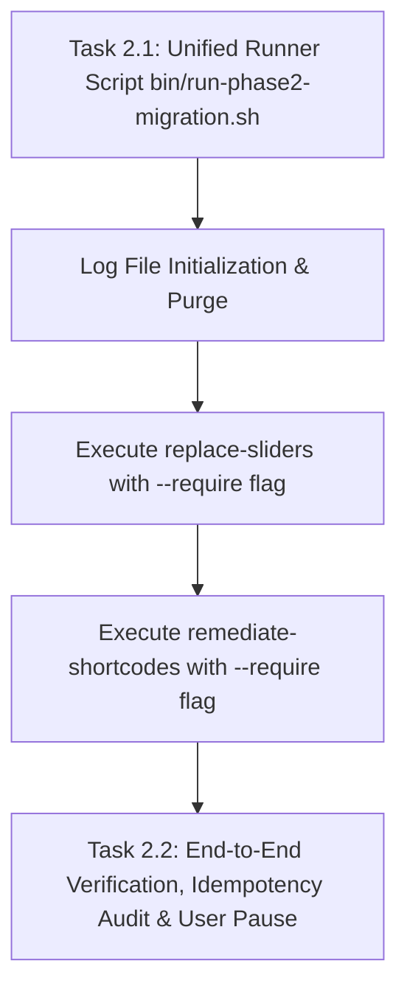

# Phase 2 Plan: Programmatic Shortcode Remediation & Slider Replacement

**TOPIC NAME**: EKA Portal Migration  
**ISSUE NAME**: Phase 2 - Programmatic Shortcode Remediation & Slider Replacement  
**SPEC FILE**: `ai-work/specs/PHASE-2-TACHYDROMOS-BOARD-MIGRATION-SPEC.md`  
**STATUS**: `[PLAN REVISED / READY FOR RUNNER CREATION]`  

---

## 1. Overview & Implementation Assessment

Phase 2 automates shortcode remediation and slider replacement under **PHP 7.4** without activating the flagship theme. Commands are executed via WP-CLI using `--require=wp-content/themes/ekalexandria-flagship/inc/cli-commands.php`.

### Scope
* **Slider Replacement (`eka replace-sliders`)**: Replaces homepage dynamic sliders with `core/query` loops and inner static sliders with `core/gallery` blocks.
* **Shortcode Remediation (`eka remediate-shortcodes`)**: Replaces `[testimonials]` and `[vc_posts_grid]` shortcodes with query loops, strips legacy VC/BeTheme shortcodes, and injects navigation sidebars into specified pages.

---

## 2. Dependency Graph & Architecture



---

## 3. Revised Tasks & Acceptance Criteria

### Task 2.1: Unified Runner Script Shell Creation & Execution (`bin/run-phase2-migration.sh`)
* **Deliverable**: `bin/run-phase2-migration.sh`
* **Rules & Log Clearing Mandate**:
  - At the very beginning of execution, the script **MUST purge/clear** log files in `ai-work/logs/`:
    ```bash
    > ai-work/logs/phase2-unified-migration.log
    > ai-work/logs/sliders-migration.log
    > ai-work/logs/remediate-shortcodes.log
    ```
  - Use `php7.4 $(which wp) --require=wp-content/themes/ekalexandria-flagship/inc/cli-commands.php` to invoke subcommands:
    - `eka replace-sliders`
    - `eka remediate-shortcodes`
  - Pipe overall master output to `ai-work/logs/phase2-unified-migration.log`.
* **Acceptance Criteria**:
  - `bin/run-phase2-migration.sh` is executable (`chmod +x`).
  - Executing script clears existing logs and generates fresh log files in `ai-work/logs/`.
* **Verification**:
  - Run `bash bin/run-phase2-migration.sh` and inspect created logs in `ai-work/logs/`.

### Task 2.2: End-to-End Unified Migration Verification, Idempotency Audit & User Pause
* **Command**: `bash bin/run-phase2-migration.sh > ai-work/logs/phase2-unified-migration.log 2>&1`
* **Detailed Explanation**:
  1. **First Execution Pass**: Execute `bin/run-phase2-migration.sh`.
  2. **Idempotency Verification Pass**: Re-run `bin/run-phase2-migration.sh` a second time to verify clean, error-free re-execution.
  3. **Log & Database Audit**: Check log files in `ai-work/logs/` for zero fatal errors.
  4. **Manual User Validation Pause**: Upon successful verification, halt execution and present results for explicit user approval before proceeding to Phase 3.

---

## 4. Resource & Token Cost Estimation

| Task | Benchmark Token Range | Focus Area |
| :--- | :--- | :--- |
| **Task 2.1: Unified Runner Script & Log Purge** | 15,000 - 25,000 tokens | Update `bin/run-phase2-migration.sh` with `--require` flag |
| **Task 2.2: End-to-End Audit & User Pause** | 15,000 - 25,000 tokens | Idempotency run, log checking |
| **TOTAL ESTIMATED COST** | **30,000 - 50,000 tokens** | **~$0.08 - $0.15 USD** |

---

## 5. Git Workflow & Checkpoints

- **Branch**: `main`
- **Commit Strategy**:
  - `feat(migration): update bin/run-phase2-migration.sh runner script for shortcodes and sliders`
- **Checkpoint**: Manual user validation pause at completion of Phase 2.

