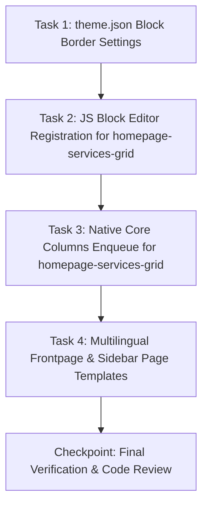

# Plan: FSE Theme Refinement - Internal Pages Styling, Multilingual Templates & Block Registration

**TOPIC NAME**: `FSE-THEME-REFINEMENT`  
**ISSUE NAME**: `INTERNAL-PAGES-STYLING-REGISTRATION`  
**SPEC**: `ai-work/specs/PHASE-7-FSE-INTERNAL-PAGES-STYLING-SPEC.md`  

---

## 1. Dependency Graph & Vertical Task Slicing

---

## 2. Tasks & Acceptance Criteria

### Task 1: `theme.json` Block Border Settings
- **Goal**: Enable border settings (`radius`, `style`, `width`) for `core/group` and `core/image` under `settings.blocks` in `theme.json`.
- **Files**: `theme.json`
- **Acceptance Criteria**:
  - `theme.json` validates with zero JSON syntax errors.
  - `settings.blocks` defines `core/group.border` and `core/image.border` properties.
- **Verification**: `php -r "json_decode(file_get_contents('theme.json')); echo json_last_error_msg();"` returns `No error`.
- **Git Commit**: `feat(theme.json): add core/group and core/image border settings`

### Task 2: JS Block Editor Registration for `eka/homepage-services-grid`
- **Goal**: Create editor JS script and enqueue via `enqueue_block_editor_assets` in `inc/blocks.php` to resolve FSE Site Editor missing block banner.
- **Files**:
  - `assets/js/blocks-editor.js`
  - `inc/blocks.php`
- **Acceptance Criteria**:
  - `assets/js/blocks-editor.js` registers `eka/homepage-services-grid` using `@wordpress/blocks` and `@wordpress/server-side-render`.
  - `inc/blocks.php` hooks `enqueue_block_editor_assets` loading `assets/js/blocks-editor.js` with `wp-blocks`, `wp-element`, `wp-server-side-render` dependencies.
- **Verification**: Verify script syntax (`node -c assets/js/blocks-editor.js`) and check editor registration.
- **Git Commit**: `feat(blocks): register eka/homepage-services-grid JS editor script`

### Task 3: Native Gutenberg Core Columns Enqueue for `eka/homepage-services-grid`
- **Goal**: Explicitly enqueue `wp-block-columns` style in `eka_render_homepage_services_grid()`.
- **Files**: `inc/blocks.php`
- **Acceptance Criteria**:
  - `wp_enqueue_style('wp-block-columns')` is called inside `eka_render_homepage_services_grid()`.
  - Grid renders using native Gutenberg column CSS without custom column SCSS.
- **Verification**: Validate `inc/blocks.php` PHP syntax (`php -l inc/blocks.php`).
- **Git Commit**: `feat(blocks): enqueue native wp-block-columns style for homepage-services-grid`

### Task 4: Multilingual Frontpage & Sidebar Page Templates
- **Goal**: Create/verify language variants for `front-page` and `page-parent-sidebar` (`el`, `en`, `ar`).
- **Files**:
  - `templates/front-page-el.html`
  - `templates/front-page-en.html`
  - `templates/front-page-ar.html`
  - `templates/page-parent-sidebar-el.html`
  - `templates/page-parent-sidebar-en.html`
  - `templates/page-parent-sidebar-ar.html`
- **Acceptance Criteria**:
  - Each language variant references matching language header (`header-el`, `header-en`, `header-ar`) and footer (`footer-el`, `footer-en`, `footer-ar`).
  - `page-parent-sidebar-*` templates feature 70% main content column + 30% sidebar column.
- **Verification**: Verify Gutenberg markup validity across all 6 template files.
- **Git Commit**: `feat(templates): add multilingual front-page and page-parent-sidebar templates`

---

## 3. Industry Standard Estimated Token & Resource Cost

| Phase / Task | Input Tokens | Output Tokens | Total Tokens | Estimated Cost (USD) |
| :--- | :--- | :--- | :--- | :--- |
| Task 1: `theme.json` Border Settings | ~12,000 | ~1,500 | ~13,500 | $0.002 |
| Task 2: JS Editor Registration | ~18,000 | ~2,500 | ~20,500 | $0.003 |
| Task 3: Core Columns Enqueue | ~10,000 | ~1,200 | ~11,200 | $0.002 |
| Task 4: Multilingual Templates | ~22,000 | ~3,500 | ~25,500 | $0.004 |
| Checkpoint & Review | ~15,000 | ~1,500 | ~16,500 | $0.002 |
| **Total Estimated Cost** | **~77,000** | **~10,200** | **~87,200** | **~$0.013** |

*Cost calculated based on industry standard AI model API rates for agentic coding.*

---

## 4. Git Workflow Strategy
- Single git branch: `master`.
- Strictly sequential commits following user review after each completed task.
