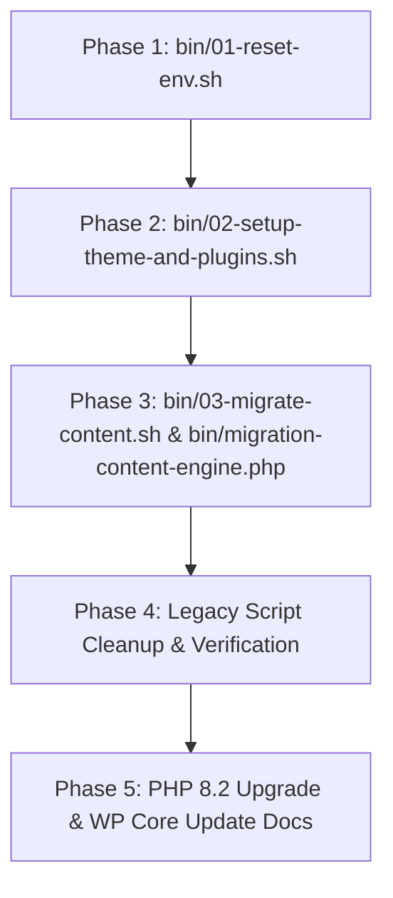

# Implementation Plan: Legacy WordPress Migration Strategy & Modular Pipeline Refactoring

- **SPEC FILE**: `ai-work/MIGRATION-CONSOLIDATION-SPEC.md`
- **TARGET ENVIRONMENT**: PHP 7.4 (CLI/WP-CLI) → PHP 8.2 Cutover

---

## 1. Executive Summary & Strategy

This plan consolidates all legacy WordPress database reset, CPT import, plugin cleanup, content transformation, and navigation menu assignment tasks into a deterministic, 3-stage modular pipeline (`bin/01-reset-env.sh`, `bin/02-setup-theme-and-plugins.sh`, `bin/03-migrate-content.sh`).

### Core Guarantees & Constraints:
1. **Zero Theme Bloat**: Migration scripts reside strictly in `bin/` and execute out-of-band via CLI / WP-CLI. `functions.php` and `inc/custom-features.php` remain clean FSE theme runtime files.
2. **Flagship Theme File Protection**: `bin/01-reset-env.sh` excludes `wp-content/themes/ekalexandria-flagship/***` from `rsync --delete` operations.
3. **Idempotency & AST Validation**: Content transformations validate structure via `eka_validate_blocks_ast()`.
4. **Log Hygiene**: Logs are truncated on startup and report exact conversion and error metrics.
5. **Strict Execution Order**: Reset (01) → Theme & Plugins / CPTs (02) → Content Transformations & Menus (03).

---

## 2. Dependency Graph & Architecture

---

## 3. Vertical Work Breakdown

### Task 1: Refactor Staging Environment Reset Script (`bin/01-reset-env.sh`)
- **Target File**: `bin/01-reset-env.sh` (derived from `bin/reset-env.sh`)
- **Key Changes**:
  - Truncate log `ai-work/logs/01-reset-env.log` on startup.
  - Run `bin/pre-flight.sh`.
  - Export live production DB snapshot to `/tmp/prod_db.sql`.
  - Drop & recreate `backstage_eka` DB; import `/tmp/prod_db.sql`.
  - Synchronize files with `rsync -av --delete` adding explicit flag: `--exclude='wp-content/themes/ekalexandria-flagship/***'`.
  - Apply ownership (`alexseif:www-data`) and permissions.
  - Perform DB search-replace (`ekalexandria.org` → `backstage.ekalexandria.org`).
  - Patch legacy autoloader hash mismatches (Mailchimp, Rank Math, Polylang) and WPBakery line 339 nested ternary error.
- **Verification**: `bash -n bin/01-reset-env.sh`.

### Task 2: Implement Theme Activation, CPT Import & Legacy Cleanup (`bin/02-setup-theme-and-plugins.sh`)
- **Target Files**: `bin/02-setup-theme-and-plugins.sh`, `bin/migrate-cpts.php`
- **Key Changes**:
  - Truncate logs `02-setup-theme-and-plugins.log`, `cpt-migration.log`, `cleanup-plugins.log`.
  - Activate `ekalexandria-flagship` theme via WP-CLI.
  - Extract CPT migration logic into `bin/migrate-cpts.php` (Tachydromos PDFs & Board Member testimonials with Polylang links).
  - Deactivate & uninstall legacy plugins (`LayerSlider`, `js_composer`, `display-posts-shortcode`, `force-regenerate-thumbnails`, `ewww-image-optimizer`, `wordpress-seo`, `w3-total-cache`).
  - Add `rm -rf "$STAGING_DIR/public/wp-content/plugins/$plugin"` fallback for any residual plugin directories.
  - Purge legacy drop-ins (`advanced-cache.php`, `object-cache.php`, `cache/`, `w3tc-config/`).
- **Verification**: `bash -n bin/02-setup-theme-and-plugins.sh` and `php7.4 -l bin/migrate-cpts.php`.

### Task 3: Consolidate Content Migration Engine (`bin/migration-content-engine.php` & `bin/03-migrate-content.sh`)
- **Target Files**: `bin/migration-content-engine.php`, `bin/03-migrate-content.sh`
- **Key Changes**:
  - Implement 6-phase content transformation sequence:
    - **Step 3A (Sliders)**: Scoped replacement of `[rev_slider]` & `[layerslider]` with `wp:query` / `wp:gallery` blocks.
    - **Step 3B (Testimonials)**: Replace `[testimonials]` with `wp:query` for `board_member` CPT.
    - **Step 3C (vc_posts_grid)**: Isolated sub-navigation handler for `by_id:X,Y,Z` → `wp:query`. Add `TODO` comment for future `[vc_posts_grid]` variant analysis.
    - **Step 3D (WPBakery Structure)**: Convert `[vc_row]` → `wp:columns`, `[vc_column]` → `wp:column`, `[caption]` → `wp:image`.
    - **Step 3E (Residual Clean-Up)**: Strip `/vc_*` and `/mfn_*` tags; wrap unrecognized shortcodes in `wp:html`.
    - **Step 3F (Classic HTML AST)**: Wrap bare HTML elements in Gutenberg blocks, filter inline CSS via FSE allowlist, validate via `eka_validate_blocks_ast()`.
    - **Step 3G (Transient Delete)**: `wp transient delete --all`.
    - **Step 3H (Page Templates)**: Homepage (`13236`) → `front-page-el`, EN → `front-page-en`, AR → `front-page-ar`; Parent/Child pages (`Ίδρυση`, `Υπηρεσίες`, `Δραστηριότητες`) → `page-parent-sidebar`.
    - **Final Task (Navigation & Menus)**: Assign main menu locations, seed footer navigation posts (`footer-english-menu`, `footer-arabic-menu`), assign sidebar navigation menus. Add `TODO` comment for sidebar menu assignment implementation logic.
  - Log execution and metrics (`Scanned`, `Converted`, `Skipped`, `Failed`).
- **Verification**: `bash -n bin/03-migrate-content.sh` and `php7.4 -l bin/migration-content-engine.php`.

### Task 4: Legacy Script Cleanup & Preservation Verification
- **Target Actions**:
  - Delete superseded scripts: `ai-work/cleanup-plugins.sh`, `bin/cutover.sh`, `bin/run-phase2-migration.sh`, `bin/run-phase4-migration.sh`.
  - Verify that all scoping JSON files in `ai-work/scopings/` remain intact.
- **Verification**: Confirm file deletion and existence of `ai-work/scopings/*.json`.

### Task 5: PHP 8.2 Upgrade & WP Core Update Documentation
- Document precise steps for upgrading web server & CLI to `php8.2`, updating WP core (`wp core update`), and updating plugins (`wp plugin update --all`).

---

## 4. Token Cost Analysis & Optimization Guidelines

| Metric / Phase | Estimated Input Tokens | Estimated Output Tokens | Estimated Total Tokens | Estimated Cost (USD) |
| :--- | :--- | :--- | :--- | :--- |
| **Phase 1: Environment Reset** | ~15,000 | ~3,000 | ~18,000 | ~$0.09 |
| **Phase 2: Setup & CPT Script** | ~20,000 | ~5,000 | ~25,000 | ~$0.135 |
| **Phase 3: Content Engine Pipeline** | ~35,000 | ~10,000 | ~45,000 | ~$0.255 |
| **Phase 4: Cleanup & Verification** | ~10,000 | ~2,000 | ~12,000 | ~$0.06 |
| **Total Estimated** | **~80,000** | **~20,000** | **~100,000** | **~$0.54** |

*Note: Calculations based on standard industry AI coding rates (~$3/1M input, ~$15/1M output).*

### Token Optimization Guidelines:
- Focus edits tightly using exact line references.
- Avoid printing whole legacy DB dumps or large log outputs in context.
- Use syntax checks (`php -l`, `bash -n`) before full execution tests.
