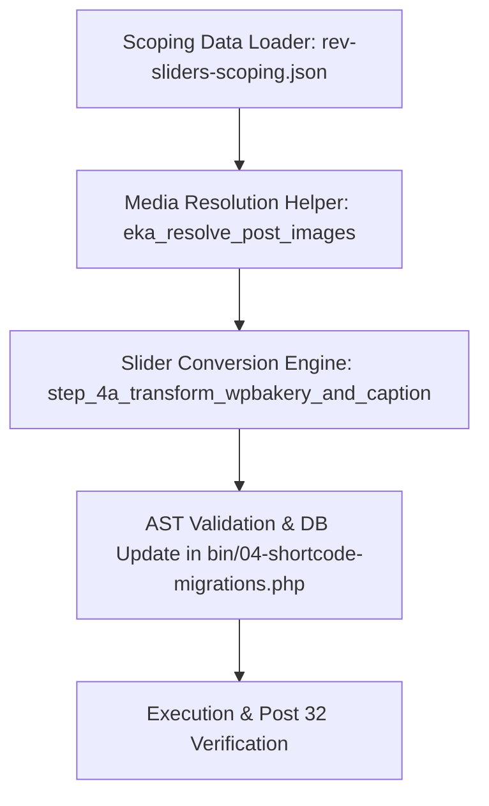

# TOPIC NAME: SHORTCODE-MIGRATION
# ISSUE NAME: REV-SLIDER-IMAGE-IMPORT

# Architecture Plan: RevSlider & LayerSlider Gutenberg Image Import Remediation

## 1. Overview & Objective
Transform legacy `[rev_slider]`, `[rev_slider_vc]`, and `[layerslider]` shortcodes into valid Gutenberg `wp:gallery` blocks containing nested `wp:image` blocks in `bin/04-shortcode-migrations.php`. Image IDs and URLs are dynamically resolved using scoping data (`ai-work/scopings/rev-sliders-scoping.json`) and direct `mysqli` queries against `wp_posts` attachment records.

## 2. Dependency Graph

## 3. Vertical Work Slices & Tasks

### Phase 1: Foundation & Data Resolution
- **Task 1**: Implement `eka_load_slider_scoping()` and `eka_resolve_post_images($post_id, $scoping_map, $mysqli)` in `bin/04-shortcode-migrations.php`.
  - *Acceptance Criteria*: Loads `rev-sliders-scoping.json` into an in-memory index map (`$scoping_map`) keyed by `page_id`. Extracts image IDs and URLs from `attached_media`, `embedded_images`, `gallery_image_ids`, and falls back to `mysqli` queries for child attachments (`post_parent = $post_id` and `post_type = 'attachment'`).

### Phase 2: Shortcode Transformation Engine
- **Task 2**: Update `step_4a_transform_wpbakery_and_caption` to consume post context and output native `wp:gallery` & `wp:image` block markup.
  - *Acceptance Criteria*: Converts `[rev_slider]`, `[rev_slider_vc]`, and `[layerslider]` shortcodes into `wp:gallery` blocks containing `wp:image` child blocks with resolved ID and URL. If no images are found, outputs AST-compliant gallery fallback markup.

### Phase 3: Execution & Verification
- **Task 3**: Execute migration pipeline and verify Post 32 output.
  - *Acceptance Criteria*: Run `php bin/04-shortcode-migrations.php`. Confirm Post 32 (`Στελέχωση`) contains attachment `13369` (`HR.png`) inside `wp:gallery` -> `wp:image`. Ensure zero AST validation failures in `ai-work/logs/04-shortcode-migrations.log`.

## 4. Git Workflow & Checkpoints
- Checkpoint 1: After Task 1 completion (Scoping loader & resolver verified).
- Checkpoint 2: After Task 2 completion (Shortcode transformation refactored & unit tested).
- Checkpoint 3: After Task 3 completion (Pipeline run & Post 32 audit passed).

## 5. Token Cost & Optimization Estimate

| Task / Phase | Estimated Input Tokens | Estimated Output Tokens | Estimated Cost (USD) |
|--------------|------------------------|-------------------------|----------------------|
| Task 1: Scoping Loader & Resolver | 12,000 | 1,500 | ~$0.005 |
| Task 2: Shortcode Conversion Engine | 15,000 | 2,500 | ~$0.008 |
| Task 3: Verification & Audit | 10,000 | 1,000 | ~$0.003 |
| **Total Project** | **37,000** | **5,000** | **~$0.016** |

*Optimization Strategy*:
- Limit context views to exact lines in `04-shortcode-migrations.php`.
- In-memory scoping map lookup ($scoping_map[$post_id]) eliminates repeated JSON parsing.
