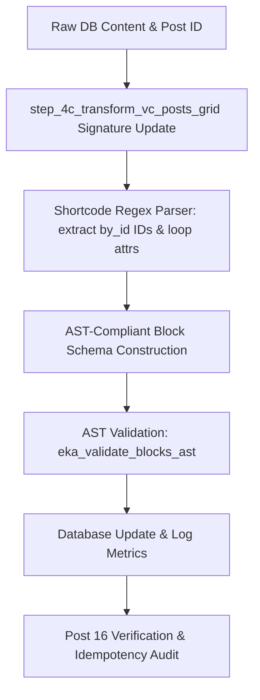

# TOPIC NAME: SHORTCODE-MIGRATION
# ISSUE NAME: SUBPAGE-GRID

# Architecture Plan: Subpage Grid Shortcode Migration to Gutenberg Query Loop

## 1. Overview & Objective
Refactor `step_4c_transform_vc_posts_grid()` in `bin/04-shortcode-migrations.php` to transform legacy `[vc_posts_grid]` shortcodes into AST-compliant Gutenberg 2-column FSE Query Loop blocks (`wp:query` wrapped in `wp:group`). The transformation dynamically extracts subpage IDs from the shortcode `loop` parameter (`by_id:ID1,ID2...`) and injects the parent post ID (`parents: [post_id]`) into the block query attributes.

## 2. Dependency Graph


## 3. Vertical Work Slices & Tasks

### Phase 1: Core Function Refactoring
- **Task 1**: Update `step_4c_transform_vc_posts_grid($content, $post_id = 0)` signature and transformation logic in `bin/04-shortcode-migrations.php`.
  - *Acceptance Criteria*: 
    1. Accepts `$content` and `$post_id`.
    2. Parses `by_id:ID1,ID2...` from `[vc_posts_grid]` `loop` parameter into `"include": [ID1, ID2, ...]`.
    3. Injects `"parents": [$post_id]` if `$post_id > 0`.
    4. Outputs AST-compliant `wp:group` wrapping a 2-column `wp:query` grid with `wp:post-featured-image` (4:3 aspect ratio, 12px rounded corners) and `wp:post-title` (level 3, linked). Excerpt is omitted.
    5. Replaces wrapping `[vc_row]` / `[vc_column]` blocks around `[vc_posts_grid]`.

### Phase 2: Pipeline Integration
- **Task 2**: Update the main execution loop in `bin/04-shortcode-migrations.php` to pass `$id` into `step_4c_transform_vc_posts_grid($content, $id)`.
  - *Acceptance Criteria*: 
    1. The execution loop calls `$content = step_4c_transform_vc_posts_grid($content, $id);`.
    2. No existing `wp:query` or non-matching shortcode content is altered.

### Phase 3: Verification & Idempotency Audit
- **Task 3**: Execute Stage 04 pipeline, verify Post 16 content, and validate idempotency.
  - *Acceptance Criteria*:
    1. Run `php bin/04-shortcode-migrations.php`.
    2. `wp post get 16` output matches the target block schema with `"parents": [16]` and extracted `"include"` IDs `[7411, 7409, 7405, 3444]`.
    3. Zero AST validation failures reported in `ai-work/logs/04-shortcode-migrations.log`.
    4. Re-running `php bin/04-shortcode-migrations.php` results in 0 additional conversions (idempotent).

## 4. Git Workflow & Checkpoints

### Git Workflow Rules
1. **Branch Strategy**: Create a dedicated feature branch from `main`:
   ```bash
   git checkout -b feature/shortcode-migration-subpage-grid
   ```
2. **Commit Message Format**: Follow Conventional Commits format:
   - `feat(migration): refactor step_4c to generate AST-compliant 2-column subpage query blocks`
   - `fix(migration): pass post_id to step_4c in main execution loop`
   - `test(migration): verify stage 04 post 16 transformation and idempotency`
3. **Commit Cadence**: Commit after each successful checkpoint verification.
4. **Clean History**: Ensure no untracked temp files or broken code before committing.

### Checkpoints
- **Checkpoint 1** (End of Task 1): `step_4c_transform_vc_posts_grid` refactored and unit-tested against dummy shortcode inputs.
- **Checkpoint 2** (End of Task 2): Pipeline call site updated; dry run verified.
- **Checkpoint 3** (End of Task 3): Pipeline executed; Post 16 audited; idempotency confirmed; changes committed to git.

## 5. Token Cost & Optimization Estimate

| Phase / Task | Estimated Input Tokens | Estimated Output Tokens | Estimated Cost (USD) |
|--------------|------------------------|-------------------------|----------------------|
| Task 1: Refactor `step_4c` Logic | 10,000 | 1,200 | ~$0.004 |
| Task 2: Main Loop Integration | 6,000 | 500 | ~$0.002 |
| Task 3: Execution & Audit | 8,000 | 800 | ~$0.003 |
| **Total Project** | **24,000** | **2,500** | **~$0.009** |

*Optimization Strategy*:
- Perform surgical edits directly on `step_4c` and main execution loop lines in `bin/04-shortcode-migrations.php`.
- Avoid full file rewrites to minimize token utilization and preserve adjacent function comments.
