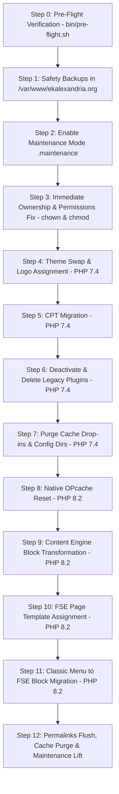

# Implementation Plan: Standalone Production Cutover Script (`bin/deploy-production.sh`)

- **SPEC FILE**: `ai-work/deployment-production-SPEC.md`
- **TOPIC NAME**: `deployment`
- **ISSUE NAME**: `production-final-cutover`
- **TARGET ENVIRONMENT**: Single Standalone Production Server Execution (`/var/www/ekalexandria.org/public`)

---

## 1. Executive Summary & Architectural Strategy

This plan defines the architecture, sequence, error handling, and manual execution design for `bin/deploy-production.sh`. This script will be run manually by the sysadmin on the live production server. It operates as a fully autonomous, single-pass script that executes all 12 deployment steps with zero manual intervention required during execution.

### Architectural & Safety Guarantees:
1. **Fully Standalone & Non-Interactive**: Runs unattended via CLI/SSH with `set -eo pipefail` and explicit error trapping. If any step fails, the script immediately halts, retains `.maintenance` mode, and logs exact failure details to `ai-work/logs/deploy-production.log`.
2. **Early Ownership & Permission Correction (Step 3)**: `chown -R devops:www-data` and `chmod -R u+w` run immediately after backup creation to guarantee all subsequent file write, deletion (`rm -rf`), and WP-CLI plugin/theme uninstall operations succeed without permission errors.
3. **No Hardcoded Staging Autoloader Patches**: Hardcoded hash replacements (`sed` of staging-specific hash strings like `5b8fa...`) are omitted because production files were not subjected to staging `rsync` hash skew. WP-CLI execution capability with plugins enabled is validated cleanly during pre-flight.
4. **Isolated Safety Backups (Step 1)**: Database dump (`.sql`) and file archive (`.tar.gz`, excluding uploads) are written strictly to `/var/www/ekalexandria.org/` (outside web root) prior to any code or database modification.
5. **Dual-PHP Runtime Sequencing**:
   - **Phase A (PHP 7.4)**: Pre-flight checks, backup creation, maintenance mode, permission fixes, theme swap (`ekalexandria-flagship`), logo assignment (`63053`), legacy theme deletion (`betheme`), CPT migration (`bin/migrate-cpts.php`), legacy plugin deactivation & deletion (`LayerSlider`, `js_composer`, etc.), and cache drop-in removal.
   - **Phase B (PHP 8.2)**: OPcache reset, Gutenberg content block transformation (`bin/migration-content-engine.php`), FSE page template assignment (`bin/assign-page-templates.php`), classic menu to FSE block migration (`bin/migrate-classic-menus-to-fse.php`), rewrite flush, cache flush, and maintenance mode removal.

---

## 2. Assessment: Composer Autoloader Patching Analysis

### Question: Why did composer autoloader patching exist in `01-reset-and-setup.sh` and is it needed in production?
- **Root Cause Analysis**: The autoloader `sed` replacements in `01-reset-and-setup.sh` (for Mailchimp, Rank Math, and Polylang) were introduced specifically for the **staging environment**. On staging, running `rsync` from production over existing staging directories caused Composer's static autoloader (`autoload_static.php`) and real autoloader (`autoload_real.php`) class hashes to mismatch, throwing `Class 'ComposerStaticInit...' not found` fatal errors.
- **Production Reality**: On live production (`/var/www/ekalexandria.org/public`), plugins were installed in-place without `rsync` file overwrites from another server. Production plugin vendor autoloaders already match their respective class hashes.
- **Decision & Strategy**:
  1. **Do NOT run hardcoded staging `sed` hash replacements on production**: Hardcoded hash strings from staging do not apply to production and risk corrupting valid vendor files.
  2. **Automated Verification in Pre-Flight**: Step 0 (`bin/pre-flight.sh`) verifies WP-CLI responsiveness with active plugins (`php7.4 wp plugin list`). If WP-CLI runs cleanly, autoloader integrity is confirmed automatically before any deployment steps execute.

---

## 3. Deployment Pipeline & Execution Flow

---

## 4. Vertical Work Breakdown

### Task 1: Environment Detection, Dry-Run Flag & Fail-Safe Script Shell Architecture
- **Target File**: `bin/deploy-production.sh`
- **Key Implementation Details**:
  - Add `set -eo pipefail` and `trap 'on_error $? $LINENO'` exit handler.
  - Support `--dry-run` / `--test` CLI argument: when present, simulate steps, validate binary paths and environment checks, but skip destructive DB/filesystem mutations and backup file generation.
  - Dynamically detect `WEB_ROOT="/var/www/ekalexandria.org/public"` and `BACKUP_DIR="/var/www/ekalexandria.org"`.
  - Set up logging redirection to both standard output and `ai-work/logs/deploy-production.log`.
  - Ensure clear terminal output header and step indicators for manual operator monitoring.
- **Verification**: `bash -n bin/deploy-production.sh` and `bash bin/deploy-production.sh --dry-run`.

### Task 2: Implement Phase A (Steps 0–7) Pre-Flight, Backup, Permissions & Legacy Cleanup
- **Target File**: `bin/deploy-production.sh`
- **Key Implementation Details**:
  - **Step 0**: Execute `bin/pre-flight.sh` (includes WP-CLI plugin load check). Halt on error.
  - **Step 1**: Generate timestamped backups in `$BACKUP_DIR` (Skipped if `--dry-run` active):
    - `eka_prod_db_backup_$(date +%Y%m%d_%H%M%S).sql` (`php7.4 wp db export`)
    - `eka_prod_files_backup_$(date +%Y%m%d_%H%M%S).tar.gz` (`tar -czf` excluding `wp-content/uploads/`)
  - **Step 2**: Enable maintenance mode by dropping `$WEB_ROOT/.maintenance` file (Skipped if `--dry-run`).
  - **Step 3**: **Permissions Correction**:
    - `chown -R devops:www-data "$WEB_ROOT"` (Skipped if `--dry-run`)
    - `chmod -R u+w "$WEB_ROOT/wp-content"` (Skipped if `--dry-run`)
  - **Step 4**: Activate `ekalexandria-flagship`, set logo attachment ID `63053`, and delete `betheme` theme (`wp theme delete betheme` + `rm -rf wp-content/themes/betheme`) (Skipped if `--dry-run`).
  - **Step 5**: Execute CPT migration (`php7.4 bin/migrate-cpts.php`) (Skipped if `--dry-run`).
  - **Step 6**: Deactivate `google-captcha`; deactivate & uninstall legacy plugins (`LayerSlider`, `js_composer`, `display-posts-shortcode`, `force-regenerate-thumbnails`, `ewww-image-optimizer`, `wordpress-seo`, `w3-total-cache`) with `rm -rf` directory fallback (Skipped if `--dry-run`).
  - **Step 7**: Remove drop-ins (`advanced-cache.php`, `object-cache.php`) and cache folders (`wp-content/cache/`, `wp-content/w3tc-config/`) (Skipped if `--dry-run`).
- **Verification**: `bash -n bin/deploy-production.sh` and `bash bin/deploy-production.sh --dry-run`.

### Task 3: Implement Phase B (Steps 8–12) PHP 8.2 Modernization & FSE Binding
- **Target File**: `bin/deploy-production.sh`
- **Key Implementation Details**:
  - **Step 8**: Reset OPcache using `php8.2 $(which wp) eval 'if(function_exists("opcache_reset")) opcache_reset();'` (Skipped if `--dry-run`).
  - **Step 9**: Execute Content Engine migration via `php8.2 bin/migration-content-engine.php --skip-plugins` (Skipped if `--dry-run`).
  - **Step 10**: Execute FSE template assignment via `php8.2 bin/assign-page-templates.php` (Skipped if `--dry-run`).
  - **Step 11**: Execute navigation binding via `php8.2 bin/migrate-classic-menus-to-fse.php` (Skipped if `--dry-run`).
  - **Step 12**: Flush rewrite rules (`php8.2 $(which wp) rewrite flush`), clear object cache (`php8.2 $(which wp) cache flush`), and remove `.maintenance` (Skipped if `--dry-run`).
- **Verification**: `bash -n bin/deploy-production.sh` and `bash bin/deploy-production.sh --dry-run`.

### Task 4: Script Syntax Audit & Non-Destructive Test Execution Verification
- **Target Files**: `bin/deploy-production.sh`, `bin/pre-flight.sh`
- **Key Actions**:
  - Verify bash syntax (`bash -n bin/deploy-production.sh`).
  - Verify executable permissions (`chmod +x bin/deploy-production.sh`).
  - Run dry-run execution (`bash bin/deploy-production.sh --dry-run`).
  - Run pre-flight test suite (`bash bin/pre-flight.sh`).
  - Run PHPUnit test suite (`vendor/bin/phpunit bin/tests`).
  - Audit log output formats and error recovery guidance.
- **Verification**: All non-destructive tests pass (Zero syntax errors, clean `--dry-run` output, 100% PHPUnit tests passing). Live production script execution is strictly avoided.

---

## 5. Automated Internal Script Exit Gates & Error Recovery

Since the script runs manually on production, all safety checks are embedded directly inside `bin/deploy-production.sh`:

| Step Range | Automated Internal Gate Check | Action on Step Failure |
| :--- | :--- | :--- |
| **Step 0** | Pre-flight validation (`pre-flight.sh`) | Abort immediately before taking backups or touching site files. |
| **Step 1–2** | Safety Backup & Maintenance File Check | Verify SQL and tarball files exist with non-zero size before proceeding to file modifications. |
| **Step 3–7** | Phase A Command Status Tracing | If WP-CLI or `rm -rf` fails, trap logs exact line number, retains `.maintenance`, and displays rollback command. |
| **Step 8–12** | Phase B Command Status Tracing | If PHP 8.2 execution or AST validation fails, script halts with `.maintenance` active to protect public traffic. |

---

## 6. Token Cost Analysis & Industry Alignment

| Task / Phase | Estimated Input Tokens | Estimated Output Tokens | Total Estimated Tokens | Estimated Cost (USD) |
| :--- | :--- | :--- | :--- | :--- |
| **Task 1: Script Architecture & Error Trap** | ~10,000 | ~2,000 | ~12,000 | ~$0.06 |
| **Task 2: Phase A Implementation** | ~20,000 | ~4,500 | ~24,500 | ~$0.13 |
| **Task 3: Phase B Implementation** | ~20,000 | ~4,500 | ~24,500 | ~$0.13 |
| **Task 4: Syntax Audit & Verification** | ~8,000 | ~1,500 | ~9,500 | ~$0.05 |
| **Total Estimated** | **~58,000** | **~12,500** | **~70,500** | **~$0.37** |

*Pricing model based on standard industry coding AI models ($3.00 / 1M input tokens, $15.00 / 1M output tokens).*
