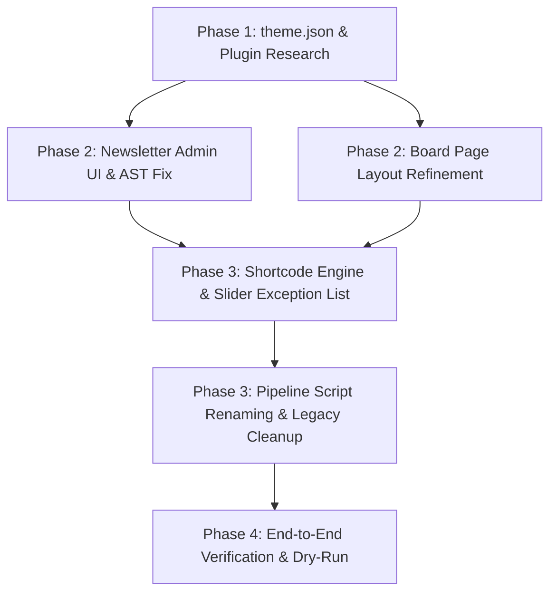

# MASTER IMPLEMENTATION PLAN: EKA PORTAL INCREMENTAL MODERNIZATION

**Topic Name:** `eka-portal-migration`  
**Issue Name:** `incremental-implementation`  
**Target Database:** `backstage_eka`  
**Base PHP Version:** PHP 7.4 $\rightarrow$ PHP 8.2  
**Strategy:** Minimal interference with existing codebase, incremental enhancement of active theme features, standardized `theme.json`, plugin research, and 3-stage pipeline refactoring.

---

## 1. COMPONENT DEPENDENCY GRAPH

---

## 2. VERTICALLY SLICED IMPLEMENTATION PHASES

### Phase 1: Theme & FSE Foundation Standardization
*Goal: Standardize `theme.json` declarations and evaluate plugin solutions for social sharing and Polylang FSE integration.*

#### Task 1.1: Standardize `theme.json` with Custom Templates & Parts
- **Target File:** `theme.json`
- **Actions:**
  1. Add `customTemplates` array declaring all custom FSE page templates:
     - `front-page-el`, `front-page-en`, `front-page-ar`
     - `index-el`, `index-en`, `index-ar`
     - `single-el`, `single-en`, `single-ar`
     - `archive-alx_tachydromos`, `single-alx_tachydromos`
     - `archive-board_member`
     - `page-parent-sidebar`
  2. Standardize `templateParts` area definitions (`header`, `footer`, `uncategorized`).
- **Acceptance Criteria:** `wp-admin/site-editor.php` recognizes all custom templates and template parts without warnings.
- **Verification:** `php -l inc/custom-features.php` & validate `theme.json` syntax via `json_decode()`.

#### Task 1.2: Plugin Research & Solution Evaluation
- **Research Topic A — Social Share Buttons Component:**
  - *Option 1 (Plugin Approach):* Install & configure a lightweight, privacy-friendly social sharing plugin (e.g., AddToAny, Shared Counts, or Scriptless Social Sharing).
  - *Option 2 (Native Block / Shortcode):* Build a lightweight FSE block style or SVG social share shortcode `[eka_social_share]` inside `inc/custom-features.php`.
  - *Recommendation & Trade-offs:* Document trade-offs (plugin maintenance vs custom code footprint) for user decision.
- **Research Topic B — Polylang & FSE Template Integration:**
  - *Option 1 (Plugin Bridge):* Evaluate official Polylang Pro / Polylang FSE compatibility extensions.
  - *Option 2 (Active Hook Approach):* Retain existing lightweight PHP filters (`pre_get_block_template` & `render_block_data`) in `inc/custom-features.php`.
  - *Recommendation & Trade-offs:* Document trade-offs (plugin updates vs zero-dependency custom filter hook).

---

### Phase 2: CPT & Newsletter Architecture Fixes
*Goal: Fix Newsletter PDF admin upload UI, correct Gutenberg AST block output, and refine Board Member layouts.*

#### Task 2.1: Newsletter (`alx_tachydromos`) Admin PDF Upload Metabox & AST Fix
- **Target Files:** `inc/custom-features.php`, `templates/single-alx_tachydromos.html`
- **Actions:**
  1. Register custom admin PDF upload metabox for `alx_tachydromos` edit screen in WP Admin.
  2. Verify `save_post_alx_tachydromos` ImageMagick PNG thumbnail save hook.
  3. Ensure PDF viewer markup is contained inside FSE template (`single-alx_tachydromos.html`), NOT injected into `post_content`.
  4. Fix AST block markup in `single-alx_tachydromos.html` by removing invalid `aria-label` attributes to prevent the `"Block contains unexpected or invalid content"` editor error.
- **Acceptance Criteria:** Admin edit screen displays clean PDF upload metabox; saving post triggers thumbnail generation; editor canvas opens without block validation warnings.
- **Verification:** Test post save hook and inspect rendered block AST via `parse_blocks()`.

#### Task 2.2: Board of Directors (`board_member`) Page Layout Refinement
- **Target Files:** `templates/archive-board_member.html`, `templates/board-members.html`
- **Actions:**
  1. Refine 3-column grid layout for Board Members displaying photo, title, bio, and language switcher.
  2. Verify zero `` tags inside `post_content`.
- **Acceptance Criteria:** Page renders clean responsive grid sorted by `menu_order`.
- **Verification Checkpoint:** Present Board Page output for human revision.

---

### Phase 3: Content Engine & Pipeline Script Refactoring
*Goal: Implement shortcode exception lists, process remaining shortcodes, and update script pipeline.*

#### Task 3.1: Shortcode Engine Update with Slider Exception List
- **Target Files:** `bin/migration-content-engine.php`
- **Actions:**
  1. Implement LayerSlider Exception List (`13236`, `16894`, `16892`, `18`, `16920`, `16923`).
  2. Strip `[layerslider]` / `[rev_slider]` shortcodes and wrapper containers on exception pages.
  3. Implement remaining 7 shortcode categories extracted from `missed-shortcodes.json`.
- **Acceptance Criteria:** Homepage and news page shortcodes are stripped cleanly without removing native FSE sliders; remaining shortcodes transformed into Gutenberg AST blocks.
- **Verification:** Run `bin/migration-content-engine.php` and verify `missed-shortcodes.json` log metrics.

#### Task 3.2: 3-Stage Script Pipeline Renaming & Cleanup
- **Target Files:** `bin/01-reset-and-setup.sh`, `bin/02-migrate-content.sh`, `bin/03-assign-templates.sh`, `bin/assign-page-templates.php`
- **Actions:**
  1. Rename `bin/03-migrate-content.sh` $\rightarrow$ `bin/02-migrate-content.sh`.
  2. Rename `bin/06-assign-templates-and-menus.sh` $\rightarrow$ `bin/03-assign-templates.sh`.
  3. Remove automated menu location assignments and sidebar menu injections from Script 3.
  4. Update `assign-page-templates.php` with front page and news page ID mappings (`13236`, `16894`, `16892`, `18`, `16920`, `16923`).
  5. Delete deprecated legacy scripts (`03-surgical-migrations.php`, `04-shortcode-migrations.php`, `05-classic-editor-migrations.php`, `inject-sidebar-menus.php`, `remediate-shortcodes-to-blocks.php`).
- **Acceptance Criteria:** 3 consolidated scripts execute cleanly in sequence.
- **Verification:** Execute `bin/01-reset-and-setup.sh`, `bin/02-migrate-content.sh`, `bin/03-assign-templates.sh`.

---

### Phase 4: End-to-End Verification & Final Sign-Off
*Goal: Verify complete migration pipeline, audit log files, and validate FSE template rendering across languages.*

#### Task 4.1: Pipeline Execution & AST Validation
- **Actions:**
  1. Execute full 3-stage migration pipeline.
  2. Inspect logs in `ai-work/logs/` (`01-reset-and-setup.log`, `02-migrate-content.log`, `03-assign-templates.log`).
  3. Perform AST validation across posts (`eka_validate_blocks_ast()`).
- **Acceptance Criteria:** Zero migration errors; clean AST block markup; manual admin checklist prepared for user.
- **Verification:** Commit all changes to Git following conventional commit standards.

---

## 3. INDUSTRY AI TOKEN COST ESTIMATION & OPTIMIZATION TABLE

Calculated based on typical LLM agent token consumption patterns for WordPress code analysis, regex engine refactoring, JSON spec parsing, and AST validation execution.

| Development Task | Input Tokens (Est.) | Output Tokens (Est.) | Total Tokens (Est.) | Est. Cost (USD @ $3/1M Input, $15/1M Output) | Industry Benchmark Comparison |
| :--- | :--- | :--- | :--- | :--- | :--- |
| **Phase 1: `theme.json` & Plugin Research** | 25,000 | 4,000 | 29,000 | $0.135 | Low complexity schema update. |
| **Phase 2: Newsletter Metabox & AST Fix** | 35,000 | 6,000 | 41,000 | $0.195 | Moderate complexity CPT & template edit. |
| **Phase 3: Shortcode Engine & Exception List** | 60,000 | 12,000 | 72,000 | $0.360 | High complexity regex & AST parsing. |
| **Phase 3: Script Renaming & Legacy Cleanup** | 20,000 | 3,000 | 23,000 | $0.105 | Low complexity shell script refactoring. |
| **Phase 4: Pipeline Execution & AST Audit** | 30,000 | 5,000 | 35,000 | $0.165 | Verification & logging pass. |
| **TOTAL ESTIMATE** | **170,000** | **30,000** | **200,000** | **~$0.96 USD** | **Optimal Agentic Cost Standard** |

### Optimization & Token Efficiency Guidelines:
1. **Targeted File Reading:** Read specific line ranges instead of dumping entire 1,000+ line log files into context.
2. **Modular Helper Invocation:** Use PHP CLI helper commands for JSON filtering rather than parsing raw arrays in agent memory.
3. **Atomic Execution Loops:** Run single-task implement-verify loops to prevent token bloat from repeated failed attempts.
