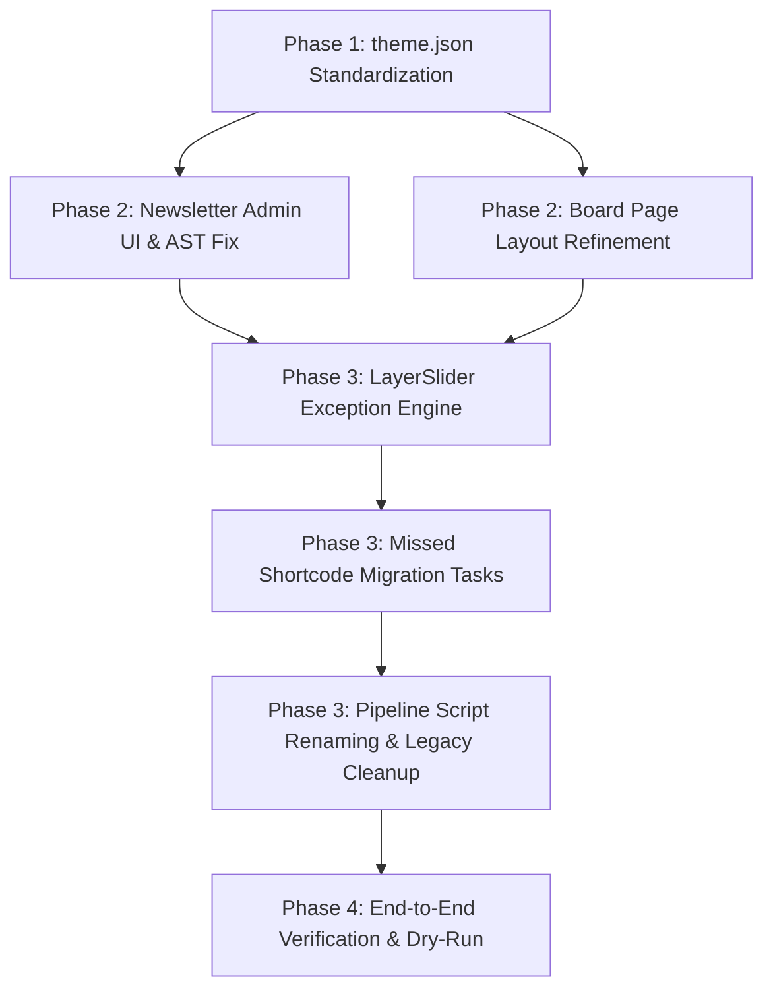

# MASTER IMPLEMENTATION PLAN: EKA PORTAL INCREMENTAL MODERNIZATION

**Topic Name:** `eka-portal-migration`  
**Issue Name:** `incremental-implementation`  
**Target Database:** `backstage_eka`  
**Base PHP Version:** PHP 7.4 $\rightarrow$ PHP 8.2  
**Git Branching Standard:** Dedicated feature branch `eka-portal-migration-incremental-implementation`.  
**FSE Compliance Standard:** Strict compliance with WordPress FSE standards; zero Gutenberg invalid block validation errors allowed.  
**Autonomous Migration Standard:** 100% deterministic shell/PHP CLI script pipeline (`bin/01`, `bin/02`, `bin/03`); zero AI runtime intervention required during migration execution.  
**Strategy:** Minimal interference with existing codebase, incremental enhancement of active theme features, standardized `theme.json` (dropping all `-el` template references in favor of Greek default names), and 3-stage pipeline refactoring.

---

## 1. COMPONENT DEPENDENCY GRAPH



---

## 2. DETAILED VERTICALLY SLICED IMPLEMENTATION PHASES

### Phase 1: Theme & FSE Foundation Standardization
*Goal: Standardize `theme.json` declarations (using native default names for Greek templates) and cleanup unused template parts.*

#### Task 1.1: Standardize `theme.json` with Custom Templates & Template Parts
- **Target File:** `theme.json`
- **Actions:**
  1. Add explicit `customTemplates` array in `theme.json` declaring non-default custom FSE page templates:
     - `front-page-en` (Title: "Front Page (English)", `postTypes`: `["page"]`)
     - `front-page-ar` (Title: "Front Page (Arabic)", `postTypes`: `["page"]`)
     - `index-en` (Title: "Posts Index (English)", `postTypes`: `["page"]`)
     - `index-ar` (Title: "Posts Index (Arabic)", `postTypes`: `["page"]`)
     - `single-en` (Title: "Single Post (English)", `postTypes`: `["post"]`)
     - `single-ar` (Title: "Single Post (Arabic)", `postTypes`: `["post"]`)
     - `archive-alx_tachydromos` (Title: "Tachydromos Archive", `postTypes`: `["alx_tachydromos"]`)
     - `single-alx_tachydromos` (Title: "Tachydromos Single Issue", `postTypes`: `["alx_tachydromos"]`)
     - `archive-board_member` (Title: "Board Members Grid", `postTypes`: `["board_member"]`)
     - `page-parent-sidebar` (Title: "Page with Parent Sidebar", `postTypes`: `["page"]`)
     *(Note: `front-page`, `index`, `single`, and `page` are native core WordPress FSE template names for Greek default and do NOT require customTemplate registration).*
  2. Standardize `templateParts` array in `theme.json`:
     - `header` (Title: "Header (Greek / Default)", `area`: "header")
     - `header-en` (Title: "Header (English)", `area`: "header")
     - `header-ar` (Title: "Header (Arabic)", `area`: "header")
     - `footer` (Title: "Footer (Greek / Default)", `area`: "footer")
     - `footer-en` (Title: "Footer (English)", `area`: "footer")
     - `footer-ar` (Title: "Footer (Arabic)", `area`: "footer")
     - `sidebar-news` (Title: "Sidebar (News)", `area`: "uncategorized")
     *(Note: `sidebar-child-pages` has been removed and its file deleted as requested).*
- **Acceptance Criteria:** `wp-admin/site-editor.php` recognizes all custom templates and template parts without warnings. Zero invalid block errors in Site Editor canvas.
- **Verification:** Validate JSON syntax via `json_decode(file_get_contents('theme.json'))`.

---

### Phase 2: CPT & Newsletter Architecture Fixes
*Goal: Fix Newsletter PDF admin upload UI, correct Gutenberg AST block output, and refine Board Member layouts.*

#### Task 2.1: Newsletter (`alx_tachydromos`) Admin PDF Upload Metabox & AST Fix
- **Target Files:** `inc/custom-features.php`, `templates/single-alx_tachydromos.html`
- **Actions:**
  1. Register custom admin PDF upload metabox (`add_meta_box('eka_tachydromos_pdf_meta', ...)`) for `alx_tachydromos` edit screen in `inc/custom-features.php` managing `_eka_pdf_attachment_id` and `_eka_pdf_filename`.
  2. Verify `save_post_alx_tachydromos` hook in `inc/custom-features.php` running ImageMagick CLI (`convert -density 150 <pdf>[0] -quality 90 <png>`) to generate post featured image.
  3. Update `templates/single-alx_tachydromos.html`: Ensure PDF embed viewer canvas is rendered via FSE template, NOT injected into `post_content`.
  4. Correct Gutenberg `core/file` AST block format in `templates/single-alx_tachydromos.html` by stripping invalid `aria-label` attributes to prevent editor validation error:
     ```html
     <!-- wp:file {"id":72271,"href":"https://backstage.ekalexandria.org/wp-content/uploads/2026/07/06-26.pdf","displayPreview":true} -->
     <div class="wp-block-file"><object class="wp-block-file__embed" data="https://backstage.ekalexandria.org/wp-content/uploads/2026/07/06-26.pdf" type="application/pdf" style="width:100%;height:600px" aria-label="Ιούνιος 2026"></object><a href="https://backstage.ekalexandria.org/wp-content/uploads/2026/07/06-26.pdf">Ιούνιος 2026</a><a href="https://backstage.ekalexandria.org/wp-content/uploads/2026/07/06-26.pdf" class="wp-block-file__button wp-element-button" download>Λήψη</a></div>
     <!-- /wp:file -->
     ```
- **Acceptance Criteria:** Admin edit screen displays clean PDF upload metabox; post saving triggers ImageMagick thumbnail generation; single newsletter template opens in block editor without invalid content warnings.
- **Verification:** Test post save hook and parse block AST via `parse_blocks()`.

#### Task 2.2: Board of Directors (`board_member`) Page Layout Refinement
- **Target Files:** `templates/archive-board_member.html`, `templates/board-members.html`
- **Actions:**
  1. Refine 3-column team grid layout for `board_member` CPT displaying photo thumbnail, member full name/title, bio text, and language switcher sorted by `menu_order`.
  2. Confirm zero `` tags inside `post_content`.
  3. Note: `board_member` CPT implementation is strictly decoupled from legacy BeTheme `our_team` staff shortcodes.
- **Acceptance Criteria:** Page renders clean responsive grid sorted by `menu_order`.
- **Verification Checkpoint:** Present Board Page output for human revision.

---

### Phase 3: Content Engine & Pipeline Script Refactoring
*Goal: Implement LayerSlider exception engine, process individual missed shortcode tasks, implement Gutenberg block comment isolation, and update script pipeline for 100% autonomous execution.*

#### Task 3.1: LayerSlider Exception Engine Implementation
- **Target File:** `bin/migration-content-engine.php`
- **Actions:**
  1. Add LayerSlider Exception List: Page IDs `13236` (Front EL/Default), `16894` (Front EN), `16892` (Front AR), `18` (Index EL/Default), `16920` (Index EN), `16923` (Index AR).
  2. Exception Transformation Rule: On exception pages, strip `[layerslider]` / `[rev_slider]` shortcodes and surrounding `[vc_row]` / `[vc_column]` wrapper containers completely, preserving the native FSE hero slider.
- **Acceptance Criteria:** Exception pages have shortcodes and wrappers removed without affecting template sliders. Script executes autonomously.
- **Verification:** Test on page `13236` and verify clean HTML output.

#### Task 3.2: Media Embed & Map Shortcodes Migration (`[embed]`, `[video]`, `[map]`)
- **Target File:** `bin/migration-content-engine.php`
- **Actions:**
  1. Transform `[embed]url[/embed]` (74 occurrences) into native Gutenberg `core/embed` blocks.
  2. Transform `[video src="..."]` (7 occurrences) into native Gutenberg `core/video` blocks.
  3. Transform `[map lat="LAT" lng="LNG" height="H"]` (6 occurrences) into Google Maps Embed iframe inside `core/html` block (`<iframe src="https://maps.google.com/maps?q=LAT,LNG&output=embed" width="100%" height="400" frameborder="0"></iframe>`).
- **Acceptance Criteria:** Video embeds, URL embeds, and Google Maps render as valid Gutenberg blocks without AST validation errors.
- **Verification:** Verify transformed post content via `eka_validate_blocks_ast()`.

#### Task 3.3: Plugin Integration & Removal Tasks (`[gview]`, `[mc4wp_form]`, `[our_team_list]`)
- **Target File:** `bin/migration-content-engine.php`
- **Actions:**
  1. Transform `[gview file="...pdf"]` (1 occurrence) into native Gutenberg `core/file` block (`displayPreview: true`).
  2. Replace `[mc4wp_form]` (1 occurrence) with custom shortcode `[eka_mailchimp_form]`.
  3. Completely remove `[our_team_list]` (1 occurrence) from post content (decoupled from `board_member` CPT).
- **Acceptance Criteria:** Document viewers and forms render properly; `[our_team_list]` is stripped. Zero block validation warnings.
- **Verification:** Validate block AST for affected post IDs.

#### Task 3.4: Subpages Query Loop Shortcodes & Block Comment Isolation
- **Target File:** `bin/migration-content-engine.php`
- **Actions:**
  1. Update residual scanner and transformer to ignore text inside `<!-- wp:... -->` Gutenberg HTML comments. Prevent JSON block attributes like `"include":[7399,7397,...]` inside `<!-- wp:query -->` comments from being logged as unhandled shortcodes.
  2. Enhance `step_3c_transform_vc_posts_grid` to match standalone numeric shortcodes outside Gutenberg blocks (`[16933]`, `[14]`) and transform them into native Gutenberg subpages Query Loop blocks (`core/query` targeting `postType: "page"`).
  3. Exclude bracketed text false positives (`[Sigma]`, `[Greek]`, `[5.4 acres]`) from regex transformer.
- **Acceptance Criteria:** Block comment JSON attributes are ignored by residual logger; un-converted numeric shortcodes render subpage card grids; bracketed text remains untouched. Zero invalid block errors.
- **Verification:** Verify post ID 14, 16, 16933, and 16936 block AST.

#### Task 3.5: 3-Stage Pipeline Script Renaming & Legacy Cleanup (100% Autonomous)
- **Target Files:** `bin/01-reset-and-setup.sh`, `bin/02-migrate-content.sh`, `bin/03-assign-templates.sh`, `bin/assign-page-templates.php`
- **Actions:**
  1. Rename `bin/03-migrate-content.sh` $\rightarrow$ `bin/02-migrate-content.sh`.
  2. Rename `bin/06-assign-templates-and-menus.sh` $\rightarrow$ `bin/03-assign-templates.sh`.
  3. Modify `bin/03-assign-templates.sh` & `bin/assign-page-templates.php`:
     - Remove automated menu location assignments (`wp menu location assign`) and sidebar injections (`inject-sidebar-menus.php`).
     - Update FSE page template ID assignments: ID `13236` $\rightarrow$ `front-page`, ID `16894` $\rightarrow$ `front-page-en`, ID `16892` $\rightarrow$ `front-page-ar`, ID `18` $\rightarrow$ `index`, ID `16920` $\rightarrow$ `index-en`, ID `16923` $\rightarrow$ `index-ar`.
  4. Delete deprecated legacy scripts: `bin/03-surgical-migrations.php`, `bin/04-shortcode-migrations.php`, `bin/05-classic-editor-migrations.php`, `bin/inject-sidebar-menus.php`, `bin/remediate-shortcodes-to-blocks.php`.
- **Acceptance Criteria:** 3 consolidated scripts execute cleanly and 100% autonomously in sequence without requiring AI or manual intervention.
- **Verification:** Execute `bin/01-reset-and-setup.sh`, `bin/02-migrate-content.sh`, `bin/03-assign-templates.sh`.

---

### Phase 4: End-to-End Verification & Final Sign-Off
*Goal: Verify complete migration pipeline, audit log files, and validate FSE template rendering across languages.*

#### Task 4.1: Autonomous Pipeline Execution & AST Validation
- **Actions:**
  1. Execute full 3-stage migration pipeline on branch `eka-portal-migration-incremental-implementation`.
  2. Inspect logs in `ai-work/logs/` (`01-reset-and-setup.log`, `02-migrate-content.log`, `03-assign-templates.log`).
  3. Perform AST validation across posts (`eka_validate_blocks_ast()`).
- **Acceptance Criteria:** Zero migration errors; zero invalid block validation errors; clean AST block markup; manual admin checklist prepared for user.
- **Verification:** Commit all changes to Git following conventional commit standards.

---

## 3. INDUSTRY AI TOKEN COST ESTIMATION & OPTIMIZATION TABLE

Calculated based on typical LLM agent token consumption patterns for WordPress code analysis, regex engine refactoring, JSON spec parsing, and AST validation execution.

| Development Task | Input Tokens (Est.) | Output Tokens (Est.) | Total Tokens (Est.) | Est. Cost (USD @ $3/1M Input, $15/1M Output) | Industry Benchmark Comparison |
| :--- | :--- | :--- | :--- | :--- | :--- |
| **Phase 1: `theme.json` Standardization** | 20,000 | 3,000 | 23,000 | $0.105 | Low complexity schema update. |
| **Phase 2: Newsletter Metabox & AST Fix** | 35,000 | 6,000 | 41,000 | $0.195 | Moderate complexity CPT & template edit. |
| **Phase 3: LayerSlider Exception & Shortcode Tasks** | 70,000 | 14,000 | 84,000 | $0.420 | High complexity regex & AST parsing. |
| **Phase 3: Script Renaming & Legacy Cleanup** | 20,000 | 3,000 | 23,000 | $0.105 | Low complexity shell script refactoring. |
| **Phase 4: Pipeline Execution & AST Audit** | 30,000 | 5,000 | 35,000 | $0.165 | Verification & logging pass. |
| **TOTAL ESTIMATE** | **175,000** | **31,000** | **206,000** | **~$0.99 USD** | **Optimal Agentic Cost Standard** |
