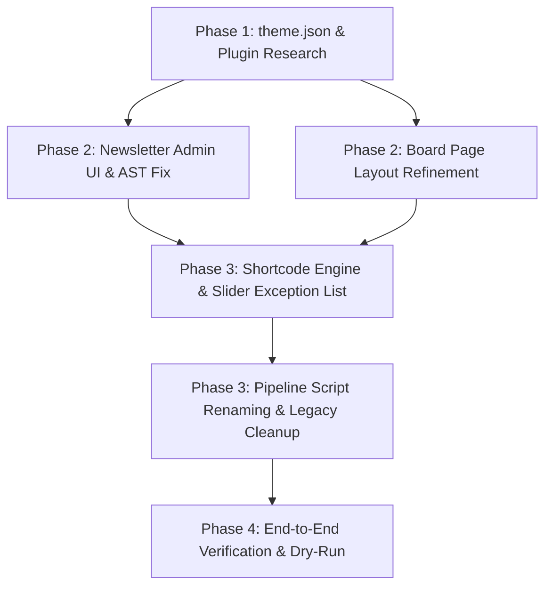

# MASTER IMPLEMENTATION PLAN: EKA PORTAL INCREMENTAL MODERNIZATION

**Topic Name:** `eka-portal-migration`  
**Issue Name:** `incremental-implementation`  
**Target Database:** `backstage_eka`  
**Base PHP Version:** PHP 7.4 $\rightarrow$ PHP 8.2  
**Strategy:** Minimal interference with existing codebase, incremental enhancement of active theme features, standardized `theme.json` (dropping all `-el` template references in favor of Greek default names), plugin research, and 3-stage pipeline refactoring.

---

## 1. COMPONENT DEPENDENCY GRAPH



---

## 2. DETAILED VERTICALLY SLICED IMPLEMENTATION PHASES

### Phase 1: Theme & FSE Foundation Standardization
*Goal: Standardize `theme.json` declarations (using native default names for Greek templates) and evaluate plugin solutions for social sharing and Polylang FSE integration.*

#### Task 1.1: Standardize `theme.json` with Custom Templates & Parts
- **Target File:** `theme.json`
- **Actions:**
  1. Add explicit `customTemplates` array in `theme.json` declaring non-default custom FSE page templates:
     - `front-page-en` (Title: "Front Page (English)", `postTypes`: `["page"]`)
     - `front-page-ar` (Title: "Front Page (Arabic)", `postTypes`: `["page"]`)
     - `index-en` (Title: "Posts Index (English)", `postTypes`: `["page"]`)
     - `index-ar` (Title: "Posts Index (Arabic)", `postTypes`: `["page"]`)
     - `single-en` (Title: "Single Post (English)", `postTypes`: `["post"]`)
     - `single-ar` (Title: "Single Post (Arabic)", `postTypes`: `["post"]`)
     - `archive-alx_tachydromos` (Title: "Tachydromos Archive", `postTypes`: `["alx_tachydromos"]`)
     - `single-alx_tachydromos` (Title: "Tachydromos Single Issue", `postTypes`: `["alx_tachydromos"]`)
     - `archive-board_member` (Title: "Board Members Grid", `postTypes`: `["board_member"]`)
     - `page-parent-sidebar` (Title: "Page with Parent Sidebar", `postTypes`: `["page"]`)
     *(Note: `front-page`, `index`, `single`, and `page` are native core WordPress FSE template names for Greek default and do NOT require customTemplate registration).*
  2. Standardize `templateParts` array in `theme.json`:
     - `header` (Title: "Header (Greek / Default)", `area`: "header")
     - `header-en` (Title: "Header (English)", `area`: "header")
     - `header-ar` (Title: "Header (Arabic)", `area`: "header")
     - `footer` (Title: "Footer (Greek / Default)", `area`: "footer")
     - `footer-en` (Title: "Footer (English)", `area`: "footer")
     - `footer-ar` (Title: "Footer (Arabic)", `area`: "footer")
     - `sidebar-news` (Title: "Sidebar (News)", `area`: "uncategorized")
     - `sidebar-child-pages` (Title: "Sidebar (Child Pages)", `area`: "uncategorized")
- **Acceptance Criteria:** `wp-admin/site-editor.php` recognizes all custom templates and template parts without warnings.
- **Verification:** Execute `php -l theme.json` and validate JSON syntax via `json_decode(file_get_contents('theme.json'))`.

#### Task 1.2: Plugin Research & Solution Evaluation
- **Research Topic A — Social Share Buttons Component:**
  - *Option 1 (Plugin Approach):* Evaluate lightweight, privacy-friendly social sharing plugin options (e.g., AddToAny, Shared Counts, or Scriptless Social Sharing).
  - *Option 2 (Native Shortcode / Block):* Register lightweight SVG social share shortcode `[eka_social_share]` inside `inc/custom-features.php`.
  - *Recommendation & Trade-offs:* Document trade-offs (plugin maintenance vs zero-dependency custom code) for user decision.
- **Research Topic B — Polylang & FSE Template Integration:**
  - *Option 1 (Plugin Bridge):* Evaluate official Polylang Pro / Polylang FSE compatibility extensions.
  - *Option 2 (Active Hook Approach):* Retain existing lightweight PHP filter hooks (`pre_get_block_template` & `render_block_data`) in `inc/custom-features.php`.
  - *Recommendation & Trade-offs:* Document trade-offs (plugin updates vs zero-dependency custom filter hook).

---

### Phase 2: CPT & Newsletter Architecture Fixes
*Goal: Fix Newsletter PDF admin upload UI, correct Gutenberg AST block output, and refine Board Member layouts.*

#### Task 2.1: Newsletter (`alx_tachydromos`) Admin PDF Upload Metabox & AST Fix
- **Target Files:** `inc/custom-features.php`, `templates/single-alx_tachydromos.html`
- **Actions:**
  1. Register custom admin PDF upload metabox (`add_meta_box('eka_tachydromos_pdf_meta', ...)`) for `alx_tachydromos` edit screen in `inc/custom-features.php` managing `_eka_pdf_attachment_id` and `_eka_pdf_filename`.
  2. Verify `save_post_alx_tachydromos` hook in `inc/custom-features.php` running ImageMagick CLI (`convert -density 150 <pdf>[0] -quality 90 <png>`) to generate post featured image.
  3. Update `templates/single-alx_tachydromos.html`: Ensure PDF embed viewer canvas is rendered via FSE template, NOT injected into `post_content`.
  4. Correct Gutenberg `core/file` AST block format in `templates/single-alx_tachydromos.html` by stripping invalid `aria-label` attributes to prevent editor validation error:
     ```html
     <!-- wp:file {"id":72271,"href":"https://backstage.ekalexandria.org/wp-content/uploads/2026/07/06-26.pdf","displayPreview":true} -->
     <div class="wp-block-file"><object class="wp-block-file__embed" data="https://backstage.ekalexandria.org/wp-content/uploads/2026/07/06-26.pdf" type="application/pdf" style="width:100%;height:600px" aria-label="Ιούνιος 2026"></object><a href="https://backstage.ekalexandria.org/wp-content/uploads/2026/07/06-26.pdf">Ιούνιος 2026</a><a href="https://backstage.ekalexandria.org/wp-content/uploads/2026/07/06-26.pdf" class="wp-block-file__button wp-element-button" download>Λήψη</a></div>
     <!-- /wp:file -->
     ```
- **Acceptance Criteria:** Admin edit screen displays clean PDF upload metabox; post saving triggers ImageMagick thumbnail generation; single newsletter template opens in block editor without invalid content warnings.
- **Verification:** Test post save hook and parse block AST via `parse_blocks()`.

#### Task 2.2: Board of Directors (`board_member`) Page Layout Refinement
- **Target Files:** `templates/archive-board_member.html`, `templates/board-members.html`
- **Actions:**
  1. Refine 3-column team grid layout for `board_member` CPT displaying photo thumbnail, member full name/title, bio text, and language switcher sorted by `menu_order`.
  2. Confirm zero `` tags inside `post_content`.
- **Acceptance Criteria:** Page renders clean responsive grid sorted by `menu_order`.
- **Verification Checkpoint:** Present Board Page output for human revision.

---

### Phase 3: Content Engine & Pipeline Script Refactoring
*Goal: Implement shortcode exception lists, process remaining shortcodes with exact transformation rules, and update script pipeline.*

#### Task 3.1: Shortcode Migration Engine with Slider Exception List & Categorized Rules
- **Target File:** `bin/migration-content-engine.php`
- **Actions:**
  1. Implement LayerSlider Exception List: Page IDs `13236` (Front EL/Default), `16894` (Front EN), `16892` (Front AR), `18` (Index EL/Default), `16920` (Index EN), `16923` (Index AR).
  2. Exception Transformation Rule: Completely strip `[layerslider]` / `[rev_slider]` shortcodes and surrounding `[vc_row]` / `[vc_column]` wrapper containers on exception pages.
  3. Implement explicit handlers for the 7 shortcode categories in `bin/migration-content-engine.php`:
     - **Category 1 (WPBakery Structural):** `[vc_row]`, `[vc_column]` $\rightarrow$ `core/columns` & `core/column` (calculating `flex-basis: X%` from fractions like `1/2` $\rightarrow$ `50%`, `1/3` $\rightarrow$ `33.33%`); `[vc_column_text]` $\rightarrow$ `core/paragraph` / `core/freeform`; `[vc_single_image]` $\rightarrow$ `core/image`; `[vc_raw_html]` $\rightarrow$ `core/html`.
     - **Category 2 (BeTheme / Muffin):** `[mfn_button]` $\rightarrow$ `core/buttons`; `[items_list]`, `[content_box]` $\rightarrow$ unwrapped into `core/group` or `core/paragraph`.
     - **Category 3 (Sliders - Non-Exception inner pages):** `[rev_slider]`, `[layerslider]` $\rightarrow$ `core/gallery` (`is-style-legacy-slider`) populated with Media Library attachment IDs.
     - **Category 4 (Team & Board Query):** `[our_team]`, `[our_team_list]`, `[testimonials]` $\rightarrow$ `core/group` member cards or `core/query` block targeting `board_member` CPT sorted by `menu_order`.
     - **Category 5 (Core & Media Embeds):** `[embed]` $\rightarrow$ `core/embed`; `[caption]` $\rightarrow$ `core/image` with `<figcaption>`; `[gallery]` $\rightarrow$ `core/gallery`; `[video]` $\rightarrow$ `core/video`; `[audio]` $\rightarrow$ `core/audio`.
     - **Category 6 (Plugin Integrations):** `[gview file="...pdf"]` $\rightarrow$ native `core/file` block (`displayPreview: true`); `[mc4wp_form]` $\rightarrow$ `[eka_mailchimp_form]`.
     - **Category 7 (Numeric References / Brackets):** `[14]`, `[7837, 8088]` $\rightarrow$ `eka/homepage-services-grid` or `eka/child-pages-sidebar`; bracketed text (`[Sigma]`, `[during World War II]`) $\rightarrow$ ignored by regex transformer.
- **Acceptance Criteria:** Shortcodes on exception pages are stripped cleanly; remaining shortcodes across the database are transformed into Gutenberg AST blocks without breaking block syntax.
- **Verification:** Run `bin/migration-content-engine.php` and verify `ai-work/logs/missed-shortcodes.json` log metrics.

#### Task 3.2: 3-Stage Pipeline Script Renaming & Legacy Cleanup
- **Target Files:** `bin/01-reset-and-setup.sh`, `bin/02-migrate-content.sh`, `bin/03-assign-templates.sh`, `bin/assign-page-templates.php`
- **Actions:**
  1. Rename `bin/03-migrate-content.sh` $\rightarrow$ `bin/02-migrate-content.sh`.
  2. Rename `bin/06-assign-templates-and-menus.sh` $\rightarrow$ `bin/03-assign-templates.sh`.
  3. Modify `bin/03-assign-templates.sh` & `bin/assign-page-templates.php`:
     - Remove automated menu location assignments (`wp menu location assign`) and sidebar injections (`inject-sidebar-menus.php`).
     - Update FSE page template ID assignments: ID `13236` $\rightarrow$ `front-page`, ID `16894` $\rightarrow$ `front-page-en`, ID `16892` $\rightarrow$ `front-page-ar`, ID `18` $\rightarrow$ `index`, ID `16920` $\rightarrow$ `index-en`, ID `16923` $\rightarrow$ `index-ar`.
  4. Delete deprecated legacy scripts: `bin/03-surgical-migrations.php`, `bin/04-shortcode-migrations.php`, `bin/05-classic-editor-migrations.php`, `bin/inject-sidebar-menus.php`, `bin/remediate-shortcodes-to-blocks.php`.
- **Acceptance Criteria:** 3 consolidated scripts execute cleanly in sequence without references to deleted scripts.
- **Verification:** Execute `bin/01-reset-and-setup.sh`, `bin/02-migrate-content.sh`, `bin/03-assign-templates.sh`.

---

### Phase 4: End-to-End Verification & Final Sign-Off
*Goal: Verify complete migration pipeline, audit log files, and validate FSE template rendering across languages.*

#### Task 4.1: Pipeline Execution & AST Validation
- **Actions:**
  1. Execute full 3-stage migration pipeline.
  2. Inspect logs in `ai-work/logs/` (`01-reset-and-setup.log`, `02-migrate-content.log`, `03-assign-templates.log`).
  3. Perform AST validation across posts (`eka_validate_blocks_ast()`).
- **Acceptance Criteria:** Zero migration errors; clean AST block markup; manual admin checklist prepared for user.
- **Verification:** Commit all changes to Git following conventional commit standards.

---

## 3. INDUSTRY AI TOKEN COST ESTIMATION & OPTIMIZATION TABLE

Calculated based on typical LLM agent token consumption patterns for WordPress code analysis, regex engine refactoring, JSON spec parsing, and AST validation execution.

| Development Task | Input Tokens (Est.) | Output Tokens (Est.) | Total Tokens (Est.) | Est. Cost (USD @ $3/1M Input, $15/1M Output) | Industry Benchmark Comparison |
| :--- | :--- | :--- | :--- | :--- | :--- |
| **Phase 1: `theme.json` & Plugin Research** | 25,000 | 4,000 | 29,000 | $0.135 | Low complexity schema update. |
| **Phase 2: Newsletter Metabox & AST Fix** | 35,000 | 6,000 | 41,000 | $0.195 | Moderate complexity CPT & template edit. |
| **Phase 3: Shortcode Engine & Exception List** | 60,000 | 12,000 | 72,000 | $0.360 | High complexity regex & AST parsing. |
| **Phase 3: Script Renaming & Legacy Cleanup** | 20,000 | 3,000 | 23,000 | $0.105 | Low complexity shell script refactoring. |
| **Phase 4: Pipeline Execution & AST Audit** | 30,000 | 5,000 | 35,000 | $0.165 | Verification & logging pass. |
| **TOTAL ESTIMATE** | **170,000** | **30,000** | **200,000** | **~$0.96 USD** | **Optimal Agentic Cost Standard** |

### Optimization & Token Efficiency Guidelines:
1. **Targeted File Reading:** Read specific line ranges instead of dumping entire 1,000+ line log files into context.
2. **Modular Helper Invocation:** Use PHP CLI helper commands for JSON filtering rather than parsing raw arrays in agent memory.
3. **Atomic Execution Loops:** Run single-task implement-verify loops to prevent token bloat from repeated failed attempts.
