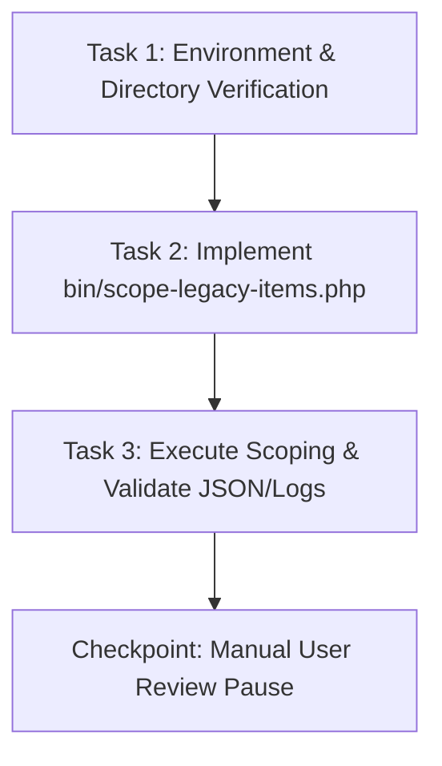

# Plan: Phase 2 - Deep Legacy Item & Page URL Scoping (PHP 7.4)

**TOPIC NAME**: EKA Portal Migration  
**ISSUE NAME**: Phase 2 - Deep Scoping of Legacy Sliders, Shortcodes, MFN Builder Items & Page URLs  
**SPEC FILE**: `ai-work/specs/PHASE-2-LEGACY-SCOPING-SPEC.md`  

---

## 1. Executive Summary & Objective

The objective of Phase 2 is to deeply audit and inventory all legacy items embedded across all WordPress posts and pages (`post_type IN ('page', 'post')`) in the EKA portal database under the **PHP 7.4** runtime.

The inventory will capture:
- Page / Post ID
- Page / Post Title and Post Type
- Full Staging Permalink / Page URL (`get_permalink()`)
- Legacy Item Type (`layerslider`, `rev_slider`, `vc_posts_grid`, `testimonials`, `mfn_builder_item`, `static_slider`, etc.)
- Item Identifier (Shortcode name / slider ID / meta key)
- Raw Snippet / Shortcode string
- Proposed Gutenberg block remediation strategy

Output targets:
- Structured JSON: `ai-work/scopings/legacy-items-inventory.json`
- Execution Log: `ai-work/logs/phase2-legacy-scoping.log`

---

## 2. Dependency Graph & Work Slicing

### Work Slicing Strategy
- **Task 1 (Read-Only Prep)**: Ensure output directories (`ai-work/scopings/`, `ai-work/logs/`) exist and verify PHP 7.4 WP-CLI access.
- **Task 2 (Implementation)**: Write `bin/scope-legacy-items.php` with regex/meta parser logic for all target shortcodes (`[layerslider]`, `[rev_slider]`, `[vc_*]`, `[testimonials]`, static sliders) and `_mfn-builder-items` metadata.
- **Task 3 (Execution & Verification)**: Run the script via `php7.4 $(which wp) eval-file`, validate JSON output syntax using `jq`, verify log generation, and confirm zero database mutations.

---

## 3. Detailed Task Breakdown

### Task 1: Environment & Directory Verification
* **Goal**: Validate runtime environment, directory structure, and WP-CLI execution path.
* **Dependencies**: None
* **Action Steps**:
  1. Confirm directories `ai-work/scopings` and `ai-work/logs` exist (create if missing).
  2. Test `php7.4 $(which wp) eval-file` readiness.
* **Acceptance Criteria**:
  - `ai-work/scopings` directory exists.
  - `ai-work/logs` directory exists.
  - `php7.4` CLI is reachable and operational.
* **Verification**: `php7.4 --version` and `php7.4 $(which wp) core version`.

### Task 2: Implement Scoping Script (`bin/scope-legacy-items.php`)
* **Goal**: Build standalone PHP script to extract legacy item details and page URLs.
* **Dependencies**: Task 1
* **Action Steps**:
  1. Query all posts and pages (`post_type IN ('page', 'post')`, `post_status IN ('publish', 'draft', 'private', 'pending')`).
  2. Extract `ID`, `post_title`, `post_type`, and full permalink via `get_permalink($post_id)`.
  3. Scan `post_content` for shortcode patterns:
     - LayerSlider: `[layerslider...]`
     - Revolution Slider: `[rev_slider...]`
     - WPBakery components: `[vc_...]`
     - Testimonials / Board: `[testimonials...]`
     - Image Sliders / Galleries: `[gallery...]` or custom slider shortcodes.
  4. Scan `postmeta` for legacy builder keys:
     - `_mfn-builder-items` (BeTheme MFN page builder layout data).
     - Slider meta fields (`mfn-post-slider`, `_layerslider-id`).
  5. Map each detected item to standard taxonomy schema:
     - `page_id`, `page_title`, `page_url`, `post_type`, `item_type`, `item_identifier`, `raw_snippet`, `proposed_remediation`.
  6. Serialize and save inventory to `ai-work/scopings/legacy-items-inventory.json` with `JSON_PRETTY_PRINT | JSON_UNESCAPED_SLASHES`.
* **Acceptance Criteria**:
  - Script handles empty or non-matching posts gracefully.
  - Correctly resolves page URLs without site URL mismatch.
  - Implements strict read-only database operations (no `wp_update_post` or `$wpdb` writes).
* **Verification**: Code review of `bin/scope-legacy-items.php`.

### Task 3: Execute Scoping & Validate Inventory Output
* **Goal**: Execute the scoping workflow, capture execution logs, validate JSON integrity, and verify zero database mutations.
* **Dependencies**: Task 2
* **Action Steps**:
  1. Run command:
     `php7.4 $(which wp) eval-file bin/scope-legacy-items.php --path=public > ai-work/logs/phase2-legacy-scoping.log 2>&1`
  2. Validate JSON with `jq . ai-work/scopings/legacy-items-inventory.json > /dev/null`.
  3. Inspect log file `ai-work/logs/phase2-legacy-scoping.log` for errors.
  4. Verify post count and item count summaries in output.
* **Acceptance Criteria**:
  - `ai-work/scopings/legacy-items-inventory.json` exists and is valid JSON.
  - `ai-work/logs/phase2-legacy-scoping.log` captures execution output cleanly.
  - No database records modified during execution.
* **Verification**: `jq . ai-work/scopings/legacy-items-inventory.json` and `git status` check on database/files.

---

## 4. Git Workflow & Safety Rules

- **Branch / Commit Workflow**:
  - Commit 1: `feat(scoping): create bin/scope-legacy-items.php script`
  - Commit 2: `docs(scoping): generate legacy-items-inventory.json and execution log`
- **Safety Protocol**:
  - Strictly route WP-CLI through `php7.4`.
  - Perform zero write operations on post table or options table.
  - Manual user pause required before progressing to Phase 3.

---

## 5. Token Cost & Optimization Analysis

| Provider / Model | Est. Input Tokens | Est. Output Tokens | Input Rate ($/1M) | Output Rate ($/1M) | Est. Total Cost ($) |
|---|---|---|---|---|---|
| **Gemini 3.6 Flash** | 25,000 | 4,000 | $0.075 | $0.30 | **$0.0031** |
| **Gemini 1.5 Pro** | 25,000 | 4,000 | $1.25 | $5.00 | **$0.0513** |
| **Claude 3.5 Sonnet** | 25,000 | 4,000 | $3.00 | $15.00 | **$0.1350** |
| **GPT-4o** | 25,000 | 4,000 | $2.50 | $10.00 | **$0.1025** |

### Areas for Token Optimization
1. **Targeted File Reading**: Avoid dumping large database blobs in CLI outputs; print summary statistics in script logs.
2. **Compact Logging**: Limit verbose item printing to JSON output file rather than stdout stream.
