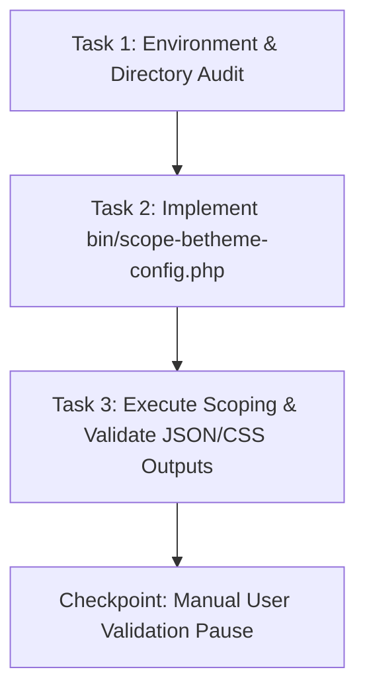

# Plan: Phase 3 - Deep BeTheme Configuration, Options & Layout Scoping (PHP 7.4)

**TOPIC NAME**: EKA Portal Migration  
**ISSUE NAME**: Phase 3 - Deep BeTheme Configuration, Options & Layout Scoping  
**SPEC FILE**: `ai-work/specs/PHASE-3-BETHEME-CONFIG-SCOPING-SPEC.md`  

---

## 1. Executive Summary & Objective

The objective of Phase 3 is to deeply analyze, extract, and document all legacy BeTheme configuration options, theme options arrays (`betheme` / `mfn_theme_options`), dynamic sidebar configurations, custom MFN builder layouts (`_mfn-builder-items`), color palettes, typography tokens, header configurations, and custom CSS into structured JSON/CSS artifacts under the **PHP 7.4** runtime.

Target Output Artifacts:
- **BeTheme Options Array**: `ai-work/scopings/betheme-config-scoping.json`
- **MFN Builder Pages Catalog**: `ai-work/scopings/mfn-pages.json`
- **Extracted Custom CSS & Dynamic Sidebars**: `ai-work/scopings/betheme-custom-css.css`
- **Execution Log**: `ai-work/logs/phase3-scoping.log`

---

## 2. Dependency Graph & Work Slicing

### Work Slicing Strategy
- **Task 1 (Prep)**: Verify required `ai-work/scopings/` and `ai-work/logs/` directories exist and ensure `php7.4` CLI compatibility.
- **Task 2 (Script Implementation)**: Build a dedicated PHP script (`bin/scope-betheme-config.php`) executing under PHP 7.4 that extracts:
  1. Complete serialized `betheme` / `mfn_theme_options` settings array.
  2. Database scan for all pages containing `_mfn-builder-items` postmeta.
  3. Custom CSS blocks from theme options or customizer options.
- **Task 3 (Execution & Verification)**: Run the script via `php7.4 $(which wp) eval-file`, route logs cleanly to `ai-work/logs/phase3-scoping.log`, validate JSON syntax via `jq`, verify CSS output, and confirm zero database mutations.

---

## 3. Detailed Task Breakdown

### Task 1: Environment & Directory Verification
* **Goal**: Confirm output directories exist and verify `php7.4` WP-CLI environment.
* **Dependencies**: None
* **Action Steps**:
  1. Ensure `ai-work/scopings/` and `ai-work/logs/` exist.
  2. Test `php7.4 $(which wp) --version` access.
* **Acceptance Criteria**:
  - `ai-work/scopings` directory exists.
  - `ai-work/logs` directory exists.
  - `php7.4` CLI is reachable and functional.
* **Verification Step**: Run `php7.4 --version` and check folder existence.

### Task 2: Implement BeTheme Scoping Script (`bin/scope-betheme-config.php`)
* **Goal**: Build a robust, read-only PHP 7.4 scoping script for BeTheme configurations.
* **Dependencies**: Task 1
* **Action Steps**:
  1. Query `get_option('betheme')` and `get_option('mfn_theme_options')`.
  2. Map header layout preferences, logo URLs/dimensions, primary/secondary colors, typography fonts, and dynamic sidebar registrations.
  3. Query `wp_postmeta` for all posts/pages containing `_mfn-builder-items`.
  4. Extract custom CSS strings (`custom-css` / `mfn_custom_css` meta or options).
  5. Save JSON outputs to `ai-work/scopings/betheme-config-scoping.json` and `ai-work/scopings/mfn-pages.json`.
  6. Save CSS output to `ai-work/scopings/betheme-custom-css.css`.
* **Acceptance Criteria**:
  - Full theme options serialized without data loss.
  - Read-only execution with zero `$wpdb` or `update_option` write calls.
* **Verification Step**: Code inspection of `bin/scope-betheme-config.php`.

### Task 3: Execute Scoping & Validate Output Integrity
* **Goal**: Execute the Phase 3 scoping process, validate JSON syntax, check execution log clean output, and verify read-only database state.
* **Dependencies**: Task 2
* **Action Steps**:
  1. Execute command:
     `php7.4 $(which wp) eval-file bin/scope-betheme-config.php --path=public > ai-work/logs/phase3-scoping.log 2>&1`
  2. Validate JSON with `jq . ai-work/scopings/betheme-config-scoping.json > /dev/null`.
  3. Validate JSON with `jq . ai-work/scopings/mfn-pages.json > /dev/null`.
  4. Audit `ai-work/logs/phase3-scoping.log` for error-free completion.
* **Acceptance Criteria**:
  - All output files exist and pass validation.
  - `phase3-scoping.log` cleanly captures execution.
  - No database records modified.
* **Verification Step**: `jq .` execution and `git status` check.

---

## 4. Git Workflow & Safety Protocol

- **Commit Plan**:
  - `feat(scoping): create bin/scope-betheme-config.php script`
  - `docs(scoping): generate Phase 3 BeTheme JSON/CSS scopings and log`
- **Safety Protocol**:
  - All WP-CLI invocations routed strictly through `php7.4`.
  - Strictly read-only operations.
  - Manual user review pause required before advancing to Phase 4.

---

## 5. Token Cost & Optimization Analysis

| Provider / Model | Est. Input Tokens | Est. Output Tokens | Input Rate ($/1M) | Output Rate ($/1M) | Est. Total Cost ($) |
|---|---|---|---|---|---|
| **Gemini 3.6 Flash** | 25,000 | 4,000 | $0.075 | $0.30 | **$0.0031** |
| **Gemini 1.5 Pro** | 25,000 | 4,000 | $1.25 | $5.00 | **$0.0513** |
| **Claude 3.5 Sonnet** | 25,000 | 4,000 | $3.00 | $15.00 | **$0.1350** |
| **GPT-4o** | 25,000 | 4,000 | $2.50 | $10.00 | **$0.1025** |

### Areas for Token Optimization
- Clean output redirection to `ai-work/logs/phase3-scoping.log` ensures CLI dumps are kept out of prompt context.
