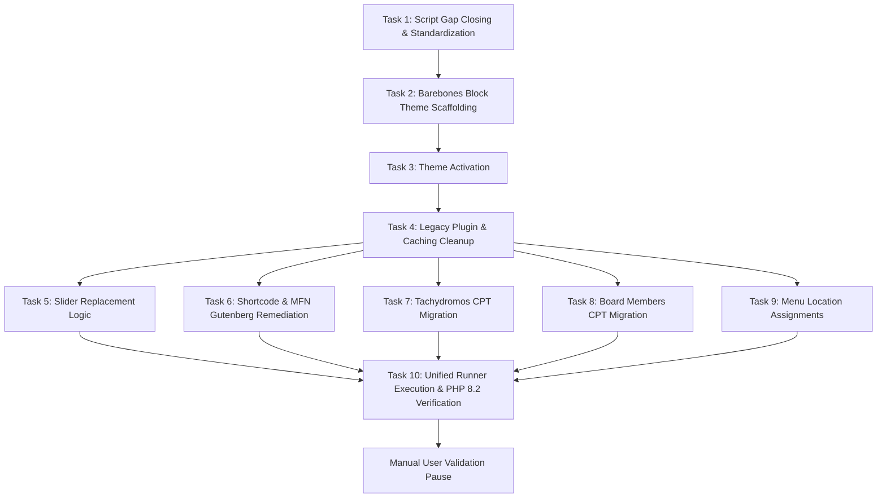

# Implementation Plan: Phase 4 - Theme Cutover, Content Migration, Shortcode & MFN Gutenberg Remediation, Plugin Cleanup & PHP 8.2 Upgrade

**TOPIC NAME**: EKA Portal Migration  
**ISSUE NAME**: Phase 4 - Consolidated Migration & Cutover Pass  
**STATUS**: `[PLANNING / REVISED FOR FSE SCAFFOLDING / APPROVED FOR EXECUTION]`  

---

## 1. Overview & Objective
Execute the unified cutover pass for the EKA Portal migration using data from Phase 2 & Phase 3 scoping artifacts:
1. Standardize runner scripts (`bin/run-phase4-migration.sh`, `bin/cleanup-plugins.sh`) to close gaps with `PHASE-4-PLUGIN-DEACTIVATION-SPEC.md`.
2. Scaffold barebones FSE block theme infrastructure (`style.css`, `theme.json`, `templates/index.html`, `templates/page.html`, `templates/single.html`, `parts/header.html`, `parts/footer.html`) so theme activation is valid and block content renders natively.
3. Activate `ekalexandria-flagship` theme.
4. Deactivate/cleanup stalling legacy plugins (`LayerSlider`, `js_composer`, `revslider`, etc.) and cache drop-ins so post updates occur without legacy filter interception.
5. Programmatically convert legacy shortcodes (`[vc_*]`, `[testimonials]`) and BeTheme MFN builder items (`_mfn-builder-items`) into native Gutenberg HTML block structures (`core/group`, `core/columns`, `core/column`, `core/heading`, `core/paragraph`, `core/buttons`).
6. Replace LayerSlider & static sliders with native blocks (`core/query` loops and `core/gallery`).
7. Migrate `alx_tachydromos` newsletters and `board_member` records with Polylang translation linkages.
8. Assign navigation menu locations and inject sub-navigation sidebars.
9. Transition CLI runtime to PHP 8.2 and verify zero fatal errors in `wp-content/debug.log`.

---

## 2. Dependency Graph

---

## 3. Vertical Task Breakdown & Acceptance Criteria

### Task 1: Script Gap Closing & Standardization
* **Goal**: Close gaps in `bin/run-phase4-migration.sh` and `bin/cleanup-plugins.sh`.
* **Changes**:
  - Update `bin/run-phase4-migration.sh` to explicitly call `wp eka replace-sliders` and `wp eka remediate-shortcodes` in the correct execution sequence.
  - Update `bin/cleanup-plugins.sh` to remove `rm -rf` automated fallback for failed plugin deletions, enforcing failure logging for manual developer remediation per spec mandate.
* **Verification**:
  - Inspect `bin/run-phase4-migration.sh` to ensure all subcommands are chained.
  - Search `bin/cleanup-plugins.sh` for `rm -rf` to verify zero instance remaining.

### Task 2: Barebones Block Theme Infrastructure Scaffolding
* **Goal**: Provide standard FSE boilerplate files so `ekalexandria-flagship` activates cleanly as a valid FSE block theme.
* **Files Created**:
  - `style.css`: Theme header declaration (Theme Name: EKA Alexandria Flagship, FSE Block Theme).
  - `theme.json`: Version 2 block settings and content layout dimensions.
  - `templates/index.html` & `templates/page.html`: Block templates containing `<!-- wp:post-title -->` and `<!-- wp:post-content -->`.
  - `templates/single.html`: Block template for single post viewing.
  - `parts/header.html` & `parts/footer.html`: Simple placeholder template parts.
* **Verification**:
  - Confirm file existence via CLI. Verify theme validity with `wp theme status ekalexandria-flagship --path=public`.

### Task 3: Theme Activation
* **Command**: `php7.4 $(which wp) theme activate ekalexandria-flagship --path=public`
* **Log File**: `ai-work/logs/phase4-unified-migration.log`
* **Criteria**: Flagship theme is active so `wp eka` CLI subcommands are natively registered.

### Task 4: Legacy Plugin & Caching Cleanup (`bin/cleanup-plugins.sh`)
* **Command**: `bash bin/cleanup-plugins.sh`
* **Log File**: `ai-work/logs/cleanup-plugins.log`
* **Criteria**: Deactivate and remove stalling plugins (`LayerSlider`, `js_composer`, `revslider`, `ewww-image-optimizer`, `wordpress-seo`, `w3-total-cache`). Purge caching drop-ins (`advanced-cache.php`, `object-cache.php`, `w3tc-config`, `cache`). Strict logging: log failures without `rm -rf` fallbacks.

### Task 5: Dynamic & Static Slider Replacement (`wp eka replace-sliders`)
* **Command**: `php7.4 $(which wp) eka replace-sliders --path=public`
* **Log File**: `ai-work/logs/sliders-migration.log`
* **Criteria**: Dynamic homepage/news sliders on pages `13236, 17194, 17215, 17219, 8934, 16920, 16923` replaced with `core/query` loops. Static sliders on inner pages replaced with `core/gallery` blocks using pre-mapped media IDs from `layer-sliders-scoping.json`.

### Task 6: Gutenberg Shortcode & MFN Remediation (`wp eka remediate-shortcodes`)
* **Command**: `php7.4 $(which wp) eka remediate-shortcodes --path=public`
* **Log File**: `ai-work/logs/remediate-shortcodes.log`
* **Criteria**: MFN builder items (`mfn-pages.json`) and WPBakery shortcodes (`[vc_*]`) converted to native block comment syntax. `[testimonials]` replaced with `board_member` `core/query` loop. `[vc_posts_grid]` replaced with post `core/query` loops. Vertical `core/navigation` blocks injected for sub-navigation sidebars (Menus 70, 71, 117, 3377, 3378, 3944, 3945, 3707, 3716).

### Task 7: Alexandrinos Tachydromos (`alx_tachydromos`) CPT Migration (`wp eka migrate-tachydromos`)
* **Command**: `php7.4 $(which wp) eka migrate-tachydromos --path=public`
* **Log File**: `ai-work/logs/tachydromos-migration.log`
* **Criteria**: 32 newsletters migrated from `tachydromos-scoping.json`, Greek month titles normalized, PDF `core/file` blocks embedded, unscaled media IDs reassigned, `_eka_pdf_filename` meta saved for idempotency.

### Task 8: Board Members (`board_member`) CPT Migration (`wp eka migrate-board`)
* **Command**: `php7.4 $(which wp) eka migrate-board --path=public`
* **Log File**: `ai-work/logs/board-migration.log`
* **Criteria**: 15 testimonials migrated from `board-scoping.json`, `` and `[vc_*]` tags stripped, unscaled thumbnails reassigned, Polylang translations linked via `pll_save_post_translations`, `_legacy_testimonial_id` saved.

### Task 9: Navigation Menu Location Assignments
* **Command**: WP-CLI menu location assignments
* **Log File**: `ai-work/logs/menu-assignments.log`
* **Criteria**: Greek Main (13 -> `main-menu`), English Main (3315 -> `main-menu___en`), Arabic Main (3316 -> `main-menu___ar`), Greek Footer (21 -> `social-menu-bottom`).

### Task 10: Unified Pass Execution & PHP 8.2 Transition Verification
* **Command**: `bash bin/run-phase4-migration.sh` & `php8.2 $(which wp) ...`
* **Criteria**: Orchestrate full execution in `bin/run-phase4-migration.sh`. Verify dual-pass idempotency. Transition CLI verification runtime to PHP 8.2. Confirm zero fatal errors or WSOD in `public/wp-content/debug.log`. Hold for Manual User Validation.

---

## 4. Git Workflow
- Feature Branch: `feature/phase-4-consolidated-cutover`
- Commit Message Convention: `feat(phase-4): <description>`
- Verification requirement: Manual verification before every commit.

---

## 5. Token Budget & Cost Table

| Operation Phase | Target Output / Tooling | Estimated Token Budget |
| :--- | :--- | :--- |
| **Task 1 & Task 2: Script Gap Closing & Scaffolding** | Updating scripts, creating `style.css`, `theme.json`, `templates/` | ~3,000 tokens |
| **Tasks 3-9: Execution & Logging** | Executing `bin/run-phase4-migration.sh` under PHP 7.4 | ~4,500 tokens |
| **Task 10: PHP 8.2 & Audit** | Running PHP 8.2 verification & targeted log parsing | ~4,500 tokens |
| **Total Estimated Budget** | | **~12,000 tokens** |

---

## 6. Checkpoint
- **Manual User Validation Pause**: Upon successful completion of Task 10, halt execution and present log summaries for manual user review before starting Phase 5.
