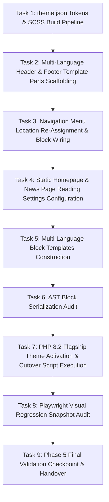

# Implementation Plan: Phase 5 - PHP 8.2 Upgrade, Theme Deployment & Visual Audit

**TOPIC NAME**: EKA Portal Migration  
**ISSUE NAME**: Phase 5 - PHP 8.2 Upgrade, Theme Deployment & Visual Audit  
**STATUS**: `[PLANNING / REVISED WITH SCOPED JSON & CSS / PENDING HUMAN REVIEW]`  

---

## 1. Overview & Objective
Execute Phase 5 of the EKA Portal Migration: activate the bespoke `ekalexandria-flagship` Full Site Editing (FSE) block theme under PHP 8.2, configure `theme.json` from Phase 3 JSON scoping files (`ai-work/scopings/styles.json` & `ai-work/scopings/betheme-config-scoping.json`), compile SCSS design system assets (`npm run build`), construct multi-language layout template parts and templates (EL, EN, AR), programmatically assign navigation menu locations, configure reading settings (Static Homepage and News Page), validate block AST serialization against WordPress standards, and perform Playwright visual regression snapshots.

Key deliverables:
1. **`theme.json` Token Mapping**: Map typography (`Roboto`, `Patua One`), colors (`#000119` header wrapper, `#293e7a` primary theme color/links, `#545454` footer background, `#626262` body text), logo paths, and layout settings extracted in `ai-work/scopings/styles.json` and `ai-work/scopings/betheme-config-scoping.json` directly into `theme.json` v2 schema.
2. **Scoped CSS Design System & SCSS Compilation**: Integrate extracted Phase 3 BeTheme scoping CSS assets (`ai-work/scopings/betheme-active-styles.css` & `ai-work/scopings/betheme-custom-css.css`) into `assets/scss/style.scss` and `assets/scss/rtl.scss`, and compile via `@wordpress/scripts` into minified production CSS in `build/`.
3. **Template Parts Construction**: Scaffolding multi-language headers (`header-el.html`, `header-en.html`, `header-ar.html`) with logo (`eka-logo-wide-small.png`), Top Bar (Polylang switcher, social links), dynamic main navigation, and restored modal search trigger; scaffolding footers (`footer-el.html`, `footer-en.html`, `footer-ar.html`).
4. **Menu Assignment Re-Verification**: Re-assign WP menu locations (`Main Greek Menu` ID 13 -> `main-menu`, `Main English Menu` ID 3315 -> `main-menu___en`, `Main Arabic Menu` ID 3316 -> `main-menu___ar`, `Footer Greek Menu` ID 21 -> `social-menu-bottom`) and ensure navigation blocks bind to correct menu IDs.
5. **Homepage & News Page Configuration**: Programmatically set/verify WordPress reading options (`show_on_front` = `page`, `page_on_front` = Homepage ID, `page_for_posts` = News Page ID) so page routing seamlessly loads modern FSE templates.
6. **Multi-Language Block Templates**: Create native Gutenberg block templates for Front-Page (`front-page-el.html`, `front-page-en.html`, `front-page-ar.html`), Page (`page.html`), Single Post (`single.html`), General Archive (`archive.html`), Category (`category.html`), Alexandrinos Tachydromos Archive & Single (`archive-alx_tachydromos.html`, `tachydromos.html`), and Board Members Archive & Single (`archive-board_member.html`, `board-members.html`).
7. **AST Block Validation**: Validate all FSE template block structures via `@wordpress/block-serialization-default-parser`.
8. **PHP 8.2 Theme Activation & Production Cutover**: Execute theme activation under PHP 8.2 and verify clean execution with zero fatal errors or deprecations in `public/wp-content/debug.log`.
9. **Playwright Baseline Audit**: Execute automated visual regression snapshots (`bin/scrape-baselines.js`) against reference snapshots.

---

## 2. Dependency Graph


---

## 3. Vertical Task Breakdown & Acceptance Criteria

### Task 1: `theme.json` Tokens & Scoped SCSS Asset Compilation (`npm run build`)
* **Goal**:
  1. Map design tokens from `ai-work/scopings/styles.json` and `ai-work/scopings/betheme-config-scoping.json` into `theme.json` v2 schema:
     - Typography: Body font `Roboto, Arial, sans-serif`, Headings `Patua One, Arial, sans-serif`.
     - Color Palette: Primary accent `#293e7a`, Header wrapper `#000119`, Footer bg `#545454`, Text `#626262`, Headings `#444444`.
     - Layout Content & Wide Width dimensions.
  2. Import extracted Phase 3 scoping CSS assets (`ai-work/scopings/betheme-active-styles.css` & `ai-work/scopings/betheme-custom-css.css`) into `assets/scss/style.scss` & `assets/scss/rtl.scss`.
  3. Compile minified production bundles using `@wordpress/scripts`.
* **Commands**:
  ```bash
  npm install
  npm run build > ai-work/logs/phase5-deployment.log 2>&1
  ```
* **Acceptance Criteria**:
  - `theme.json` reflects scoped colors, typography, and logo references.
  - `npm run build` exits 0 with zero compilation errors and populates `build/`.

### Task 2: Multi-Language FSE Header & Footer Template Parts Scaffolding (`parts/`)
* **Goal**: Build multi-language header (`header-el.html`, `header-en.html`, `header-ar.html`) and footer (`footer-el.html`, `footer-en.html`, `footer-ar.html`) template parts using scoped BeTheme parameters (`betheme-config-scoping.json`).
* **Features Included**:
  - **Top Bar**: Polylang Language Selector and social media links.
  - **Main Header**: Scoped Logo (`eka-logo-wide-small.png`), dynamic navigation block, and modal search trigger.
  - **Footer**: Scoped footer layout, footer menu, copyright statement, and site credits.
* **Acceptance Criteria**:
  - Clean Gutenberg block syntax without hardcoded inline `style="..."` attributes.

### Task 3: Navigation Menu Location Re-Assignment & Block Wiring (`wp eka assign-menus`)
* **Goal**: Re-assign WordPress menu locations programmatically to ensure header and footer navigation blocks bind correctly across languages.
* **Assignments**:
  - Greek Main Menu (ID 13) -> `main-menu`
  - English Main Menu (ID 3315) -> `main-menu___en`
  - Arabic Main Menu (ID 3316) -> `main-menu___ar`
  - Greek Footer Menu (ID 21) -> `social-menu-bottom`
* **Acceptance Criteria**:
  - `wp menu location assign` or `wp eka assign-menus` executes successfully.
  - Header and footer template parts link directly to valid navigation menu refs.

### Task 4: Static Homepage & News (Posts Page) Configuration (`wp eka configure-reading-settings`)
* **Goal**: Programmatically configure WordPress reading settings (`show_on_front` = `page`, `page_on_front` = Homepage ID, `page_for_posts` = News Page ID) so homepage and news listing routes accurately bind to FSE templates.
* **Acceptance Criteria**:
  - `wp option get show_on_front` returns `page`.
  - `wp option get page_on_front` and `wp option get page_for_posts` return valid page IDs.
  - Front-page and News URLs render respective modern block templates without layout fallback errors.

### Task 5: Multi-Language FSE Block Templates Construction (`templates/`)
* **Goal**: Construct native block layout templates for all required page types.
* **Files**:
  - Front-Page: `front-page-el.html`, `front-page-en.html`, `front-page-ar.html`
  - Pages & Posts: `page.html`, `single.html`
  - Archives & Taxonomy: `archive.html`, `category.html`
  - Alexandrinos Tachydromos: `archive-alx_tachydromos.html`, `tachydromos.html`
  - Board Members: `archive-board_member.html`, `board-members.html`
* **Acceptance Criteria**:
  - Pure native Gutenberg core blocks (Query Loop, Post Title, Post Content, Featured Image, Columns). Zero un-scoped layout assumptions.

### Task 6: AST Block Serialization Audit
* **Goal**: Verify AST block structure validity using `@wordpress/block-serialization-default-parser`.
* **Acceptance Criteria**:
  - All template files in `templates/` and `parts/` pass block parser verification with 0 syntax errors or unclosed block comments.

### Task 7: PHP 8.2 Flagship Theme Activation & Production Cutover (`wp eka production-cutover`)
* **Goal**: Activate `ekalexandria-flagship` under PHP 8.2 CLI runtime, flush rewrite rules, and run standalone cutover script logging output to `ai-work/logs/phase5-deployment.log`.
* **Commands**:
  ```bash
  php8.2 $(which wp) theme activate ekalexandria-flagship --path=public >> ai-work/logs/phase5-deployment.log 2>&1
  php8.2 $(which wp) rewrite flush --path=public >> ai-work/logs/phase5-deployment.log 2>&1
  ```
* **Acceptance Criteria**:
  - Zero PHP fatal errors, warnings, or deprecations in `public/wp-content/debug.log`.

### Task 8: Playwright Visual Regression Snapshot Audit (`node bin/scrape-baselines.js`)
* **Goal**: Run Playwright automated baseline comparison to capture and audit rendered visual layout snapshots.
* **Command**:
  ```bash
  node bin/scrape-baselines.js >> ai-work/logs/phase5-deployment.log 2>&1
  ```
* **Acceptance Criteria**:
  - All core page types match reference baseline snapshots in `ai-work/baselines/`.

### Task 9: Phase 5 Final Validation Checkpoint & Handover
* **Goal**: Inspect final execution logs, verify environment health under PHP 8.2, and halt for final human user approval.

---

## 4. Git Workflow
- **Feature Branch**: `feature/phase-5-php82-theme-deployment`
- **Commit Message Convention**: `feat(phase-5): <description>`
- **Verification Requirement**: Manual spec verification required prior to code commits.

---

## 5. Token Budget & Cost Table

| Operation Phase | Target Output / Tooling | Estimated Token Budget |
| :--- | :--- | :--- |
| **Tasks 1-2: `theme.json` & Template Parts** | Map `styles.json` & `betheme-config-scoping.json` to `theme.json`, SCSS compile (`npm run build`), template parts (`parts/`) | ~4,500 tokens |
| **Tasks 3-4: Menus & Reading Settings** | Menu location assignment & reading configuration WP-CLI commands | ~2,500 tokens |
| **Tasks 5-6: Template Files & AST Audit** | Multi-language templates (`templates/`) & parser validation | ~4,500 tokens |
| **Tasks 7-9: Cutover, Audit & Checkpoint** | PHP 8.2 theme cutover, Playwright snapshot audit & logs | ~3,500 tokens |
| **Total Estimated Budget** | | **~15,000 tokens** |

---

## 6. Checkpoint
- **Manual User Validation Pause**: Upon completion of Task 8, halt execution and present log summaries for final user sign-off.
