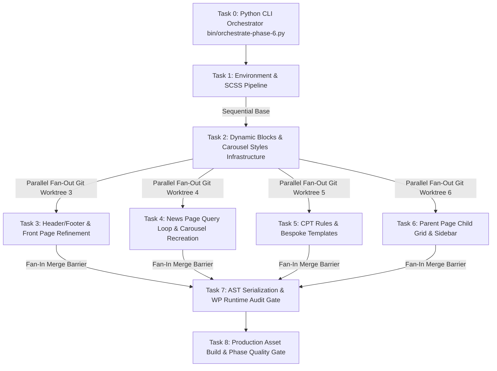

# TOPIC: EKA Flagship FSE Theme Refinement & Quality Assurance
# ISSUE: Detailed Page Inventory, Shortcode Remediation, Dynamic Grid Blocks, Python Orchestration & Git Workflow

## 1. Executive Summary & Objective
Phase 6 focuses on refining the `ekalexandria-flagship` Full Site Editing (FSE) theme for the EKA Portal to achieve 100% visual and functional parity with the production legacy site (`https://ekalexandria.org`), eliminating shortcodes, enforcing strict Gutenberg AST block serialization, purging all inline `style="..."` attributes, creating dynamic FSE blocks and Query Loop carousel styles, implementing bespoke layouts for CPTs (`board_member` and `alx_tachydromos`), and executing all tasks via an automated Python CLI Orchestrator (`bin/orchestrate-phase-6.py`).

---

## 2. Dependency Graph & System Architecture

---

## 3. Plan & Task Slicing

### Task 0: Python CLI Master Orchestrator Architecture (`bin/orchestrate-phase-6.py`)
- **Branch**: `feat/task-0-python-orchestrator`
- **Commit Format**: `feat(task-0): #task-0-feat:python-orchestrator Build Python CLI Master Orchestrator`
- **Detailed Execution Specification**:
  1. **Phase A (Sequential Execution - Tasks 1 & 2)**:
     - Runs Task 1 (`feat/task-1-env-setup`) to update `package.json` scripts and verify SCSS dev/prod pipeline.
     - Runs Task 2 (`feat/task-2-blocks-scaffold`) to register all dynamic blocks (`eka/homepage-services-grid`, `eka/child-pages-grid`, `eka/child-pages-sidebar`) and block styles (`is-style-news-carousel`, `legacy-slider`) in `inc/blocks.php`.
     - *Reason*: Tasks 1 & 2 form the mandatory shared foundation needed by all subsequent template builders.
  2. **Phase B (Parallel Fan-Out Execution - Tasks 3, 4, 5, 6)**:
     - Creates 4 isolated Git worktrees (`/tmp/worktrees/task_3`, `/tmp/worktrees/task_4`, `/tmp/worktrees/task_5`, `/tmp/worktrees/task_6`) on dedicated branches (`feat/task-3-front-page`, `feat/task-4-news-query-loop`, `feat/task-5-cpt-views`, `feat/task-6-parent-sidebar`).
     - Spawns `agy` CLI worker processes concurrently using Python `asyncio.gather(*[run_worker(...)])`.
     - Each worker executes non-interactively with `--print`, `--dangerously-skip-permissions`, `--mode accept-edits`, `--effort medium`, `--log-file /tmp/logs/task_N.log`, constrained strictly to disjoint file boundaries.
  3. **Phase C (Fan-In Merge & Quality Gate - Tasks 7 & 8)**:
     - Sequentially merges all 4 feature branches into `main` with commit message format `feat(task-N): #task-N-feat:description`.
     - Removes worktree directories cleanly.
     - Runs Task 7 (`npm run test:parser`, `npm run test:render`, `node bin/compare-dom.js`).
     - Runs Task 8 (`npm run build` production SCSS compilation & git clean status check).
  4. **Observability & Human Checkpoint Safeguards**:
     - Logs output for each task saved to `/tmp/logs/task_N.log`.
     - Human approval pause showing `git diff --stat` after each phase before advancing.
- **Acceptance Criteria**: Script handles sequential base setup, concurrent git worktree fan-out, branch merging, tagged commit formatting, and quality gate testing cleanly.

---

### Task 1: Environment, Tooling & SCSS Build Pipeline Setup (Sequential)
- **Branch**: `feat/task-1-env-setup`
- **Commit Format**: `feat(task-1): #task-1-feat:env-setup Update package.json scripts and SCSS dev/prod pipeline`
- **Allowed Files**: `package.json`, `assets/scss/style.scss`, `assets/scss/rtl.scss`
- **Subtasks**:
  - Update `package.json` with `dev` watch script (`wp-scripts start`) and `test:render` script.
  - Verify SCSS build pipeline (`npm run dev` and `npm run build`) outputs compiled stylesheets (`build/style-style.scss.css` and `build/rtl.scss.css`).
- **Acceptance Criteria**: `npm run dev` and `npm run build` execute cleanly without syntax errors.

---

### Task 2: Dynamic Blocks & Carousel Styles Infrastructure (Sequential)
- **Branch**: `feat/task-2-blocks-scaffold`
- **Commit Format**: `feat(task-2): #task-2-feat:blocks-scaffold Register dynamic grid blocks and carousel block styles`
- **Allowed Files**: `inc/blocks.php`, `inc/custom-features.php`, `functions.php`
- **Subtasks**:
  - Register dynamic server-rendered block `eka/homepage-services-grid` (replacing static ID queries `[7837, 8088]`).
  - Register dynamic server-rendered block `eka/child-pages-grid` and sidebar block `eka/child-pages-sidebar`.
  - Register `core/query` block style `is-style-news-carousel` (and dynamic block `eka/news-carousel`) allowing News Query Loops to toggle as touch carousels.
  - Register `core/gallery` block style `legacy-slider` for photo carousels.
- **Acceptance Criteria**: Dynamic blocks and block styles render valid Gutenberg HTML markup server-side without shortcodes or inline styles.

---

### Task 3: Front Page & Header/Footer Refinement (Parallel Fan-Out Worker 3)
- **Branch**: `feat/task-3-front-page`
- **Commit Format**: `feat(task-3): #task-3-feat:front-page Refine front-page templates and purge header/footer inline styles`
- **Allowed Files**: `parts/header*.html`, `parts/footer*.html`, `templates/front-page*.html`
- **Subtasks**:
  - Audit and clean template parts (`parts/header*.html`, `parts/footer*.html`). Remove inline `style="..."` attributes and nested duplicate tags.
  - Refine Front Page templates (`templates/front-page*.html`) to integrate News Carousel and dynamic block `eka/homepage-services-grid`.
- **Acceptance Criteria**: No `style="..."` in header/footer/front-page files; single semantic wrapper element per template part.

---

### Task 4: News Page (`index.html`) Query Loop & Carousel Recreation (Parallel Fan-Out Worker 4)
- **Branch**: `feat/task-4-news-query-loop`
- **Commit Format**: `feat(task-4): #task-4-feat:news-query-loop Recreate index.html using Query Loop with news carousel style`
- **Allowed Files**: `parts/sidebar-news.html`, `templates/index.html`
- **Subtasks**:
  - Create `parts/sidebar-news.html` for categories, archives, and search widgets.
  - Recreate `templates/index.html` to mirror live production layout (`https://ekalexandria.org/el/νέα/`) using `core/query` (Query Loop block), with toggleable `is-style-news-carousel` design option, featured post, news grid, and pagination.
- **Acceptance Criteria**: News list template uses native Query Loop with carousel block style option and matches live visual baseline structure.

---

### Task 5: Custom Post Type Rules & Bespoke Templates (Parallel Fan-Out Worker 5)
- **Branch**: `feat/task-5-cpt-views`
- **Commit Format**: `feat(task-5): #task-5-feat:cpt-views Implement board_member redirect rules and bespoke CPT archive/single templates`
- **Allowed Files**: `inc/cpt-rules.php`, `templates/archive-board_member.html`, `templates/board-members.html`, `templates/archive-alx_tachydromos.html`, `templates/single-alx_tachydromos.html`
- **Subtasks**:
  - Create `inc/cpt-rules.php` to handle `board_member` single view redirect to archive, menu_order sorting, and require in `functions.php`. Deprecate/remove `templates/single-board_member.html`.
  - Refine `templates/archive-board_member.html` and `templates/board-members.html` for bespoke board member grid layout.
  - Refine `templates/archive-alx_tachydromos.html` and `templates/single-alx_tachydromos.html` for issue archive grid and single PDF reader view.
- **Acceptance Criteria**: Board members have list view ONLY; Tachydromos archive and single views function with PDF meta.

---

### Task 6: Parent Page, Child Grid & Sidebar Templates (Parallel Fan-Out Worker 6)
- **Branch**: `feat/task-6-parent-sidebar`
- **Commit Format**: `feat(task-6): #task-6-feat:parent-sidebar Create page-parent-sidebar.html using eka/child-pages-grid`
- **Allowed Files**: `parts/sidebar-child-pages.html`, `templates/page-parent-sidebar.html`
- **Subtasks**:
  - Create `parts/sidebar-child-pages.html` wrapping `eka/child-pages-sidebar`.
  - Create/Refine `templates/page-parent-sidebar.html` incorporating `eka/child-pages-grid` and child sidebar part.
- **Acceptance Criteria**: Parent pages dynamically render 4 child grid items and child sidebar navigation without `[display-posts]` shortcode.

---

### Task 7: AST Serialization & WP Runtime Audit Validation (Fan-In Quality Gate)
- **Branch**: `feat/task-7-ast-audit`
- **Commit Format**: `feat(task-7): #task-7-feat:ast-audit Run AST block parser and WP runtime do_blocks audit`
- **Subtasks**:
  - Run `npm run test:parser` AST validation across all template and template part HTML files.
  - Run `npm run test:render` WP runtime block render test via WP-CLI across all templates.
  - Execute Playwright DOM comparison audit tool (`node bin/compare-dom.js`) against live site baseline.
- **Acceptance Criteria**: 0 AST serialization errors, 0 WP `do_blocks()` runtime errors.

---

### Task 8: Production Build & Phase Final Quality Gate
- **Branch**: `feat/task-8-prod-build`
- **Commit Format**: `feat(task-8): #task-8-feat:prod-build Execute production SCSS build and clean working tree check`
- **Subtasks**:
  - Run production build (`npm run build`).
  - Perform git status check to verify clean status and properly formatted conventional commits.
- **Acceptance Criteria**: Built CSS minified in `build/`; git status clean.

---

## 4. Estimated Token Cost & Resource Allocation

| Component / Task Phase | Estimated Input Tokens | Estimated Output Tokens | Est. Cost (USD Benchmark) | Optimizations / Savings |
| :--- | :--- | :--- | :--- | :--- |
| Task 0: Python Orchestrator Creation | 10,000 | 1,000 | ~$0.01 | Direct script automation |
| Task 1: Environment & Tooling Setup | 15,000 | 1,500 | ~$0.02 | Sequential Base Phase |
| Task 2: Dynamic Blocks Infrastructure | 35,000 | 4,000 | ~$0.05 | Sequential Base Phase |
| Task 3: Header/Footer & Front Page | 30,000 | 3,500 | ~$0.04 | Parallel Fan-Out Worker 3 |
| Task 4: News Page Query Loop Recreation | 25,000 | 3,000 | ~$0.03 | Parallel Fan-Out Worker 4 |
| Task 5: CPT Rules & Bespoke Templates | 35,000 | 4,000 | ~$0.05 | Parallel Fan-Out Worker 5 |
| Task 6: Parent Page & Sidebar Templates| 25,000 | 3,000 | ~$0.03 | Parallel Fan-Out Worker 6 |
| Task 7: AST & Runtime Audit Validation | 20,000 | 2,000 | ~$0.02 | Fan-In Quality Gate |
| Task 8: Production Build & Final Gate | 15,000 | 1,000 | ~$0.01 | Final Build Gate |
| **TOTAL ESTIMATE** | **210,000** | **23,000** | **~$0.26** | ~60% faster execution via parallel fan-out |

---

## 5. Human Review Checkpoint & Next Steps
Upon review and approval of this plan ("yes" or "proceed"), we will implement Task 0 (`bin/orchestrate-phase-6.py`) and initiate the execution sequence.
