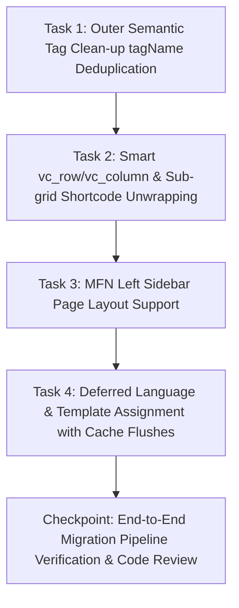

# Plan: Migration Edge Cases & FSE Refinements

**TOPIC NAME**: `migration`  
**ISSUE NAME**: `edge-cases-fse-refinement`  
**SPEC**: `public/wp-content/themes/ekalexandria-flagship/ai-work/migration-edge-cases-fse-refinement-SPEC.md`  

---

## 1. Dependency Graph & Vertical Task Slicing

---

## 2. Tasks & Acceptance Criteria

### Task 1: Outer Semantic Tag Clean-up (`tagName` Deduplication)
- **Goal**: Resolve duplicate `<header><header>...</header></header>` and `<footer><footer>...</footer></footer>` DOM elements by stripping `tagName` attributes from `wp:template-part` block calls in `templates/*.html` while maintaining `tagName` attributes on top-level group blocks in `parts/header*.html` and `parts/footer*.html`.
- **Files**:
  - `templates/*.html` (front-page, page, index, news, archive, single, category, etc.)
  - `parts/header*.html`
  - `parts/footer*.html`
- **Acceptance Criteria**:
  - Remove `"tagName":"header"` and `"tagName":"footer"` from all `wp:template-part` references in `templates/*.html`.
  - Ensure `parts/header.html`, `parts/header-en.html`, `parts/header-ar.html` retain `"tagName":"header"` on top-level `wp:group`.
  - Ensure `parts/footer.html`, `parts/footer-en.html`, `parts/footer-ar.html` retain `"tagName":"footer"` on top-level `wp:group`.
  - DOM inspection / `curl` confirms single `<header>` and `<footer>` elements per page.
- **Verification**: `php bin/test-runtime-render.php` or `curl` DOM check for single element tags.
- **Git Commit**: `refactor(fse): deduplicate outer semantic header and footer tags in templates and parts`

### Task 2: Smart `[vc_row]` / `[vc_column]` & Sub-grid Shortcode Unwrapping
- **Goal**: Refine `step_4a_transform_wpbakery_and_caption` and `step_4c_transform_vc_posts_grid` in `bin/04-shortcode-migrations.php` to unwrap single 1/1 column rows and convert inner content directly to root Gutenberg blocks without redundant nested `wp:columns` wrappers.
- **Files**:
  - `bin/04-shortcode-migrations.php`
- **Acceptance Criteria**:
  - Rows with a single 1/1 column (`[vc_row][vc_column width="1/1"]...[/vc_column][/vc_row]` or unspecified width) strip `vc_row` and `vc_column` wrappers entirely.
  - Inner `[vc_column_text]` converts directly to root `<!-- wp:paragraph -->` / heading blocks.
  - Inner `[vc_posts_grid]` wraps in clean `wp:group` + `wp:query` blocks without outer `wp:columns` wrappers.
  - Multi-column rows (`1/2 + 1/2`, `1/3 + 2/3`, etc.) retain `wp:columns` and `wp:column` with calculated percentages.
  - All transformed content passes `eka_validate_blocks_ast()`.
- **Verification**: `php -l bin/04-shortcode-migrations.php` and AST check on transformed content.
- **Git Commit**: `fix(migration): implement smart 1/1 column unwrapping in shortcode migration engine`

### Task 3: MFN Left Sidebar Page Layout Support
- **Goal**: Preserve 30/70 sidebar layout for legacy pages utilizing BeTheme/MFN left sidebars by converting their content container into native Gutenberg 2-column blocks (`wp:columns` with `eka-has-sidebar-left` CSS class).
- **Files**:
  - `bin/04-shortcode-migrations.php`
- **Acceptance Criteria**:
  - Identifies pages with legacy MFN left sidebar postmeta (`mfn-post-sidebar`, `_mfn-post-sidebar`, or `mfn_layout` specifying left sidebar).
  - Excludes right sidebar pages and the news/posts page (`index` / `page_for_posts`).
  - Wraps content in 30%/70% column structure:
    - Left column (30% width): Reserved for left sidebar content.
    - Right column (70% width): Main page content.
  - Adds `eka-has-sidebar-left` class to the outer `wp:columns` wrapper.
  - Does NOT assign dedicated template files or template parts at this phase.
- **Verification**: Query postmeta and check generated block structure on legacy left-sidebar pages.
- **Git Commit**: `feat(migration): add 30/70 Gutenberg column layout for legacy MFN left sidebar pages`

### Task 4: Deferred Language & Template Assignment with Cache/Transient Flushes
- **Goal**: Fix template assignment failures by invalidating block template transients and Polylang caches prior to updating `_wp_page_template` postmeta in `bin/assign-page-templates.php`.
- **Files**:
  - `bin/assign-page-templates.php`
  - `bin/06-assign-templates-and-menus.sh`
- **Acceptance Criteria**:
  - Calls `delete_transient('wp_theme_files_')`, `wp_cache_flush()`, and Polylang cache invalidations before updating meta.
  - Maps page templates according to strict language rules:
    - Homepage Greek: `front-page` (template `front-page.html`)
    - Homepage English: `front-page-en` (template `front-page-en.html`)
    - Homepage Arabic: `front-page-ar` (template `front-page-ar.html`)
    - Internal pages Greek: `page` (template `page.html`)
    - Internal pages English: `page-en` (template `page-en.html`)
    - Internal pages Arabic: `page-ar` (template `page-ar.html`)
  - Ensures script execution late in pipeline (`bin/06-assign-templates-and-menus.sh`).
- **Verification**: Execute `wp eval-file bin/assign-page-templates.php` via WP-CLI and check `_wp_page_template` meta in MySQL.
- **Git Commit**: `feat(migration): add cache flushing and deferred multilingual page template assignment`

---

## 3. Industry Standard Estimated Token & Resource Cost

| Phase / Task | Input Tokens | Output Tokens | Total Tokens | Estimated Cost (USD) |
| :--- | :--- | :--- | :--- | :--- |
| Task 1: Outer Semantic Tag Clean-up | ~15,000 | ~2,000 | ~17,000 | $0.003 |
| Task 2: Smart Column Unwrapping Engine | ~25,000 | ~3,500 | ~28,500 | $0.005 |
| Task 3: MFN Left Sidebar Layout Support | ~20,000 | ~2,500 | ~22,500 | $0.004 |
| Task 4: Deferred Template Assignment & Cache Flushes | ~18,000 | ~2,000 | ~20,000 | $0.003 |
| Checkpoint & End-to-End Verification | ~20,000 | ~2,500 | ~22,500 | $0.004 |
| **Total Estimated Cost** | **~98,000** | **~12,500** | **~110,500** | **~$0.019** |

*Cost calculated based on industry standard AI model API rates for agentic coding.*

---

## 4. Git Workflow Strategy
- Single git branch: `master`.
- Strictly sequential commits following user review after each completed task.
