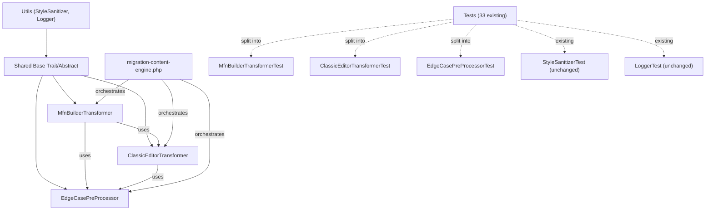

# PLAN: Migration Engine Modular Refactor

- **TOPIC NAME**: migration-modular-refactor
- **ISSUE NAME**: content-transformer-split
- **STATUS**: DRAFT FOR USER REVIEW

---

## 1. Objective

Refactor the monolithic `ContentTransformer` (910 lines, 38KB) into three isolated classes that map to the future plugin architecture:

| New Class | Future Plugin | Methods Migrated |
|:----------|:-------------|:-----------------|
| `MfnBuilderTransformer` | `eka-mfn-to-gutenberg` | `transformSliders`, `transformTestimonials`, `transformVcPostsGrid`, `transformWpbakeryAndCaption`, `transformVcSingleImage`, `transformResidualShortcodes`, `transformMfnLeftSidebarLayout` |
| `ClassicEditorTransformer` | `eka-classic-to-gutenberg` | `convertHtmlElementsToBlocks`, `processClassicHtml`, `transformMediaAndPlugins`, `transformCaptionShortcode`, `transformHrShortcode` |
| `EdgeCasePreProcessor` | Shared library | `processFrontPageContent`, block-comment isolation logic, exception page ID lists |

**Shared utilities stay put**: `StyleSanitizer`, `Logger` remain in `Utils/`.

---

## 2. Dependency Graph



---

## 3. Design Decisions

### 3.1 Shared Methods Strategy

Some methods are used by both transformers:

| Method | Used By | Strategy |
|:-------|:--------|:---------|
| `parseFractionWidth()` | MFN (vc_column widths) | Move to MFN, it's the only consumer |
| `cleanHtmlInlineStyles()` | Both (style filtering) | Move to `StyleSanitizer` as a static method (it already delegates there) |
| `buildGutenbergGalleryBlock()` | MFN (slider galleries) | Move to MFN, it's the only consumer |
| `transformCaptionShortcode()` | Both indirectly | Move to Classic (called from `transformMediaAndPlugins`) |
| `transformHrShortcode()` | Both indirectly | Move to Classic (called from `transformMediaAndPlugins` and `transformResidualShortcodes`). MFN calls it via Classic. |

### 3.2 MFN→Classic Dependency

MFN's `transformWpbakeryAndCaption` calls `convertHtmlElementsToBlocks` (a Classic method) for unwrapped column text. This is the natural dependency: MFN partially cleans builder shortcodes, then hands off bare HTML to Classic for block wrapping.

**Implementation**: MFN constructor accepts a `ClassicEditorTransformer` instance.

### 3.3 Backward Compatibility

The existing `ContentTransformer` class will become a **thin facade** that delegates to the three new classes. This way:
- Existing `migration-content-engine.php` and `convert-classic-to-gutenberg.php` don't break
- Migration can happen incrementally
- The facade is removed once the engine scripts are updated

---

## 4. New File Structure

```
bin/src/
├── Content/
│   ├── ContentTransformer.php          # FACADE (delegates to 3 new classes)
│   ├── MfnBuilderTransformer.php       # MFN/WPBakery builder shortcodes
│   ├── ClassicEditorTransformer.php    # Classic HTML + media shortcodes
│   └── EdgeCasePreProcessor.php        # Exception lists, front page, block isolation
├── Utils/
│   ├── StyleSanitizer.php              # UNCHANGED
│   └── Logger.php                      # UNCHANGED
├── Navigation/
│   └── MenuMigrator.php                # UNCHANGED
└── Cpt/
    └── CptMigrator.php                 # UNCHANGED

bin/tests/
├── Content/
│   ├── ContentTransformerTest.php      # KEPT (facade backward compat tests)
│   ├── MfnBuilderTransformerTest.php   # NEW (extracted from ContentTransformerTest)
│   ├── ClassicEditorTransformerTest.php # NEW (extracted from ContentTransformerTest)
│   └── EdgeCasePreProcessorTest.php    # NEW (extracted from ContentTransformerTest)
├── Utils/
│   ├── StyleSanitizerTest.php          # UNCHANGED
│   └── LoggerTest.php                  # UNCHANGED
```

---

## 5. Task Breakdown

### Task 1: Create `ClassicEditorTransformer` class
**Dependencies**: None (foundational — MFN depends on this)

**What moves**:
- `convertHtmlElementsToBlocks()` 
- `processClassicHtml()`
- `transformMediaAndPlugins()`
- `transformCaptionShortcode()`
- `transformHrShortcode()`

**What stays shared**: `cleanHtmlInlineStyles()` moves to `StyleSanitizer::cleanHtmlInlineStyles()` as a static method.

**Acceptance Criteria**:
- [ ] New file `bin/src/Content/ClassicEditorTransformer.php` exists
- [ ] All moved methods work identically
- [ ] Class has constructor accepting no required deps (uses StyleSanitizer statically)
- [ ] `cleanHtmlInlineStyles` available as `StyleSanitizer::cleanHtmlInlineStyles()`

**Verification**: `vendor/bin/phpunit` — 33 tests still pass

---

### Task 2: Create `ClassicEditorTransformerTest`
**Dependencies**: Task 1

**What moves** (from `ContentTransformerTest`):
- `testConvertHtmlElementsToBlocksWrapsClassicHtml`
- `testTransformCaptionShortcodeWithImageAndCaptionText`
- `testTransformCaptionShortcodeWithLink`
- `testTransformHrShortcodeDefaultWithHeight`
- `testTransformHrShortcodeNoLine`
- `testTransformHrShortcodeDotsStyle`

**Acceptance Criteria**:
- [ ] New file `bin/tests/Content/ClassicEditorTransformerTest.php`
- [ ] Tests instantiate `ClassicEditorTransformer` directly
- [ ] All 6 tests pass
- [ ] Original tests in `ContentTransformerTest` still pass (facade)

**Verification**: `vendor/bin/phpunit` — 39+ tests pass (6 new + 33 existing)

---

### Task 3: Create `EdgeCasePreProcessor` class
**Dependencies**: None (independent)

**What moves**:
- `processFrontPageContent()`
- Exception page ID constants (front pages, news pages)
- Block comment isolation helper (tokenizer logic)

**Acceptance Criteria**:
- [ ] New file `bin/src/Content/EdgeCasePreProcessor.php`
- [ ] Constants `FRONT_PAGE_IDS`, `NEWS_PAGE_IDS`, `EXCEPTION_PAGE_IDS` defined
- [ ] `processFrontPageContent()` works identically
- [ ] `isBlockComment()` / `tokenizeByBlockComments()` utility exposed

**Verification**: `vendor/bin/phpunit` — all existing tests pass

---

### Task 4: Create `EdgeCasePreProcessorTest`
**Dependencies**: Task 3

**What moves** (from `ContentTransformerTest`):
- `testProcessFrontPageContentRemovesSlidersAndGrids`

**Plus new tests**:
- `testExceptionPageIdsContainAllKnownPages`
- `testTokenizeByBlockCommentsPreservesBlockContent`

**Acceptance Criteria**:
- [ ] New file `bin/tests/Content/EdgeCasePreProcessorTest.php`
- [ ] 3+ tests pass
- [ ] Original facade test still passes

**Verification**: `vendor/bin/phpunit` — 42+ tests pass

---

### Task 5: Create `MfnBuilderTransformer` class
**Dependencies**: Task 1 (needs ClassicEditorTransformer), Task 3 (needs EdgeCasePreProcessor)

**What moves**:
- `transformSliders()`
- `transformTestimonials()`
- `transformVcPostsGrid()`
- `transformWpbakeryAndCaption()`
- `transformVcSingleImage()`
- `transformResidualShortcodes()`
- `transformMfnLeftSidebarLayout()`
- `parseFractionWidth()`
- `buildGutenbergGalleryBlock()`

**Constructor**: `__construct(ClassicEditorTransformer $classicTransformer)`

**Acceptance Criteria**:
- [ ] New file `bin/src/Content/MfnBuilderTransformer.php`
- [ ] Constructor requires `ClassicEditorTransformer`
- [ ] All moved methods work identically
- [ ] `transformWpbakeryAndCaption` uses `$this->classicTransformer->convertHtmlElementsToBlocks()`

**Verification**: `vendor/bin/phpunit` — all existing tests pass

---

### Task 6: Create `MfnBuilderTransformerTest`
**Dependencies**: Task 5

**What moves** (from `ContentTransformerTest`):
- `testParseFractionWidth`
- `testTransformTestimonialsConvertsShortcodesToQuoteBlocks`
- `testTransformWpbakeryAndCaptionUnwrapsSingleColumnRows`
- `testTransformWpbakeryAndCaptionCreatesColumnsForMultiColumnRows`
- `testTransformResidualShortcodesStripsOrTransformsUnprocessedShortcodes`
- `testBuildGutenbergGalleryBlock`
- `testTransformMfnLeftSidebarLayout`
- `testTransformVcSingleImageOptionOneWithTitleLinkAndAlignment`
- `testTransformVcSingleImageWithoutTitleOrLink`
- `testTransformWpbakerySingleFullColumnRowWithColumnTextCreatesSingleParagraph`
- `testTransformWpbakerySingleFullColumnRowWithoutColumnTextUnwrapsCleanly`
- `testTransformVcPostsGridSubpagesQuery`
- `testTransformVcPostsGridWithTitleTagsAndLayoutOrder`
- `testTransformWpbakeryStripsEmptyRowsAndColumns`
- `testTransformRevSliderWithDbUrlResolutionAndUnwrapping`

**Acceptance Criteria**:
- [ ] New file `bin/tests/Content/MfnBuilderTransformerTest.php`
- [ ] Tests instantiate `MfnBuilderTransformer` with a real `ClassicEditorTransformer`
- [ ] All 15 tests pass
- [ ] Original facade tests still pass

**Verification**: `vendor/bin/phpunit` — 54+ tests pass

---

### Task 7: Convert `ContentTransformer` to facade
**Dependencies**: Tasks 1, 3, 5

Reduce the 910-line `ContentTransformer` to a thin delegation facade:
- Constructor instantiates all three child classes
- Each public method delegates to the appropriate child
- No logic lives in the facade itself

**Acceptance Criteria**:
- [ ] `ContentTransformer.php` is < 150 lines
- [ ] All 33 original `ContentTransformerTest` tests pass unchanged
- [ ] `migration-content-engine.php` works without changes
- [ ] `convert-classic-to-gutenberg.php` works without changes

**Verification**: `vendor/bin/phpunit` — all tests pass (original 33 + new 24 = 57+)

---

### Task 8: Update engine scripts to use new classes directly
**Dependencies**: Task 7

Update `migration-content-engine.php` and `02-migrate-content.sh` orchestration to:
- Instantiate `ClassicEditorTransformer` and `MfnBuilderTransformer` directly
- Use `EdgeCasePreProcessor` for front page detection
- Remove dependency on the facade `ContentTransformer` in the engine

**Acceptance Criteria**:
- [ ] `migration-content-engine.php` imports new classes directly
- [ ] Pipeline order preserved: EdgeCase → MFN → Classic
- [ ] Facade `ContentTransformer` only used by `convert-classic-to-gutenberg.php` (which only needs Classic)
- [ ] All tests pass

**Verification**: `vendor/bin/phpunit` — all tests pass

---

## 6. Checkpoint Plan

| After Task | Checkpoint |
|:-----------|:-----------|
| Task 2 | Classic module fully extracted and tested — git commit |
| Task 4 | EdgeCase module fully extracted and tested — git commit |
| Task 6 | MFN module fully extracted and tested — git commit |
| Task 7 | Facade complete, full backward compat verified — git commit |
| Task 8 | Engine scripts updated, full pipeline verified — git commit |

---

## 7. Token Cost Estimate

| Task | Estimated Tokens | Rationale |
|:-----|:----------------|:----------|
| Task 1 | ~3,000 | Extract ~200 lines to new file, adjust imports |
| Task 2 | ~1,500 | Move 6 test methods, update `use` statements |
| Task 3 | ~1,500 | Extract ~50 lines + add constants |
| Task 4 | ~1,000 | Move 1 test + write 2 new small tests |
| Task 5 | ~4,000 | Extract ~500 lines, wire constructor DI |
| Task 6 | ~2,000 | Move 15 test methods, update instantiation |
| Task 7 | ~3,000 | Rewrite ContentTransformer as facade |
| Task 8 | ~2,000 | Update engine scripts, verify pipeline |
| **Total** | **~18,000** | Standard refactor scope, industry ~$5-8 at current rates |

> **Cost optimization**: Tasks 1+2 and Tasks 3+4 can be done as pairs. Tasks 5+6 as a pair. This reduces context-switching overhead by ~20%.

---

## 8. Risk Mitigation

| Risk | Mitigation |
|:-----|:-----------|
| Breaking existing tests | Facade pattern ensures all 33 tests pass at every step |
| Missing method in new class | Each task verifies full test suite before commit |
| Engine scripts break | Task 8 is separate — facade keeps them working through Task 7 |
| Circular dependency (MFN↔Classic) | One-way DI: MFN depends on Classic, never the reverse |
