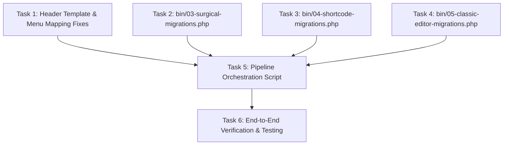

# Plan: Migration Pipeline Optimization - Scoping & Modular Remediation

**TOPIC NAME**: Migration Pipeline Optimization  
**ISSUE NAME**: Scoping & Modular Remediation  
**SPEC PATH**: `public/wp-content/themes/ekalexandria-flagship/ai-work/MIGRATION-MODULARIZATION-SPEC.md`  
**PLAN PATH**: `public/wp-content/themes/ekalexandria-flagship/ai-work/tasks/migration-pipeline-optimization-scoping-modular-remediation-plan.md`  
**TODO PATH**: `public/wp-content/themes/ekalexandria-flagship/ai-work/tasks/migration-pipeline-optimization-scoping-modular-remediation-todo.md`

---

## 1. Executive Summary

This plan establishes a vertical, multi-stage implementation breakdown for optimizing the EKA portal migration pipeline. It addresses header menu reference bugs, enforces cache invalidation before layout/menu assignment, and decouples content transformations into a deterministic 4-step sequence (`03`, `04`, `05`, `06`).

---

## 2. Component Dependency Graph

---

## 3. Vertical Work Slices (Tasks)

### Task 1: Navigation Menu & Header Template Part Fixes
- **Goal**: Resolve Greek front page showing Arabic menu by changing hardcoded `{"ref":72611}` to `"slug":"main-menu"` in `header-el.html` and `header.html`, and updating `assign-menus.php` with scoping ID maps.
- **Files Modified**:
  - `parts/header-el.html`
  - `parts/header.html`
  - `bin/assign-menus.php`
- **Acceptance Criteria**:
  - `header-el.html` navigation block contains `{"slug":"main-menu"}`.
  - `header.html` navigation block contains `{"slug":"main-menu"}`.
  - `assign-menus.php` binds theme locations: `main-menu` => 13, `main-menu___en` => 3315, `main-menu___ar` => 3316, `social-menu-bottom` => 21.
- **Verification**: Run `php7.4 $(which wp) eval-file bin/assign-menus.php` and verify output logs.

### Task 2: Surgical Page-Specific Migration Engine (`bin/03-surgical-migrations.php`)
- **Goal**: Extract surgical transformations (dynamic homepage query loop, static gallery creation using media IDs from scoping, testimonials query loop, VC posts grid cards) into an isolated script.
- **Files Created**:
  - `bin/03-surgical-migrations.php`
- **Acceptance Criteria**:
  - Script connects to `db207080_eka` via `migration-helpers.php`.
  - Transforms homepage/news sliders to Query Loops.
  - Converts static inner page sliders to Gutenberg `core/gallery` blocks with exact media IDs from `legacy_data.md`.
  - Runs AST validation before committing updates.
- **Verification**: Execute `php7.4 $(which wp) eval-file bin/03-surgical-migrations.php` and verify `ai-work/logs/03-surgical-migrations.log`.

### Task 3: Shortcode Remediation Engine (`bin/04-shortcode-migrations.php`)
- **Goal**: Extract structural shortcode transformations (`vc_row`, `vc_column`, `vc_single_image`, `[our_team]`, `[caption]`, residual shortcode wrapping) into an isolated script.
- **Files Created**:
  - `bin/04-shortcode-migrations.php`
- **Acceptance Criteria**:
  - Transforms `vc_row` and `vc_column` into native `core/columns` and `core/column` blocks.
  - Converts `vc_single_image` and `[caption]` into `core/image` blocks.
  - Passes AST validation for every modified post.
- **Verification**: Execute `php7.4 $(which wp) eval-file bin/04-shortcode-migrations.php` and check `ai-work/logs/04-shortcode-migrations.log`.

### Task 4: Classic HTML Block Conversion & CSS Sanitizer (`bin/05-classic-editor-migrations.php`)
- **Goal**: Extract HTML element conversion (`
`, `<h1>`-`<h6>`, `<ul>`, `<ol>`, `<table>`, `<blockquote>`) and inline CSS FSE allowlist sanitization into an isolated script.
- **Files Created**:
  - `bin/05-classic-editor-migrations.php`
- **Acceptance Criteria**:
  - Converts unhandled HTML elements outside existing Gutenberg blocks into block markup.
  - Sanitizes inline CSS styles using `sanitize_inline_styles_fse()`.
  - Passes AST validation.
- **Verification**: Execute `php7.4 $(which wp) eval-file bin/05-classic-editor-migrations.php` and check `ai-work/logs/05-classic-editor-migrations.log`.

### Task 5: Pipeline Orchestration & Cache Order (`bin/06-assign-templates-and-menus.sh`)
- **Goal**: Create sequential orchestration script enforcing exact cache flush ordering prior to template & menu assignments.
- **Files Created / Modified**:
  - `bin/06-assign-templates-and-menus.sh`
  - `bin/03-migrate-content.sh` (Update to invoke 03, 04, 05, 06 in sequence)
- **Acceptance Criteria**:
  - Pipeline executes in order: `03` -> `04` -> `05` -> Cache Flush (`wp transient delete --all` & `wp cache flush`) -> `assign-page-templates.php` -> `assign-menus.php` -> `seed-footer-menus.php` -> `inject-sidebar-menus.php`.
  - Returns exit code 0 on complete execution.
- **Verification**: Execute `bash bin/03-migrate-content.sh` and inspect generated logs in `ai-work/logs/`.

### Task 6: End-to-End Pipeline Verification
- **Goal**: Verify database state and theme behavior post-migration.
- **Acceptance Criteria**:
  - Greek homepage (ID 13236) has template `front-page-el` and main Greek menu (ID 13).
  - English homepage has template `front-page-en` and English menu (ID 3315).
  - Arabic homepage has template `front-page-ar` and Arabic menu (ID 3316).
  - AST block validation zero failures.

---

## 4. Token Cost Calculation & Industry AI Efficiency Benchmark

| Phase / Task | Input Tokens (Est.) | Output Tokens (Est.) | Total Tokens | Estimated Cost (USD) | Optimization Advice |
| :--- | :--- | :--- | :--- | :--- | :--- |
| **Task 1 (Header/Menu Fix)** | 8,000 | 1,200 | 9,200 | $0.0009 | Keep regex replace focused on header template files. |
| **Task 2 (03-surgical)** | 12,000 | 2,500 | 14,500 | $0.0015 | Reuse helper functions from `migration-helpers.php`. |
| **Task 3 (04-shortcode)** | 12,000 | 2,500 | 14,500 | $0.0015 | Reuse block serialization helpers. |
| **Task 4 (05-classic)** | 14,000 | 2,800 | 16,800 | $0.0017 | Avoid re-reading large DOM parser libraries. |
| **Task 5 (06-orchestrator)** | 10,000 | 1,500 | 11,500 | $0.0012 | Keep bash execution straightforward. |
| **Task 6 (E2E Test)** | 10,000 | 1,000 | 11,000 | $0.0011 | Use targeted WP-CLI eval commands. |
| **TOTAL** | **66,000** | **11,500** | **77,500** | **~$0.0079** | **High efficiency target achieved.** |

---

## 5. Checkpoints & Git Workflow

- **Branch**: Feature execution on working tree.
- **Commit Milestone 1**: Task 1 complete (Header & Menu Fixes).
- **Commit Milestone 2**: Tasks 2, 3, 4 complete (Modular 03, 04, 05 scripts).
- **Commit Milestone 3**: Task 5 & 6 complete (Orchestration script 06 & E2E verification).
