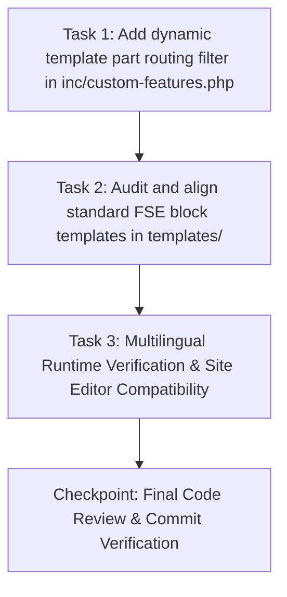

# Plan: Multilingual FSE Template Part Routing

**TOPIC NAME**: `multilingual-fse`  
**ISSUE NAME**: `template-part-routing`  
**SPEC**: `public/wp-content/themes/ekalexandria-flagship/ai-work/multilingual-fse-template-part-routing-SPEC.md`  

---

## 1. Dependency Graph & Vertical Task Slicing

---

## 2. Tasks & Acceptance Criteria

### Task 1: Implementation of Dynamic FSE Template Part Intercept Filter
- **Goal**: Register the `render_block_data` hook in `inc/custom-features.php` to dynamically route `core/template-part` requests (`header` $\rightarrow$ `header-el`/`en`/`ar`, `footer` $\rightarrow$ `footer-el`/`en`/`ar`) based on Polylang context.
- **Files**: `inc/custom-features.php`
- **Acceptance Criteria**:
  - `render_block_data` hook intercepts `core/template-part` blocks before rendering.
  - Skips execution in admin context (`is_admin()`) to maintain FSE Site Editor stability.
  - Inspects block `slug` attribute for target template parts (`header` and `footer`).
  - Fetches current Polylang language code via `pll_current_language()`.
  - Verifies existence of localized template file in `/parts/` (`file_exists(get_stylesheet_directory() . '/parts/' . $target_slug . '.html')`).
  - Replaces `slug` with localized variant (`header-el`, `header-en`, `header-ar`, etc.) only when file exists.
  - Reverts gracefully to original `slug` if language file is missing or Polylang is inactive.
  - Adds zero database query overhead.
- **Verification**: `php -l inc/custom-features.php` returns no errors.
- **Git Commit**: `feat(fse): add dynamic Polylang header and footer template part routing filter`

### Task 2: Audit & Align Standard FSE Block Templates
- **Goal**: Audit templates in `templates/` (such as `single.html`, `page.html`, `archive.html`, etc.) to ensure generic references to `header` and `footer` template parts so routing is applied cleanly across the entire site.
- **Files**:
  - `templates/single.html`
  - `templates/page.html` (if applicable)
  - `templates/archive.html` (if applicable)
- **Acceptance Criteria**:
  - Generic block templates reference generic `slug` `"header"` and `"footer"`.
  - Front-page templates (`front-page-el.html`, `front-page-en.html`, `front-page-ar.html`) remain unchanged as they explicitly reference their respective localized template parts.
- **Verification**: Inspect Gutenberg block comment markup in `templates/`.
- **Git Commit**: `refactor(templates): ensure standard FSE templates use generic header and footer slugs`

### Task 3: Multilingual Runtime Verification & Site Editor Compatibility
- **Goal**: Verify localized rendering across Greek, English, and Arabic post requests and verify Site Editor compatibility.
- **Files**: `inc/custom-features.php`
- **Acceptance Criteria**:
  - Requesting a Greek post loads `parts/header-el.html` & `parts/footer-el.html` (search input placeholder: "Αναζήτηση...").
  - Requesting an English post loads `parts/header-en.html` & `parts/footer-en.html` (search input placeholder: "Search...").
  - Requesting an Arabic post loads `parts/header-ar.html` & `parts/footer-ar.html` (search input placeholder: "بحث...").
  - Site Editor (`wp-admin/site-editor.php`) loads generic template parts cleanly without block invalidation.
- **Verification**: Runtime HTTP requests (`curl`) verifying localized placeholders and nav items; static PHP linting.
- **Git Commit**: `test(fse): verify dynamic template part routing for multilingual posts`

---

## 3. Industry Standard Estimated Token & Resource Cost

| Phase / Task | Input Tokens | Output Tokens | Total Tokens | Estimated Cost (USD) |
| :--- | :--- | :--- | :--- | :--- |
| Task 1: Filter Hook Implementation | ~10,000 | ~1,500 | ~11,500 | $0.002 |
| Task 2: Block Templates Alignment | ~8,000 | ~1,000 | ~9,000 | $0.001 |
| Task 3: Multilingual Verification | ~12,000 | ~2,000 | ~14,000 | $0.002 |
| Checkpoint & Review | ~8,000 | ~1,000 | ~9,000 | $0.001 |
| **Total Estimated Cost** | **~38,000** | **~5,500** | **~43,500** | **~$0.006** |

*Cost calculated based on industry standard AI model API rates for agentic coding.*

---

## 4. Git Workflow Strategy
- Single git branch: `master`.
- Strictly sequential commits following user review after each completed task.
