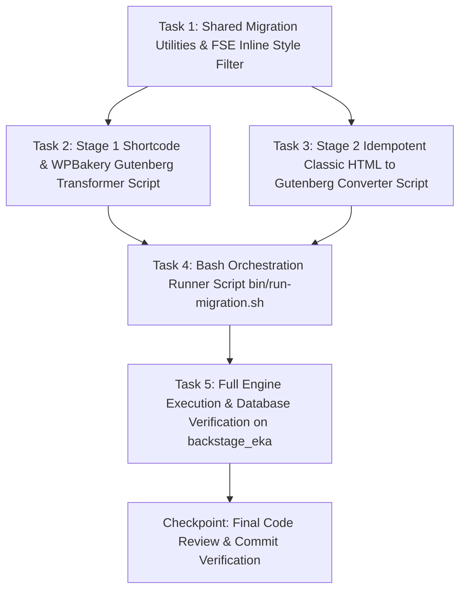

# Plan: Shortcode & Classic Block Gutenberg Migration

**TOPIC NAME**: `shortcode-classic-block-migration`  
**ISSUE NAME**: `gutenberg-remediation`  
**SPEC**: `public/wp-content/themes/ekalexandria-flagship/ai-work/shortcode-classic-block-migration-SPEC.md`  

---

## 1. Dependency Graph & Vertical Task Slicing

---

## 2. Tasks & Acceptance Criteria

### Task 1: Shared Migration Utilities & FSE Inline Style Allowlist Filter
- **Goal**: Create shared helper utilities for FSE inline style filtering (`sanitize_inline_styles_fse()`), AST block validation (`parse_blocks()`), and log management/truncation.
- **Files**: `bin/migration-helpers.php`, `bin/test-fse-sanitizer.php`
- **Acceptance Criteria**:
  - `sanitize_inline_styles_fse($style)` retains layout/sizing CSS properties (`flex-basis`, `flex-grow`, `flex-shrink`, `flex-direction`, `grid-template-columns`, `width`, `height`, `min-height`, `max-width`, `aspect-ratio`, `object-fit`, `vertical-align`, `text-align`).
  - Strips non-allowlisted presentation styles (`font-family`, hardcoded `color`, `background-color`, `margin`, `padding`, `line-height`, `font-size`, `float`, `clear`).
  - Includes helper `eka_validate_blocks_ast($content)` using native WordPress `parse_blocks()`.
  - Includes helper `eka_init_log_file($log_path)` that truncates log file on script startup.
- **Verification**: `php bin/test-fse-sanitizer.php` passes all test cases cleanly; `php -l bin/migration-helpers.php` passes linting.
- **Git Commit**: `feat(migration): add shared helpers and FSE inline style allowlist filter`

### Task 2: Stage 1 - Shortcode & WPBakery Gutenberg Transformer Script
- **Goal**: Implement `bin/remediate-shortcodes-to-blocks.php` to programmatically transform legacy shortcodes into native Gutenberg block primitives.
- **Files**: `bin/remediate-shortcodes-to-blocks.php`
- **Acceptance Criteria**:
  - Target database is `backstage_eka` (read-only reference to `db207080_eka`).
  - Truncates `ai-work/logs/remediate-shortcodes-to-blocks.log` on startup.
  - Transforms `[vc_row]` / `[vc_column width="X/Y"]` / `[vc_column_text]` into `core/columns` and `core/column` with calculated `style="flex-basis:X%"`.
  - Transforms `[vc_single_image image="ID"]` into `<!-- wp:image {"id":ID} -->`.
  - Transforms `[our_team heading="..." title="..."]` into `core/group` containing `core/heading` and `core/paragraph`.
  - Transforms `[rev_slider]` / `[layerslider]` into `core/gallery` or `core/cover` blocks.
  - Transforms `[caption]` into `core/image` with `<figcaption>`.
  - Transforms other shortcodes (`[map]`, `[gview]`, `[mc4wp_form]`) into `core/html`.
  - Validates transformed content via `parse_blocks()` AST check prior to DB update.
- **Verification**: `php -l bin/remediate-shortcodes-to-blocks.php`; test execution on sample posts in `backstage_eka`.
- **Git Commit**: `feat(migration): implement Stage 1 shortcode to block transformer script`

### Task 3: Stage 2 - Idempotent Classic HTML to Gutenberg Block Converter Script
- **Goal**: Implement `bin/convert-classic-to-gutenberg.php` to wrap bare HTML elements in Gutenberg block comments with strict idempotency guards.
- **Files**: `bin/convert-classic-to-gutenberg.php`
- **Acceptance Criteria**:
  - Target database is `backstage_eka`.
  - Truncates `ai-work/logs/convert-classic-to-gutenberg.log` on startup.
  - Idempotency guard: skips any element or container already enclosed inside Gutenberg comments (`<!-- wp:` ... `<!-- /wp:`).
  - Converts bare `
` $\rightarrow$ `<!-- wp:paragraph -->`, bare `<hN>` $\rightarrow$ `<!-- wp:heading -->`, bare `<ul>`/`<ol>` $\rightarrow$ `<!-- wp:list -->`, bare `<table>` $\rightarrow$ `<!-- wp:table -->`, bare `<blockquote>` $\rightarrow$ `<!-- wp:quote -->`.
  - Passes inline styles of converted elements through `sanitize_inline_styles_fse()`.
  - Validates converted content via `parse_blocks()` AST check prior to DB update.
- **Verification**: `php -l bin/convert-classic-to-gutenberg.php`; test rerun idempotency (running twice produces identical database content).
- **Git Commit**: `feat(migration): implement Stage 2 classic HTML to block converter script`

### Task 4: Bash Orchestration Runner Script (`bin/run-migration.sh`)
- **Goal**: Implement `bin/run-migration.sh` bash script to sequentially execute tests, Stage 1 remediation, and Stage 2 conversion with logging.
- **Files**: `bin/run-migration.sh`
- **Acceptance Criteria**:
  - Script starts with `#!/usr/bin/env bash` and `set -euo pipefail`.
  - Executes `php bin/test-fse-sanitizer.php` first.
  - Executes `php bin/remediate-shortcodes-to-blocks.php`.
  - Executes `php bin/convert-classic-to-gutenberg.php`.
  - Logs execution start, steps, and completion with clear console output.
  - Marked executable (`chmod +x bin/run-migration.sh`).
- **Verification**: `bash -n bin/run-migration.sh` passes linting; script runs cleanly.
- **Git Commit**: `feat(migration): add bash runner script for automated 2-stage migration execution`

### Task 5: Full Engine Execution & Database Verification on `backstage_eka`
- **Goal**: Run the full migration pipeline via `bin/run-migration.sh` across all legacy items in `backstage_eka` and verify database integrity.
- **Files**: Database `backstage_eka`, `ai-work/logs/remediate-shortcodes-to-blocks.log`, `ai-work/logs/convert-classic-to-gutenberg.log`
- **Acceptance Criteria**:
  - `bin/run-migration.sh` executes end-to-end cleanly.
  - Zero target shortcodes remain unhandled in transformed post contents in `backstage_eka`.
  - `parse_blocks()` validation passes for all updated posts with 0 AST structure failures.
  - Re-running `bin/run-migration.sh` verifies 100% idempotency (0 modifications on second pass).
- **Verification**: DB verification queries, log file review, AST validation report.
- **Git Commit**: `fix(migration): execute 2-stage Gutenberg migration on backstage_eka database`

---

## 3. Industry Standard Estimated Token & Resource Cost

| Phase / Task | Input Tokens | Output Tokens | Total Tokens | Estimated Cost (USD) |
| :--- | :--- | :--- | :--- | :--- |
| Task 1: Shared Helper Utilities & FSE Style Filter | ~10,000 | ~1,500 | ~11,500 | $0.002 |
| Task 2: Stage 1 Shortcode Transformer Script | ~15,000 | ~2,500 | ~17,500 | $0.003 |
| Task 3: Stage 2 Classic HTML Converter Script | ~15,000 | ~2,500 | ~17,500 | $0.003 |
| Task 4: Bash Orchestration Runner Script | ~5,000 | ~1,000 | ~6,000 | $0.001 |
| Task 5: Full Execution & End-to-End DB Verification | ~12,000 | ~2,000 | ~14,000 | $0.002 |
| Checkpoint & Review | ~8,000 | ~1,000 | ~9,000 | $0.001 |
| **Total Estimated Cost** | **~65,000** | **~10,500** | **~75,500** | **~$0.012** |

*Cost calculated based on industry standard AI model API rates for agentic coding.*

---

## 4. Git Workflow Strategy
- Single git branch: `master`.
- Strictly sequential commits following completion and verification of each task.

